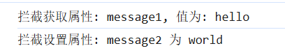

## 代理（proxy)

​	它可以理解为进行某个操作前先拦截统一操作后再执行。借助 `Proxy`，你可以在不直接修改目标对象的前提下，对其行为进行定制。

```js
const target = {
    message1: "hello",
    message2: "everyone"
};

const handler = {
    get(target, prop, receiver) {
        return `拦截获取属性: ${prop}, 值为: ${target[prop]}`;
    },
    set(target, prop, value, receiver) {
        console.log(`拦截设置属性: ${prop} 为 ${value}`);
        target[prop] = value;
        return true;
    }
};

const proxy = new Proxy(target, handler);

// 获取属性
console.log(proxy.message1);

// 设置属性
proxy.message2 = "world";
```

运行结果为



在上述代码中：

- `target` 是被代理的目标对象。
- `handler` 是一个包含各种拦截方法的对象，例如 `get` 和 `set`。
- `new Proxy(target, handler)` 创建了一个代理对象 `proxy`，对 `proxy` 的操作会经过 `handler` 的拦截处理。

#### 常见拦截方法

- **`get(target, prop, receiver)`**：在读取代理对象的属性时触发，可用于实现属性读取拦截、默认值设置等功能。
- **`set(target, prop, value, receiver)`**：在设置代理对象的属性时触发，可用于实现属性赋值验证、数据绑定等功能。
- **`has(target, prop)`**：在使用 `in` 操作符检查属性是否存在时触发。
- **`deleteProperty(target, prop)`**：在删除代理对象的属性时触发。

## 模块

JavaScript 模块是一种将代码分割成独立、可复用部分的方式。模块能封装代码，避免全局变量污染，还能实现代码的按需加载和依赖管理。

#### 模块规范

- ES6 模块（ES Modules）

  ：是 JavaScript 官方的模块规范。

  - **导出模块**：使用 `export` 关键字导出变量、函数或类。

```javascript
// math.js
export const PI = 3.14159;

export function add(a, b) {
    return a + b;
}
```

- **导入模块**：使用 `import` 关键字导入其他模块导出的内容。

```js
// main.js
import { PI, add } from './math.js';

console.log(PI);
console.log(add(1, 2));
```

- CommonJS 模块

  ：主要用于 Node.js 环境。

  - **导出模块**：使用 `module.exports` 或 `exports` 导出模块内容。

```javascript
// math.js
const PI = 3.14159;

function add(a, b) {
    return a + b;
}

module.exports = {
    PI,
    add
};
```

- **导入模块**：使用 `require` 函数导入其他模块。

```javascript
// main.js
const math = require('./math.js');

console.log(math.PI);
console.log(math.add(1, 2));模块的优势
```

- **代码复用**：模块可以在不同的项目或文件中被多次使用，提高了代码的复用性。
- **命名空间隔离**：每个模块都有自己独立的作用域，避免了全局变量冲突。
- **依赖管理**：可以清晰地定义模块之间的依赖关系，便于代码的维护和扩展。
