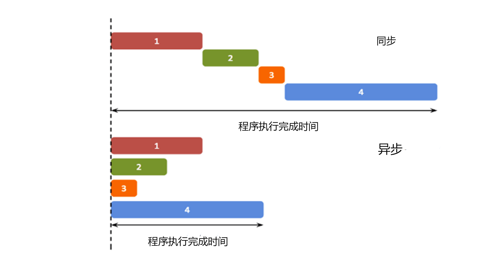

## 1.同步和异步

同步即按顺序执行。

异步即独立执行，异步就是从主线程发射一个子线程来完成任务。

就像这样：



## 2.回调函数

js从设计之初就是只支持单线程的语言，如何做到异步编程呢？js使用回调函数来解决这个问题。

回调函数就是一个函数，它是在我们启动一个异步任务的时候就告诉它：**等你完成了这个任务之后要干什么**。这样一来主线程几乎不用关心异步任务的状态了，他自己会善始善终。

常用的异步操作实现方式：

### setTimeout定时任务

```html
<!DOCTYPE html>
<html>
<head> 
<meta charset="utf-8"> 
<title>dmw</title> 
</head>
<body>

<p>回调函数等待 3 秒后执行。</p>
<p id="demo"></p>
<script>
const print = () => {
    document.getElementById("demo").innerHTML = "dmw";
};
setTimeout(print, 3000);
</script>

</body>
</html>
```

这段程序中的 setTimeout 就是一个消耗时间较长（3 秒）的过程，它的第一个参数是个回调函数，第二个参数是毫秒数，这个函数执行之后会产生一个子线程，子线程会等待 3 秒，然后执行**回调函数 "print"**，在网页显示“dmw"。

既然 setTimeout 会在子线程中等待 3 秒，在 setTimeout 函数执行之后主线程并没有停止，所以可以这样：

```html
<!DOCTYPE html>
<html>
<head> 
<meta charset="utf-8"> 
<title>dmw</title> 
</head>
<body>

<p>回调函数等待 3 秒后执行。</p>
<p id="demo1"></p>
<p id="demo2"></p>
<script>
setTimeout(function () {
    document.getElementById("demo1").innerHTML="newbee-1!";  // 三秒后子线程执行
}, 3000);
document.getElementById("demo2").innerHTML="newbee-2!";      // 主线程先执行
</script>

</body>
</html>
```

可以看见一开始显示的“newbee-2”3秒后被 ‘挤’ 下去了。

## 3.promise

Promise 是一个 ECMAScript 6 提供的类，**目的是更加优雅地书写复杂的异步任务。**

### 创建 Promise

`Promise` 对象是通过 `new Promise()` 构造函数创建的，该构造函数接收一个执行器函数（executor）作为参数。执行器函数有两个参数：`resolve` 和 `reject`，它们都是函数。当异步操作成功完成时，调用 `resolve` 函数并传入结果；当异步操作失败时，调用 `reject` 函数并传入错误信息。

示例

```js
const myPromise = new Promise((resolve, reject) => {
    // 模拟一个异步操作，比如定时器
    setTimeout(() => {
        const success = true; // 假设操作成功
        if (success) {
            resolve('操作成功'); // 操作成功，调用 resolve 并传入结果
        } else {
            reject(new Error('操作失败')); // 操作失败，调用 reject 并传入错误信息
        }
    }, 1000);
});
```

### 使用 Promise

Promise 类有 .then() .catch() 和 .finally() 三个方法，这三个方法的参数都是一个函数，.then() 可以将参数中的函数添加到当前 Promise 的正常执行序列，.catch() 则是设定 Promise 的异常处理序列，.finally() 是在 Promise 执行的最后一定会执行的序列。 .then() 传入的函数会按顺序依次执行，有任何异常都会直接跳到 catch 序列。

```html
<!DOCTYPE html>
<html>
<head> 
<meta charset="utf-8"> 
<title>dmw</title> 
</head>
<body>
<script>

const fun = new Promise((resolve, reject) => {
    // resolve("任务成功了")
    reject("任务失败了")
})
fun.then((data) => {
    console.log(data)
}).catch((err) => {
    console.log(err)
})

</script>
</body>
</html>
```


或者


### Promise 链式调用

`Promise` 的 `.then()` 方法会返回一个新的 `Promise` 对象，这使得你可以进行链式调用，按顺序处理多个异步操作。以下代码先定义两个异步操作函数，第一个函数返回一个promise对象，第一个函数成功调用就会返回promise的resolve，第二个函数就接收这个resolve，与第一个一样，成功调用后就返回它的resolve，最后一个箭头函数接收第二个的resolve并执行打印在控制台的操作。

```js
function asyncOperation1() {
    return new Promise((resolve) => {
        setTimeout(() => {
            resolve('操作 1 完成');
        }, 1000);
    });
}

function asyncOperation2(result) {
    return new Promise((resolve) => {
        setTimeout(() => {
            resolve(result + ', 操作 2 完成');
        }, 1000);
    });
}

asyncOperation1()
   .then(asyncOperation2)
   .then((finalResult) => {
        console.log(finalResult); // 输出: 操作 1 完成, 操作 2 完成
    })
   .catch((error) => {
        console.error(error.message);
    });
```

### Promise.all 和 Promise.race

- **`Promise.all()`**：接收一个 `Promise` 数组作为参数，返回一个新的 `Promise` 对象。当数组中的所有 `Promise` 都成功时，新的 `Promise` 才会成功，其结果是一个包含所有 `Promise` 结果的数组；只要有一个 `Promise` 失败，新的 `Promise` 就会失败。

```js
const promise1 = Promise.resolve('结果 1');
const promise2 = new Promise((resolve) => {
    setTimeout(() => {
        resolve('结果 2');
    }, 1000);
});

Promise.all([promise1, promise2])
   .then((results) => {
        console.log(results); // 输出: ['结果 1', '结果 2']
    })
   .catch((error) => {
        console.error(error.message);
    });
```

- **`Promise.race()`**：接收一个 `Promise` 数组作为参数，返回一个新的 `Promise` 对象。当数组中的任何一个 `Promise` 率先成功或失败时，新的 `Promise` 就会以该 `Promise` 的结果或错误状态结束。

```js
const promise3 = new Promise((resolve) => {
    setTimeout(() => {
        resolve('结果 3');
    }, 2000);
});
const promise4 = new Promise((resolve) => {
    setTimeout(() => {
        resolve('结果 4');
    }, 1000);
});

Promise.race([promise3, promise4])
   .then((result) => {
        console.log(result); // 输出: 结果 4
    })
   .catch((error) => {
        console.error(error.message);
    });
```

### 更加优雅地书写复杂的异步任务

例如，如果我想分三次输出字符串，第一次间隔 1 秒，第二次间隔 4 秒，第三次间隔 3 秒：

```html
<!DOCTYPE html>
<html>
<head> 
<meta charset="utf-8"> 
<title>dmw</title> 
</head>
<body>
<script>
setTimeout(() => {
    console.log("First")
    setTimeout( () => {
        console.log("Second")
        setTimeout(() => {
            console.log("Third");
        }, 3000)
    },4000)
}, 1000);
</script>
</body>
</html>
```


这段程序实现了这个功能，但是它是用 "函数瀑布" 来实现的。在一个复杂的程序当中，这样写可读性非常差。

来看promise如何实现的

```html
<!DOCTYPE html>
<html>
<head> 
<meta charset="utf-8"> 
<title>dmw</title> 
</head>
<body>
<script>
new Promise((resolve, reject) => {
    setTimeout(() => {
        console.log("First");
        resolve();
    }, 1000);
}).then(() => {
    return new Promise((resolve, reject) =>{
        setTimeout(() => {
            console.log("Second");
            resolve();
        }, 4000);
    });
}).then(()  => {
    setTimeout(() => {
        console.log("Third");
    }, 3000);
});

</script>
</body>
</html>
```

**重点注意事项**

**Promise 链的等待**

- 在 `.then()` 中返回一个新的 `Promise`，可以让后续的 `.then()` 等待这个新的 `Promise` 完成。
- 如果没有返回 `Promise`（如第三个 `setTimeout`），后续的 `.then()`（如果有）不会等待。

看起来很长，我们改写一下，封装成promise函数，这种返回值为一个 Promise 对象的函数称作 Promise 函数。

```js
const print = (delay, message) => {
    return new Promise((resolve, reject) => {
        setTimeout(() => {
            console.log(message);
            resolve();
        }, delay)
    })
}

print(1000, "First").then(() => {
    return print(4000, "Second")
}).then(() => {
    print(3000, "Third")
})
```

要调用时还可以使用async和await

```js
const fun = async () => {
    await print(1000, "First")
    await print(4000, "Second")
    await print(3000, "Third")
}
fun()
```

await 指令后必须跟着一个 Promise，异步函数会在这个 Promise 运行中暂停，直到此promise运行结束再继续运行。

### async/await

`async/await` 是 ES2017（ES8）引入的用于处理异步操作的语法糖，它建立在 `Promise` 的基础之上，让异步代码看起来更像同步代码，使代码的可读性和可维护性大大提高。下面详细解释其写法和使用方式。

#### 多个异步操作顺序执行

```js
function asyncOperation1() {
    return new Promise((resolve) => {
        setTimeout(() => {
            resolve('操作 1 完成');
        }, 1000);
    });
}

function asyncOperation2() {
    return new Promise((resolve) => {
        setTimeout(() => {
            resolve('操作 2 完成');
        }, 1000);
    });
}

async function main() {
    try {
        const result1 = await asyncOperation1();
        console.log(result1); // 输出: 操作 1 完成
        const result2 = await asyncOperation2();
        console.log(result2); // 输出: 操作 2 完成
    } catch (error) {
        console.error(error);
    }
}

main();
```

- 解释
  - `asyncOperation1` 和 `asyncOperation2` 分别返回一个 `Promise`，模拟两个异步操作。
  - 在 `main` 函数中，使用 `await` 依次等待两个异步操作完成。`await asyncOperation1()` 会暂停函数执行，直到 `asyncOperation1` 的 `Promise` 被解决，然后继续执行后续代码。

#### 处理多个并行的异步操作

```javascript
function asyncOperation1() {
    return new Promise((resolve) => {
        setTimeout(() => {
            resolve('操作 1 完成');
        }, 1000);
    });
}

function asyncOperation2() {
    return new Promise((resolve) => {
        setTimeout(() => {
            resolve('操作 2 完成');
        }, 1000);
    });
}

async function main() {
    try {
        const [result1, result2] = await Promise.all([asyncOperation1(), asyncOperation2()]);
        console.log(result1); // 输出: 操作 1 完成
        console.log(result2); // 输出: 操作 2 完成
    } catch (error) {
        console.error(error);
    }
}

main();
```

解释

- `Promise.all` 用于并行执行多个 `Promise`，并在所有 `Promise` 都解决后返回一个包含所有结果的数组。
- 在 `main` 函数中，使用 `await` 等待 `Promise.all` 的结果。通过解构赋值，将结果分别赋值给 `result1` 和 `result2`。