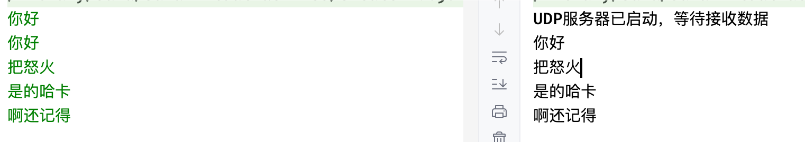
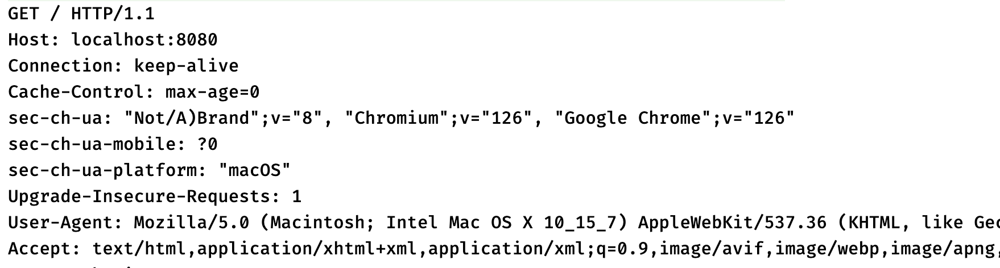
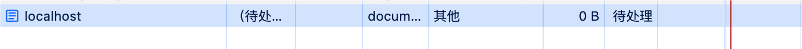
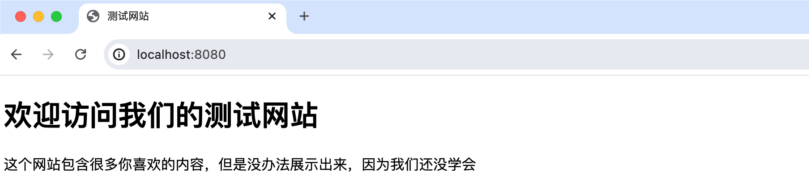

## socket

我们可以通过Socket技术（它是计算机之间进行**通信**的**一种约定**或一种方式），实现两台计算机之间的通信，Socket也被翻译为`套接字`，是操作系统底层提供的一项通信技术，它支持TCP和UDP。而Java就对Socket底层支持进行了一套完整的封装，我们可以通过Java来轻松实现Socket通信。

要实现Socket通信，我们必须创建一个数据发送者和一个数据接收者，也就是客户端和服务端，我们需要提前启动服务端，来等待客户端的连接，而客户端只需要随时启动去连接服务端即可，它们默认采用的是TCP协议进行连接。

### socket实现双向通信（Tcp)

主线程用于发送消息，子线程用于接收消息。

服务端：

```java
package com.dmw.socket;

import java.io.*;
import java.net.*;

public class Server {
    public static void main(String[] args) {
        try {
            // 1. 创建服务器Socket，指定端口号为8888
            ServerSocket serverSocket = new ServerSocket(8888);
            System.out.println("服务器已启动，等待客户端连接...");

            // 2. 等待客户端连接
            Socket socket = serverSocket.accept();
            System.out.println("客户端已连接，IP地址：" + socket.getInetAddress().getHostAddress());

            // 3. 获取输入输出流
            BufferedReader in = new BufferedReader(new InputStreamReader(socket.getInputStream()));
            PrintWriter out = new PrintWriter(socket.getOutputStream(), true);
            BufferedReader systemIn = new BufferedReader(new InputStreamReader(System.in));

            // 4. 创建线程用于接收客户端消息
            Thread receiveThread = new Thread(() -> {
                try {
                    String clientMessage;
                    while ((clientMessage = in.readLine()) != null) {
                        System.out.println("客户端说: " + clientMessage);
                    }
                } catch (IOException e) {
                    System.out.println("与客户端的连接已断开");
                }
            });
            receiveThread.start();

            // 5. 主线程用于向客户端发送消息
            String serverMessage;
            while ((serverMessage = systemIn.readLine()) != null) {
                out.println(serverMessage);
                if ("bye".equalsIgnoreCase(serverMessage)) {
                    break;
                }
            }

            // 6. 关闭资源
            receiveThread.interrupt();
            in.close();
            out.close();
            socket.close();
            serverSocket.close();
        } catch (IOException e) {
            e.printStackTrace();
        }
    }
}
```

客户端：

```java
package com.dmw.socket;

import java.io.*;
import java.net.*;

public class Client {
    public static void main(String[] args) {
        try {
            // 1. 创建客户端Socket，指定服务器地址和端口
            Socket socket = new Socket("localhost", 8888);
            System.out.println("已连接到服务器");

            // 2. 获取输入输出流
            BufferedReader in = new BufferedReader(new InputStreamReader(socket.getInputStream()));
            PrintWriter out = new PrintWriter(socket.getOutputStream(), true);
            BufferedReader systemIn = new BufferedReader(new InputStreamReader(System.in));

            // 3. 创建线程用于接收服务器消息
            Thread receiveThread = new Thread(() -> {
                try {
                    String serverMessage;
                    while ((serverMessage = in.readLine()) != null) {
                        System.out.println("服务器说: " + serverMessage);
                    }
                } catch (IOException e) {
                    System.out.println("与服务器的连接已断开");
                }
            });
            receiveThread.start();

            // 4. 主线程用于向服务器发送消息
            String clientMessage;
            while ((clientMessage = systemIn.readLine()) != null) {
                out.println(clientMessage);
                if ("bye".equalsIgnoreCase(clientMessage)) {
                    break;
                }
            }

            // 5. 关闭资源
            receiveThread.interrupt();
            in.close();
            out.close();
            socket.close();
        } catch (UnknownHostException e) {
            System.err.println("无法找到服务器");
            e.printStackTrace();
        } catch (IOException e) {
            System.err.println("无法连接到服务器");
            e.printStackTrace();
        }
    }
}
```

### Socket 通信中I/O流的使用

在 Java 的 Socket 通信中，主要使用了以下几种 **I/O 流（Stream）** 来处理数据的输入和输出。下面详细介绍这些流的作用、特点以及它们在 Socket 通信中的应用。

---

**1. `InputStream` 和 `OutputStream`**

**作用**

- **`InputStream`**：用于从数据源（如 Socket、文件等）**读取字节数据**（`byte`）。
- **`OutputStream`**：用于向目标（如 Socket、文件等）**写入字节数据**（`byte`）。

**特点**

- 处理的是 **原始字节（`byte`）**，适合二进制数据传输（如图片、文件等）。
- 是 **所有字节流的基类**，`Socket` 通信中的 `socket.getInputStream()` 和 `socket.getOutputStream()` 返回的就是这两个流。

**在 Socket 通信中的应用**

```java
// 获取 Socket 的输入流和输出流（字节流）
InputStream in = socket.getInputStream();  // 接收数据
OutputStream out = socket.getOutputStream();  // 发送数据
```

---

**2. `BufferedReader` 和 `PrintWriter`**

**作用**

- **`BufferedReader`**：用于 **高效读取字符数据**（`String`），内部有缓冲区，减少 I/O 操作次数。
- **`PrintWriter`**：用于 **方便地写入格式化文本数据**（`String`），支持 `print()`、`println()` 等方法。

**特点**

- 处理的是 **字符数据（`String`）**，适合文本通信（如聊天消息）。
- `BufferedReader` 提供 `readLine()` 方法，可以逐行读取数据。
- `PrintWriter` 可以设置 `autoflush`，使数据立即发送（而不是等到缓冲区满）。

**在 Socket 通信中的应用**

```java
// 用 InputStreamReader 把字节流转换成字符流
BufferedReader in = new BufferedReader(new InputStreamReader(socket.getInputStream()));

// PrintWriter 可以直接包装 OutputStream，并启用 autoflush
PrintWriter out = new PrintWriter(socket.getOutputStream(), true); // true 表示自动刷新
```

---

**3. `InputStreamReader` 和 `OutputStreamWriter`**

**作用**

- **`InputStreamReader`**：将 `InputStream`（字节流）转换成 `Reader`（字符流），可以指定字符编码（如 `UTF-8`）。
- **`OutputStreamWriter`**：将 `OutputStream`（字节流）转换成 `Writer`（字符流），同样支持指定编码。

**特点**

- 是 **字节流和字符流之间的桥梁**，使我们可以用字符方式处理字节数据。
- 如果不指定编码，默认使用系统编码（可能导致乱码，建议显式指定 `UTF-8`）。

**在 Socket 通信中的应用**

```java
// 将字节流转换成字符流（指定 UTF-8 编码）
BufferedReader in = new BufferedReader(
    new InputStreamReader(socket.getInputStream(), StandardCharsets.UTF_8)
);

PrintWriter out = new PrintWriter(
    new OutputStreamWriter(socket.getOutputStream(), StandardCharsets.UTF_8),
    true  // autoflush
);
```

---

**4. `DataInputStream` 和 `DataOutputStream`**

**作用**

- **`DataInputStream`**：用于读取 **基本数据类型**（如 `int`、`double`、`String`）。
- **`DataOutputStream`**：用于写入 **基本数据类型**。

**特点**

- 适合传输 **结构化数据**（如数字、布尔值、字符串等）。
- 使用 `readUTF()` 和 `writeUTF()` 可以安全地传输字符串（避免乱码）。

**在 Socket 通信中的应用**

```java
// 发送数据
DataOutputStream out = new DataOutputStream(socket.getOutputStream());
out.writeInt(100);  // 发送整数
out.writeUTF("Hello");  // 发送字符串

// 接收数据
DataInputStream in = new DataInputStream(socket.getInputStream());
int num = in.readInt();  // 读取整数
String msg = in.readUTF();  // 读取字符串
```

---

**5. `ObjectInputStream` 和 `ObjectOutputStream`**

**作用**

- **`ObjectInputStream`**：用于读取 **Java 对象**（反序列化）。
- **`ObjectOutputStream`**：用于写入 **Java 对象**（序列化）。

**特点**

- 适合传输 **Java 对象**（如自定义的 `Message` 类）。
- 对象必须实现 `Serializable` 接口。

**在 Socket 通信中的应用**

```java
// 发送对象
ObjectOutputStream out = new ObjectOutputStream(socket.getOutputStream());
out.writeObject(new Message("Alice", "Hello Bob!"));

// 接收对象
ObjectInputStream in = new ObjectInputStream(socket.getInputStream());
Message msg = (Message) in.readObject();
```

---

#### **总结：不同流的适用场景**
| 流类型                                     | 适用场景                   | 示例                                            |
| ------------------------------------------ | -------------------------- | ----------------------------------------------- |
| `InputStream` / `OutputStream`             | 原始字节传输（文件、图片） | `socket.getInputStream()`                       |
| `BufferedReader` / `PrintWriter`           | 文本通信（聊天消息）       | `new BufferedReader(new InputStreamReader(in))` |
| `DataInputStream` / `DataOutputStream`     | 结构化数据（数字、字符串） | `out.writeInt(100)`                             |
| `ObjectInputStream` / `ObjectOutputStream` | Java 对象传输              | `out.writeObject(user)`                         |

---

**最佳实践**

1. **文本通信**：`BufferedReader` + `PrintWriter`（推荐 `autoflush=true`）。
2. **二进制数据传输**：直接使用 `InputStream` 和 `OutputStream`。
3. **结构化数据**：`DataInputStream` / `DataOutputStream`。
4. **对象传输**：`ObjectInputStream` / `ObjectOutputStream`（确保对象可序列化）。

#### 文件传输

除了发送消息之外，有了输入输出流，即使是文件传输也不在话下，我们可以来编写一个文件传输程序，让客户端传输文件到服务端去：                      

```java
try(ServerSocket server = new ServerSocket(8080)) {
    Socket socket = server.accept();
    System.out.println("接受到来自客户端的连接准备开始进行文件传输");
    InputStream in = socket.getInputStream();
    FileOutputStream stream = new FileOutputStream("test");
    long len, total = 0;
    byte[] buffer = new byte[1024 * 1024 * 4];
    while ((len = in.read(buffer)) > 0) {
        System.out.println("正在进行文件传输，当前已接收: " + total + " 字节数据");
        stream.write(buffer, 0, (int) len);
        total += len;
    }
} catch (IOException e) {
    e.printStackTrace();
}            
```

```java
try (Socket socket = new Socket("localhost", 8080);
     Scanner scanner = new Scanner(System.in)) {
    System.out.println("已连接到服务端，请输入要发送的文件路径: ");
    OutputStream out = socket.getOutputStream();
    FileInputStream stream = new FileInputStream(scanner.nextLine());
    stream.transferTo(out);
} catch (IOException e) {
    e.printStackTrace();
}
```

### Socket实现UDP通信

接着来看如何使用Socket实现UDP通信，Java为我们提供了DatagramSocket API，它是一种UDP Socket，用于发送和接收UDP数据报。

由于UDP不像TCP那样需要提前连接，所以我们只需要创建一个Socket等待数据到来即可：                  

```java
try(DatagramSocket socket = new DatagramSocket(8080)) {   //绑定8080端口

} catch (IOException e) {
    e.printStackTrace();
}
```

接着我们即可连续读取客户端发来的数据：                         

```java
while(true) {
  	//UDP数据包，类似于数据缓冲区，数据会先被缓存到里面
    DatagramPacket packet = new DatagramPacket(new byte[1024], 1024);
    socket.receive(packet);   //将收到的数据缓冲到DatagramPacket中
    System.out.println(new String(packet.getData()));  //取出数据并打印
}
```

客户端这边由于不需要预先建立连接，所以我们直接创建一个UDP数据包，并在数据包中指定发送的IP地址和端口等内容，发送后直接就可以到达：                          

```java
try (DatagramSocket socket = new DatagramSocket();
     Scanner scanner = new Scanner(System.in)) {
    while (true) {
        String str = scanner.nextLine();
        byte[] data = str.getBytes();
        InetAddress address = InetAddress.getByName("127.0.0.1");  //直接在数据包中填写要发送到的目标主机IP地址和端口信息
        DatagramPacket packet = new DatagramPacket(data, data.length, address, 8080);
        socket.send(packet);
    }
} catch (IOException e){
    e.printStackTrace();
}
```

这个相比TCP就简单很多了，直接发送就能收到：



### 使用浏览器访问Socket服务器

最后我们来研究一下HTTP协议，我们前面说过，浏览器访问一个网站实际上用的就是HTTP协议，并且HTTP协议是基于TCP协议的，所以说我们可以创建一个ServerSocket来处理浏览器的访问请求，看看HTTP请求到底长啥样。首先我们还是直接编写一个服务端来等待连接：                        

```java
try(ServerSocket server = new ServerSocket(8080)){
    Socket socket = server.accept();
    InputStream in = socket.getInputStream();
    while (!socket.isClosed()) {
        int i = in.read();
        if(i == -1) break;
        System.out.print((char) i);
    }
}catch (IOException e){
    e.printStackTrace();
}
```

此时我们使用Chrome浏览器访问：http://localhost:8080，可以直接在服务端收到以下数据：



这正是我们之前说的HTTP协议对应的报文格式，可以看到当我们使用浏览器访问服务端时，浏览器会默认向我们的服务端发送一个GET请求，路径为根路径"/"，并且还包含了很多请求标头。

但是此时我们会发现，浏览器会一直处于加载中状态：



这是因为HTTP规定请求完成之后服务端需要给一个响应结果，所以说浏览器实际上一直在等待我们的服务端发送一个请求结果给它，但是我们这里没有做任何处理，所以说就会一直卡住。

现在我们来尝试给它返回一个简单的HTML页面（看不懂代码没关系，这里只是测试一下）                          

```java
try(ServerSocket server = new ServerSocket(8080)){
    Socket socket = server.accept();
    OutputStreamWriter writer = new OutputStreamWriter(socket.getOutputStream());
    String html = """
            <!DOCTYPE html>
            <html lang="en">
            <head>
                <title>测试网站</title>
            </head>
            <body>
                <h1>欢迎访问我们的测试网站</h1>
                <p>这个网站包含很多你喜欢的内容，但是没办法展示出来，因为我们还没学会</p>
            </body>
            """;
    writer.write("HTTP/1.1 200 OK\r\n");   //根据HTTP协议规范，返回对应的响应格式
    writer.write("Content-Type: text/html;charset=utf-8\r\n");  //务必加一下内容类型和编码，否则会乱码
    writer.write("\r\n");
    writer.write(html);
    writer.flush();
}catch (IOException e){
    e.printStackTrace();
}
```

此时我们使用Chrome浏览器再次访问服务端，就可以展示出我们返回的数据了：



是不是感觉非常神奇，只需要返回给浏览器一个HTML代码，就成功以网站的形式打开了。这也是我们后续学习的主要方向，只不过使用Socket这种框架来编写网站，太过于原始了，尤其是对HTTP协议报文的处理上，自己写太过麻烦了，后面我们会学习各种Web服务端，它们是专用于网站服务器的程序，我们就能快速编写更加高级的Web应用程序。