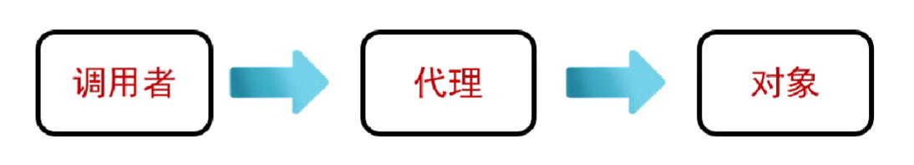

## 一、Java概述

### 1.Java定义

由Sun公司于1995发布的一种编程语言和计算平台。

主要分为三个版本：JavaSE---标准版，JavaEE---企业版，JavaME---微型版。

### 2.Java特点

1.**面向对象**，即将现实世界抽象成一个一个的对象，把相关的数据和方法当作一个整体来看待。

2.**静态语言**。强类型语言。静态语言执行效率比动态语言高，速度更快。而动态语言能够用更少的代码实现相同的功能，程序员编码效率高。

3.**跨平台和可移植性。**已编译的Java程序依靠JVM实现在不同平台能够直接运行。

4.**容易实现多线程**。在用户空间中实现多线程。

5.**高性能**。不仅支持解释执行，有些JVM(Hotspot JVM)还支持编译执行。

6.**自动管理对象的生命周期**。安全。

7.功能强大和简单易用。

## 二、Java开发环境

JDK包括jre和核心类库。jre包括jvm。

jre是java运行环境，如果只是需要运行普通的java程序，只要安装jre即可。

## 三、Java基础语法

### 1.数据类型

四类八种：

1.整数型：
byte一个字节即8位(-128-127)，
short两个字节即16位(-32768-32767)，
int4个字节即32位(-2147283648-2147483647)，
long八个字节即64位(-9e18-9e18)---后加L

2.浮点型：
float4字节即32位---精确到到小数点后六位---后加f，
double8字节即64位精确到小数点后15位---后加d。

3.字符型：
char类型是一个单一的16位Unicode字符，最小值(\u0000)也就是0，最大值\uffff即65535。

4.布尔型Boolean类型：只有true或false。

### 2.基础语法

1.大小写敏感

2.类名采用大驼峰命名法(即MyClass类似的)

3.包名小写(网址倒序)

4方法名采用小驼峰命名法(即myFirstMethod类似的)

### 3.运算符

1.**赋值运算符’=‘**，一般来说右值赋值给明确变量类型的左值就行。但是对象的赋值一般来说其实赋的是对象的引用，当一个对象的引用被赋值给另一个引用变量时，两个引用变量指向同一个对象。当然对象的赋值还有其他方式：

- **浅拷贝**：复制对象的字段值，但引用类型的字段仍然指向同一个对象。

- **深拷贝**：递归复制对象及其引用类型的字段所指向的对象，创建一个完全独立的对象。  

2.自增自减运算符：


3.算数运算符与比较运算符和数学差不多

4.逻辑运算符与数学差不多，按位运算符比较的是二进制位

5.移位运算符是将某个操作数向某个方向移动指定的二进制位数例如：

​	8>>1=4;9<<2=36;

6.三元运算符：语法为：

​	**条件表达式？表达式1：表达式2**

条件表达式为true就调用表达式1，否则调用表达式2.


## 四、Java执行流程控制

### 1.条件语句

1.if...else

`if(表达式) {`

​	`表达式为真执行；`

`}`

`else {`

​	`否则执行`

`}`

2.switch用于小范围单个值

`switch(变量) {`

​	`case 值1：`

​		`表达式1；`

​		`break；`

​	`case 值2：`

​		`表达式2：`

​		`break；`

​	`......`

​	`default：`

​		`表达式n;`

​		`break;`

`}`

注意：不要忘记加每个case的表达式后加上break，否则会发生**“穿透”(fall-through)**现象。这意味着程序会从匹配的`case`开始执行，直到遇到`break`语句或`switch`块的末尾为止，而不会自动停止。

### 2.循环语句

while，do...while，for和for-each

while(表达式) {

​	为真执行并再次调用while()；

}

do {

​	第一次直接执行，后续满足表达式执行；

}while(表达式)；

for( 初始化;条件 ;步进 ) { 条件为真执行}

for-each例如:

​	int array[]={1,2,3}

​	for(auto arr: array) {

​		System.out.println(arr);

​	}

打印数组。

### 3.跳转语句

有break，continue和return

break用于退出当前循环

continue用于退出当次循环进入下一次循环

return直接结束本次函数调用

## 五、面向对象

### 1.类和对象

类是对象的模板，有属性和方法，对象是类的具体体现，可以操作属性和方法。

### 2.对象的创建

1.在java中万事万物皆对象，但是我们操纵的确是一个个对象的引用(reference)。这个引用可以独立存在如：

`Car carKey；`

但是我们一般在创建对象引用时会同时把一个对象赋给它如：

`Car carKey = new Car();`

### 3.属性和方法

属性也被称为字段，属性可以是对象，也可以是基本数据类型。

方法也就是函数，意思是做某些事情。

方法的示例：

访问修饰符(public等)(其他修饰符static等)返回值类型 方法名称(参数列表){

​	方法体;

} 

如果没有指定修饰符默认同包访问权限(package-private)；

#### (1)构造方法

构造方法也称构造器，构造函数，它是一种特殊的方法。

特点：

1.用于在创建对象的时候初始化对象，给对象的字段赋初始值。

2.它的方法名称必须和类名相同，

3.没有返回值类型(连void都没有)。

4.如果定义类的时候没有定义构造方法，Java编译器会自动提供一个无参构造方法，将所有字段初始化为默认值。

5.可以重载，只要参数列表不同。

6.自动调用，在使用new关键字创建对象时，Java自动调用相应的构造方法来初始化对象。

7.构造方法不能被继承或重写，但可以通过`super()`调用父类的构造方法。

#### (2)方法重载

方法重载是一种允许类中出现多个同名方法的技术，这些方法的参数列表必须不同。具体调用哪个方法取决于传递的参数类型和数量。

#### (3)方法的重写

方法重写是一种面向对象编程中的多态特性，允许子类提供一个与父类同名且参数列表相同的实例方法。通过方法重写，子类可以覆盖父类的方法实现，从而提供自己的行为逻辑。

要实现方法重写，必须满足以下条件：

1. **继承关系**：子类必须继承父类。
2. **方法名和参数列表相同**：子类中的方法必须与父类中的方法具有相同的名称和参数列表。
3. **返回值类型相同或兼容**：子类方法的返回值类型必须与父类方法的返回值类型相同，或者返回值类型是父类返回值类型的子类(协变返回类型)。
4. **访问修饰符的限制**：子类方法的访问修饰符不能比父类方法的访问修饰符更严格。例如，如果父类方法是`public`，子类方法不能是`protected`或`private`。
5. **异常声明的限制**：子类方法声明的异常不能比父类方法声明的异常更宽泛。子类方法可以声明父类方法声明的异常，或者声明父类方法声明异常的子类，或者不声明异常。

### 4.初始化

在Java中，初始化是一个重要的概念，它涉及到类、成员变量、构造器、数组等的初始化过程。以下是详细的解释：

#### (1) 类的初始化

类的初始化是指在类加载到JVM(Java虚拟机)后，首次主动使用该类时，对其进行初始化的过程。类的初始化主要包括以下步骤：

- **加载**：将类的`.class`文件加载到JVM内存中。
- **连接**：
  - **验证**：检查类的结构是否正确，是否符合Java规范。
  - **准备**：为类的静态变量分配内存，并设置默认初始值。
  - **解析**：将类、接口、字段和方法的符号引用转换为直接引用。
- **初始化**：执行类构造器`<clinit>`方法，完成静态变量的赋值和静态代码块的执行。

**示例**：

```java
class MyClass {
    static {
        System.out.println("静态代码块执行");
    }
    static int staticVar = 10;
}

public class Main {
    public static void main(String[] args) {
        System.out.println(MyClass.staticVar); // 触发类的初始化
    }
}
```

**输出**：

```
静态代码块执行
10
```

#### (2) 成员初始化

成员初始化是指对类的成员变量(包括实例变量和静态变量)进行初始化。成员变量的初始化方式有以下几种：

- **默认初始化**：由JVM自动为成员变量赋予默认值。例如，`int`类型默认为`0`，`double`类型默认为`0.0`，`boolean`类型默认为`false`，对象引用类型默认为`null`。
- **显式初始化**：在成员变量声明时直接赋值。
- **构造器初始化**：通过构造器为成员变量赋值。

**示例**：

```java
class MyClass {
    int instanceVar = 10; // 显式初始化
    static int staticVar = 20; // 显式初始化
    int anotherVar; // 默认初始化为0
}
```

#### (3) 构造器初始化

构造器初始化是指通过构造器为对象的成员变量赋值。构造器是类的特殊方法，用于创建对象时初始化对象的状态。

**示例**：

java复制

```java
class MyClass {
    int instanceVar;

    // 构造器
    public MyClass(int value) {
        instanceVar = value; // 构造器初始化
    }
}

public class Main {
    public static void main(String[] args) {
        MyClass obj = new MyClass(100);
        System.out.println(obj.instanceVar); // 输出100
    }
}
```

#### (4) 数组初始化

数组初始化是指为数组分配内存并为数组元素赋值。数组初始化有以下两种方式：

- **静态初始化**：在声明数组时直接指定数组元素的值。
- **动态初始化**：指定数组的长度，由JVM自动为数组元素赋予默认值。

**示例**：

java复制

```java
// 静态初始化
int[] arr1 = {1, 2, 3, 4, 5};

// 动态初始化
int[] arr2 = new int[5]; // 默认初始化为0
```

#### (5) 初始化顺序

Java中对象的初始化顺序如下：

1. **加载类**：加载类的`.class`文件。
2. **静态变量和静态方法块初始化**：按照代码的顺序，先初始化静态变量，再执行静态代码块。
3. **实例变量初始化**：按照代码的顺序，先初始化实例变量，再执行实例代码块。
4. **构造器初始化**：执行构造器，为对象的成员变量赋值。

**示例**：

java复制

```java
class MyClass {
    static {
        System.out.println("静态代码块1");
    }

    static int staticVar = 10; // 静态变量初始化

    {
        System.out.println("实例代码块1");
    }

    int instanceVar = 20; // 实例变量初始化

    public MyClass() {
        System.out.println("构造器");
    }

    static {
        System.out.println("静态代码块2");
    }
}

public class Main {
    public static void main(String[] args) {
        new MyClass();
    }
}
```

**输出**：

```
静态代码块1
静态代码块2
实例代码块1
构造器
```

### 总结

- **类初始化**：加载类、静态变量初始化和执行静态代码块。
- **成员初始化**：包括默认初始化、显式初始化和构造器初始化。
- **构造器初始化**：通过构造器为对象的成员变量赋值。
- **数组初始化**：静态初始化和动态初始化。
- **初始化顺序**：静态变量和静态代码块 → 实例变量和实例代码块 → 构造器。

### 5.对象的销毁

Java和c/c++的一个重要的特征就是不需要手动管理对象的销毁工作。对象是由**Java虚拟机**进行管理和销毁的。我们无需手动管理对象，但是得知道对象作用域的概念。

#### (1)对象作用域

绝大多数语言都有作用域(scope)的概念，作用域决定了对象内部定义的变量名的可见性和生命周期。java中作用域通常由{}的位置决定。

`{`

​	`int a = 11;`

​	`{`

​		`int b = 22;`

​	`}`

`}`

变量a会在两个{}中生效，而变量b只在自己的{}内生效。

#### (2)this和super

二者都是关键字。

**this**作用在对象中并且不可以对静态变量或方法使用，它可以调用方法，调用属性和指向对象本身，因为局部变量优先级大于全局变量，所以在调用对象的方法进行属性的赋值时，需要使用到this来设置此对象的属性。

调用对象：例子中eatApple()方法可以调用多次，return this的返回值使得哪个对象调用这个方法都能返回对象自身。

this用在构造方法时this(参数)需要放在第一行，否则编译不通过。

**super**可以调用父类的方法，属性，指向父类。其他同this。

## 六、访问控制权限

访问控制权限又称封装，它是面向对象三大特性的一个，其核心是只对需要的类可见。

Java中成员的访问权限一共有四种，分别是public，protected，default，private。如下


### 1.继承

三大特性之一，它是所有面向对象编程语言都不可或缺的一部分。只要我们创建了一个类，就隐式的继承自Object父类，只不过没有指定。如果显式指定了父类，那么此类的父类就继承于Object类。


继承的关键字是**extends**，如果使用了extends显式指定了继承，那么我们可以说Father是父类，而Son是子类。用代码表示如下：

`class Father{}`

`class Son extends Father{}`

子类具有父类的某些特征，如果子类没有自己的方法的话，默认调用父类的方法。如果子类实现了自己的方法，那么就相当于重写了父类的方法。

### 2.多态

三大特性之一，多态是指同一个行为具有不同表现形式。即一个类实例(对象)的相同方法在不同情形下具有不同表现形式。封装和继承是多态的基础，多态只是一种表现形式。

如何实现多态？达成三个充要条件：

- 继承
- 重写父类方法
- 父类引用指向子类对象  

比如以下代码：

```java
class Fruit{
    int num;

    public void eat() {
        System.out.println("eat Fruit");
    }
}
class Pear extends Fruit{
    @Override
    public void eat() {
        super.num = 10;
        System.out.println("eat"+num+"Pear");
    }
}

public class DuoTai {
    public static void main(String[] args) {
        Fruit fruit = new Pear();
        fruit.eat();
    }
}
```

可以发现main方法中Fruit fruit = new Pear()，Fruit类型的对象竟然指向了Pear对象的引用，这其实就是多态->父类引用指向子类对象，因为Pear继承于Fruit，并且重写了eat方法，所以能够表现出来多种状态的形式。

### 3.组合

组合就是将对象引用置于新类中即可。组合也是一种提高类的复用性的一种方式。如果想要类具有更多的扩展功能，可以记住一句话**多用组合，少用继承**。二者关系如下：


### 4.动态代理

为什么需要代理：代理可以无侵入式的给对象增加其他功能。

代理大致描述为：A想要调用B类的方法，但是不直接调用而是在自己的类中创建一个B对象的代理，再由代理调用B的方法。如下图所示：



java如何保证代理的实现？通过接口保证，后面的对象和代理需要实现同一个接口，接口中就是被代理的所有方法。


**定义一个接口**

```java
public interface HelloService {
    void sayHello(String name);
}
```

**实现该接口**

```java
public class HelloServiceImpl implements HelloService {
    @Override
    public void sayHello(String name) {
        System.out.println("Hello, " + name + "!");
    }
}
```

**创建一个`InvocationHandler`实现类**

```java
import java.lang.reflect.*;

public class MyInvocationHandler implements InvocationHandler {
    private final Object target; // 被代理对象

    public MyInvocationHandler(Object target) {
        this.target = target;
    }

    @Override
    public Object invoke(Object proxy, Method method, Object[] args) throws Throwable {
        // 在方法调用之前执行的操作
        System.out.println("Before calling: " + method.getName());
        // 调用原始方法
        Object result = method.invoke(target, args);
        // 在方法调用之后执行的操作
        System.out.println("After calling: " + method.getName());
        return result;
    }
}
```

**使用`Proxy`生成代理对象**

```java
public class JdkProxyDemo {
    public static void main(String[] args) {
        // 创建目标对象
        HelloService target = new HelloServiceImpl();
        // 创建InvocationHandler实例
        MyInvocationHandler handler = new MyInvocationHandler(target);
        // 生成代理对象
        HelloService proxy = (HelloService) Proxy.newProxyInstance(
                HelloService.class.getClassLoader(), // 目标类的类加载器
                new Class<?>[]{HelloService.class}, // 目标类实现的接口
                handler // InvocationHandler
        );
        // 调用代理对象的方法
        proxy.sayHello("Kimi");
    }
}
```

**输出结果**

```
Before calling: sayHello
Hello, Kimi!
After calling: sayHello
```

### 5.向上转型

向上转型代表了子类和父类之间的关系，其实不仅有向上转型还有向下转型。

向上转型是子类对象(小范围)转换为父类对象(大范围)，自动完成，不用强制。

向下转型相反而且不是自动完成，需要强制指定。

### 6.statics

`static` 关键字用于表示一个成员(变量或方法)属于类本身，而不是类的某个特定实例。这意味着所有实例共享同一个静态成员。以下是 `static` 关键字的一些主要用途：

- **静态变量**：定义类的全局变量，所有实例共享。
- **静态方法**：定义类级别的方法，可以直接通过类名调用，不需要创建类的实例。静态方法中不能访问类的非静态成员变量和方法。
- **静态初始化块**：用于初始化静态变量，当类被加载时执行一次。提示程序性能。

### 7.final

`final` 关键字用于表示一个元素(变量、方法或类)是不可变的。以下是 `final` 关键字的一些主要用途：

- **最终变量**：一旦被初始化，其值就不能被改变。
- **最终方法**：不能被子类重写。
- **最终类**：不能被继承，且类中的成员方法默认指定为final方法，成员变量可以根据需要设为final。

## 七、接口和抽象类

在面向对象编程中，接口(Interface)和抽象类(Abstract Class)是两种非常重要的概念，它们都用于**定义规范和提供代码复用**，但它们在功能、用途和语法上有很大的区别。

### 一、定义

1. **接口(Interface)**
   - 接口是一种特殊的类，它完全由抽象方法(没有实现的方法)和常量组成。在 Java 中，接口中的方法默认是 `public` 和 `abstract` 的，字段默认是 `public static final` 的。
   - 接口的目的是定义一组行为规范，**任何实现了该接口的类都必须实现接口中定义的所有方法**。
   - 接口可以被多个类实现，从而实现多继承的效果。
2. **抽象类(Abstract Class)**
   - 抽象类是一种不能被实例化的类，它既可以包含抽象方法(没有具体实现的方法)，也可以包含具体方法(有实现的方法)。
   - 抽象类的主要目的是**为子类提供一个通用的模板**，**子类必须实现抽象类中的所有抽象方法**。
   - 抽象类只能被单个类继承，不能实现多继承。

### 二、区别

1. **方法实现**
   - **接口**：接口中的方法默认是抽象的，不能有具体实现。从 Java 8 开始，接口可以包含默认方法(`default`)和静态方法(`static`)，但这些方法的使用场景相对有限。
   - **抽象类**：抽象类可以包含抽象方法和具体方法。抽象方法需要子类实现，具体方法可以直接被子类继承和使用。
2. **字段**
   - **接口**：接口中的字段默认是 `public static final` 的，即常量。它们必须在声明时初始化，且不能被修改。
   - **抽象类**：抽象类可以包含普通字段(实例变量)，这些字段可以是 `public`、`protected` 或 `private` 的，也可以是静态的或非静态的。
3. **继承和实现**
   - **接口**：一个类可以实现多个接口。这是实现多继承的一种方式。
   - **抽象类**：一个类只能继承一个抽象类。如果需要实现多继承，必须通过接口来实现。
4. **构造方法**
   - **接口**：接口不能有构造方法，因为接口不能被实例化。
   - **抽象类**：抽象类可以有构造方法，但这些构造方法只能被子类在构造过程中调用。
5. **实例化**
   - **接口**：接口不能被实例化。
   - **抽象类**：抽象类也不能被实例化，但可以通过子类来实例化。

### 三、使用场景

1. **接口**
   - 当需要定义一组行为规范，而不需要关心具体的实现细节时，使用接口。例如，定义一个 `Animal` 接口，其中包含 `eat()` 和 `move()` 方法，不同的动物类可以实现这些方法，但具体的实现方式可以不同。
   - 当**需要实现多继承时**，使用接口。因为 Java 不支持类的多继承，但可以通过实现多个接口来实现类似的效果。
2. **抽象类**
   - 当需要为一组类提供一个通用的模板，且这些类有一些共同的行为和属性时，使用抽象类。例如，定义一个 `Vehicle` 抽象类，其中包含 `move()` 抽象方法和一些通用字段(如 `speed`、`color` 等)，然后让 `Car`、`Bike` 等子类继承并实现具体的行为。
   - 当需要在类中提供一些默认实现，同时允许子类根据需要进行扩展时，使用抽象类。

## 八、异常

Exception位于**java.lang**包下，它是一种顶级接口，继承于**Throwable**类，**Throwable类是Java语言中所以错误(error)和异常(exception)类的父类**。只有继承于Throwable的类或者其子类才能被抛出，还有一种方式是带有Java中的**@throw**注解的类也可以抛出。

在Java中，异常(Exception)是一种特殊的对象，用于表示程序运行时出现的错误或异常情况。通过异常处理机制，程序可以在遇到错误时优雅地处理问题，而不是直接崩溃。Java的异常处理机制主要包括异常的抛出(Throw)、捕获(Catch)和处理(Handle)。

### 一、异常的分类

Java中的异常主要分为两大类：**受检查的异常(Checked Exception)和非受检查的异常(Unchecked Exception)**。

1. **受检查的异常(Checked Exception)**
   - 这些异常是编译器强制要求处理的异常。它们通常是程序运行时可能出现的外部错误，例如文件找不到(`FileNotFoundException`)、网络连接失败(`IOException`)等。
   - 受检查的异常必须在代码中显式处理，否则编译器会报错。
   - 受检查的异常继承自`Exception`类，但不包括`RuntimeException`及其子类。
2. **非受检查的异常(Unchecked Exception)**
   - 这些异常是程序逻辑错误或运行时错误，例如空指针异常(`NullPointerException`)、数组越界异常(`ArrayIndexOutOfBoundsException`)等。
   - 非受检查的异常继承自`RuntimeException`类，编译器不会强制要求处理这些异常。
   - 但为了程序的健壮性，通常也会对这些异常进行捕获和处理。
3. **错误(Error)**
   - 错误是程序运行时出现的严重问题，通常是无法恢复的，例如虚拟机错误(`VirtualMachineError`)、线程死亡(`ThreadDeath`)等。
   - 错误继承自`Error`类，通常不需要程序员处理，因为它们通常表示系统级别的问题。

### 二、异常处理机制

Java提供了以下几种机制来处理异常：

1. **try-catch**
   - `try`块用于包裹可能会抛出异常的代码，`catch`块用于捕获和处理异常。
   - 可以有多个`catch`块来捕获不同类型的异常。
2. **finally**
   - `finally`块用于在`try-catch`块执行完毕后执行清理操作，无论是否捕获到异常，`finally`块都会执行。
   - 常用于关闭文件流、释放资源等操作。
3. **throw**
   - `throw`关键字用于手动抛出一个异常对象，可以是系统定义的异常，也可以是自定义的异常。
4. **throws**
   - `throws`关键字用于声明方法可能会抛出的异常。如果方法中可能会抛出受检查的异常，必须在方法签名中声明这些异常。

### 三、异常处理的流程

1. **抛出异常**
   - 当程序运行时遇到错误，会创建一个异常对象并抛出。
   - 异常对象包含错误信息，例如异常类型、错误消息、堆栈跟踪等。
2. **捕获异常**
   - 使用`try-catch`块捕获异常，捕获到异常后可以在`catch`块中进行处理。
3. **处理异常**
   - 在`catch`块中可以记录日志、提示用户、尝试恢复等操作。
4. **清理资源**
   - 使用`finally`块进行资源清理，确保资源被正确释放。

### 四、示例代码

以下是一个简单的Java异常处理示例：

```java
public class ExceptionExample {
    public static void main(String[] args) {
        try {
            // 可能会抛出异常的代码
            int result = divide(10, 0);
            System.out.println("Result: " + result);
        } catch (ArithmeticException e) {
            // 捕获并处理特定类型的异常
            System.out.println("Error: " + e.getMessage());
        } catch (Exception e) {
            // 捕获其他类型的异常
            System.out.println("General Error: " + e.getMessage());
        } finally {
            // 无论是否捕获到异常，finally块都会执行
            System.out.println("Finally block executed.");
        }
    }

    public static int divide(int a, int b) {
        if (b == 0) {
            throw new ArithmeticException("Division by zero is not allowed.");
        }
        return a / b;
    }
}
```

### 五、自定义异常

Java允许程序员定义自己的异常类，自定义异常类通常继承自`Exception`类或其子类。自定义异常可以提供更具体的错误信息。

```java
public class MyCustomException extends Exception {
    public MyCustomException(String message) {
        super(message);
    }
}

public class CustomExceptionExample {
    public static void main(String[] args) {
        try {
            checkAge(15);
        } catch (MyCustomException e) {
            System.out.println("Caught custom exception: " + e.getMessage());
        }
    }

    public static void checkAge(int age) throws MyCustomException {
        if (age < 18) {
            throw new MyCustomException("Age must be at least 18.");
        }
        System.out.println("Age is valid.");
    }
}
```

### 六、如何实践

1. **明确异常的用途**
   - 受检查的异常用于处理外部错误，非受检查的异常用于处理程序逻辑错误。
2. **合理使用`try-catch`**
   - 不要捕获所有异常，只捕获需要处理的异常。
3. **避免空的`catch`块**
   - 捕获异常后应该进行处理，而不是忽略异常。
4. **使用`finally`块清理资源**
   - 确保资源被正确释放，避免资源泄漏。
5. **自定义异常**
   - 当系统提供的异常类不足以描述错误时，可以定义自定义异常。

### 七、异常处理的优缺点

**优点**

- 提高程序的健壮性，避免程序因错误而崩溃。
- 提供详细的错误信息，方便调试和修复。
- 可以通过异常处理机制实现程序的容错机制。

**缺点**

- 异常处理机制可能会使代码变得复杂，增加阅读和维护的难度。
- 如果滥用异常处理机制，可能会导致程序性能下降。

总之，合理使用Java的异常处理机制可以提高程序的健壮性和可维护性，但需要谨慎使用，避免滥用。

## 九、内部类

写在一个类里面的类叫内部类。大体分为两种，一种为普通的，一种为静态的。

### 作用：

**1.实现多继承**，外部类继承一个接口，内部类继承一个接口。而一个外部类可以有多个内部类。

2.**实现回调机制**，内部类常用于实现事件监听器或其他回调机制。例如，GUI编程中，按钮的事件监听器通常使用匿名内部类实现。

3.**封装逻辑**，避免暴露具体实现。

内部类与外部类的其他成员变量，方法等属于同一级，普通的内部类可以直接服务外部类的成员变量和成员方法，静态内部类不可以。

普通内部类实例化时需要使用外部类.内部类。静态内部类无需。例如:

```java
Outer.Inner inner = outer.new Inner(); // 创建内部类实例
```

匿名内部类是直接在实例化时写上该接口的实现，而无需再开一个文件去写实现类。例如：

```java
interface MyInterface {
    void display();
}

class Outer {
    void method() {
        MyInterface mi = new MyInterface() {
            @Override
            public void display() {
                System.out.println("Anonymous inner class");
            }
        };
        mi.display();
    }
}
```

## 十、集合

### collections框架图


### iterable接口

定义了一种方法`iterator()`，允许以统一的方式(增强for)遍历集合。

### 顶层接口

**Collection** 是一个顶层接口，它主要用来定义集合的约定
**List**接口也是一个顶层接口，它继承了 Collection 接口，同时也是ArrayList、LinkedList 等集合元素的父类
**Set**接口位于与List 接口同级的层次上，它同时也继承了 Collection 接口。Set接口提供了额外的规定。它对add、equals、hashCode方法提供了额外的标准。

**Queue**是和 List、Set接口并列的 Collection的三大接口之一。Queue的设计用来在处理之前保持元素的访问次序。除了Collection基础的操作之外，队列提供了额外的插入，读取，检查操作。

SortedSet接口直接继承于Set接口，使用 Comparable 对元素进行自然排序或者使用 Comparator在创建时对元素提供定制的排序规则。set的迭代器将按升序元素顺序遍历集合。

Map是一个支持 key-value存储的对象，Map 不能包含重复的key，每个键最多映射一个值。这个接口代替了Dictionary类，Dictionary是一个抽象类而不是接口。

### 类(数据结构)

1. **ArrayList**：动态数组实现的列表，支持快速随机访问。
2. **Vector**：与`ArrayList`类似，但它是同步的，适用于多线程环境。
3. **LinkedList 类**：双向链表实现的列表，支持快速插入和删除。
4. **Stack**：后进先出（LIFO）的栈，基于`Vector`实现。
5. **HashSet**：基于哈希表实现的集合，不允许重复元素。
6. **TreeSet**：基于红黑树实现的有序集合。
7. **LinkedHashSet 类**：`HashSet`的链表版本，维护元素插入顺序。
8. **PriorityQueue**：基于优先级堆实现的队列，元素按自然顺序或构造时指定的比较器排序。
9. **HashMap**：基于哈希表实现的映射，允许一个null键和多个null值。
10. **TreeMap 类**：基于红黑树实现的有序映射。
11. **LinkedHashMap 类**：`HashMap`的链表版本，维护元素插入或访问顺序。
12. **Hashtable 类**：与`HashMap`类似，但它是同步的，适用于多线程环境。
13. **IdentityHashMap 类**：`HashMap`的变体，使用引用相等性而不是对象相等性。
14. **WeakHashMap 类**：键是弱引用的映射，键被垃圾回收时，映射项被自动移除。
15. **Collections 类**：提供对集合的静态方法操作，如排序、搜索和修改。

### 集合实现类特征图


## 十一、泛型

一种语言特性，允许开发者在定义类，接口或方法时使用**类型参数**，从而**提高代码的复用性和灵活性**。泛型的核心思想是将类型抽象化，使得代码可以在不同数据类型上重复使用，同时**保持类型安全**。

### **类型参数**

类型参数是泛型的核心，它允许在定义类、接口或方法时指定一个或多个类型占位符。类型参数可以是任何有效的 Java 类型，包括类、接口、数组等。

**类型参数的命名规范**

- 通常使用单个大写字母表示类型参数，常见的有：
  - `T`（Type）：表示任意类型。
  - `E`（Element）：表示集合中的元素类型。
  - `K`（Key）：表示键的类型。
  - `V`（Value）：表示值的类型。
  - `N`（Number）：表示数字类型。
  - `S`、`U`、`V` 等：用于多个类型参数的区分。

### **类型擦除**

Java泛型会在运行时被擦除，这意味着泛型信息仅在编译时存在，运行时无法获取具体类型。会导致无法创建泛型数组

```java
Box<String>[] boxes = new Box<String>[10]; // 编译错误
```

但是可以通过强制类型转换创建

```java
Box<String>[] boxes = (Box<String>[]) new Box[10]; // 需要强制类型转换
```

### 类型限制

1.**不能使用原始数据类型，只能使用包装类**

2.**不能创建泛型的静态字段**，因为静态字段属于类，而泛型类型是实例相关的。

```java
public class Box<T> {
    private static T value; // 编译错误
}
```

3.**不能实例化泛型类型参数**：

```java
public class Box<T> {
    public void set(T value) {
        T newValue = new T(); // 编译错误
    }
}
```

### 通配符

通配符（`?`）用于表示未知类型，分为无界通配符和有界通配符：

1. **无界通配符**：

   ```java
   Box<?> box = new Box<>();
   ```

   表示 `Box` 的泛型类型是未知的，可以是任何类型。

2. **有界通配符**：

   上界

   ```java
   Box<? extends Number> box = new Box<>();
   ```

   表示 `Box` 的泛型类型是 `Number` 或其子类。

   ```java
   List<String> stringList = new ArrayList<>();
   List<? extends Object> objectList = stringList; // 协变
   ```

   下界

   ```java
   Box<? super Integer> box = new Box<>();
   ```

   表示 `Box` 的泛型类型是 `Integer` 或其父类。

   ```java
   List<Object> objectList = new ArrayList<>();
   List<? super String> stringList = objectList; // 逆变
   ```

## 十二、反射

啥是反射？反射允许对成员变量，成员方法和构造方法的信息进行编程访问。


### 获取对象

```java
package com.dmw.basedemo.reflect;

public class Demo {
    public static void main(String[] args) throws ClassNotFoundException {
        /*
        * 获取class对象的三种方式：
        *   1.Class.forName("全类名");
        *   2.类名.class
        *   3.对象.getClass();
        * */

        //第一种方式
        //全类名：包名+类名
        //最为常用
        Class clazz1 = Class.forName("com.dmw.basedemo.reflect.Student");

        //第二种方式
        //一般用于传参
        Class clazz2 = Student.class;

        //第三种方式
        //当我们已经有了这个类的对象时，才可以使用。
        Student student = new Student();
        Class clazz3 = student.getClass();

        System.out.println(clazz1 == clazz2);
        System.out.println(clazz1 == clazz3);
    }
}
```


### 获取对象的构造方法

```java
package com.dmw.basedemo.reflect;

import java.lang.reflect.Constructor;
import java.lang.reflect.InvocationTargetException;
import java.lang.reflect.Parameter;

public class Demo2Constructor {
    public static void main(String[] args) throws ClassNotFoundException, NoSuchMethodException, InvocationTargetException, InstantiationException, IllegalAccessException {
        /*
        * Class类中用于获取构造方法的方法
        *   Constructor<?>[] getConstructors()获取公共的构造方法
        *   Constructor<?>[] getDeclaredConstructors()获取所有构造方法
        *   Constructor<?>[] getConstructor(Class<?>...parameterTypes)获取公共的某个构造方法
        *   Constructor<?>[] getConstructors(Class<?>...parameterTypes)获取某个构造方法
        * */

        //1.获取class字节码文件对象
        Class clazz= Class.forName("com.dmw.basedemo.reflect.Student");
        //2获取构造方法
        Constructor[] cons = clazz.getConstructors();
        for(Constructor c : cons) {
            System.out.println(c);
        }
        System.out.println("---------------");
        Constructor[] cons1 = clazz.getDeclaredConstructors();
        for(Constructor c : cons1) {
            System.out.println(c);
        }
        System.out.println("---------------");
        Constructor cons2 = clazz.getDeclaredConstructor(int.class);
        System.out.println(cons2);
        System.out.println("---------------");
        Constructor cons3 = clazz.getDeclaredConstructor(String.class);
        System.out.println(cons3);
        System.out.println("---------------");
        Constructor cons4 = clazz.getDeclaredConstructor(String.class, int.class);
        System.out.println(cons4);
        System.out.println("---------------");
        //获取权限修饰符
        int Modifiers = cons4.getModifiers();
        System.out.println(Modifiers);//其中1为public，2为protected，4为private
        System.out.println("---------------");
        //获取参数
        Parameter[] parameters = cons4.getParameters();
        for(Parameter p : parameters) {
            System.out.println(p);
        }
        //暴力反射：表示临时取消权限校验
        cons4.setAccessible(true);
        //利用获取到的构造方法来构造对象
        Student stu = (Student) cons4.newInstance("张三", 23);
        System.out.println(stu);
    }
}

```


其中**权限修饰符常量字段值**如下


### 获取对象的成员变量

```java
package com.dmw.basedemo.reflect;

import java.lang.reflect.Field;

public class Demo3Var {
    /*
    * Class类中用于获取成员变量的方法
    * Field[] getFields();//返回所有公共成员变量对象的数组
    * Field[] getDeclaredFieldS();//返回所有成员变量对象的数组
    * Field getField(String name);//返回单个公共成员变量对象
    * Field[] getDeclareField(String name);//返回单个成员变量对象
    * */
    public static void main(String[] args) throws ClassNotFoundException, NoSuchFieldException, IllegalAccessException {
        //1.获取class字节码文件对象
        Class clazz = Class.forName("com.dmw.basedemo.reflect.Student");
        //2.获取所有的成员变量
        Field[] fields = clazz.getDeclaredFields();
        for (Field field : fields) {
            System.out.println(field);
        }

        //获取单个的成员变量
        Field age = clazz.getDeclaredField("age");
        age.setAccessible(true);
        System.out.println(age);
        //获取权限修饰符
        int modifiers = age.getModifiers();
        System.out.println(modifiers);
        //获取成员变量的名字
        String n = age.getName();
        System.out.println(n);
        //获取成员变量的类型
        Class<?> type = age.getType();
        System.out.println(type);
        //获取成员变量记录的值
        Student student = new Student("zhangsan", 18);
        age.setAccessible(true);
        Object o = age.get(student);//获取student这个对象age记录的值
        System.out.println(o);
    }
}
```


### 获取对象中的成员方法

```java
/*
* Class类中用于获取对象中的成员方法
* Method[] getMethods();//获取当前类及其父类的所有公有方法。
* Method[] getDeclaredMethods()：获取当前类声明的所有方法（包括私有方法）。
* Method getMethod(String name, Class<?>... parameterTypes)：获取公有方法（包括父类方法）
* Method getDeclaredMethod(String name, Class<?>... parameterTypes)：获取当前类声明的方法（包括私有方法，但不包括父类方法）。
*
* 调用方法
* 通过Method对象，可以使用invoke(Object obj, Object... args)方法调用目标方法。其中：
    obj是目标对象实例。即调用者
    args是方法的参数。
    如果目标方法是静态方法，则obj可以为null。
* */
```

### 反射的使用

**1.获取一个类里面的所有信息，获取到之后再执行其他的业务逻辑**

```
package com.dmw.basedemo.reflect;

import java.io.BufferedWriter;
import java.io.FileWriter;
import java.io.IOException;
import java.lang.reflect.Field;

public class Demo5Application {
	//获取一个类里面的所有信息，获取到之后再执行其他的业务逻辑(此例子为获取对象的属性值并写入到文件中)
    public static void main(String[] args) throws IOException, IllegalAccessException {
        Student s = new Student("dmw",23);
        saveObject(s);
    }

    public static void saveObject(Object o) throws IOException, IllegalAccessException {
        //1.获取class字节码文件
        Class c = o.getClass();
        //2.创建IO流
        BufferedWriter bw = new BufferedWriter(new FileWriter("src\\a.txt"));
        //3.获取所有的成员变量
        Field[] fields = c.getDeclaredFields();
        for (Field f : fields) {
            f.setAccessible(true);
            String name = f.getName();
            Object value = f.get(o);
            bw.write(name+":"+value);
            bw.newLine();
        }
        bw.close();
    }
}
```


**2.跟配置文件相结合动态的创建对象，并调用方法**

```java
package com.dmw.basedemo.reflect;

import java.io.FileInputStream;
import java.io.IOException;
import java.lang.reflect.Constructor;
import java.lang.reflect.InvocationTargetException;
import java.lang.reflect.Method;
import java.util.Objects;
import java.util.Properties;

public class Demo6Application2 {
    public static void main(String[] args) throws ClassNotFoundException, IOException, NoSuchMethodException, InvocationTargetException, InstantiationException, IllegalAccessException {
        //1.读取配置文件的信息
        Properties prop = new Properties();
        FileInputStream fis = new FileInputStream("src/prop.properties");
        prop.load(fis);
        fis.close();
        System.out.println(prop);

        //2.获取全类名和方法名
        String className = (String) prop.get("classname");
        String methodName = (String) prop.get("method");
        System.out.println(className);
        System.out.println(methodName);

        //3.利用反射创建对象并运行方法
        Class clazz = Class.forName(className);
        //获取构造方法
        Constructor<?> constructor = clazz.getDeclaredConstructor();
        Object o = constructor.newInstance();
        System.out.println(o);
        Method method = clazz.getDeclaredMethod(methodName);
        method.setAccessible(true);
        method.invoke(o);//利用构造方法创建的对象调用此方法
    }
}
```

```properties
classname=com.dmw.basedemo.reflect.Student
method=study
```


## 十三、枚举

## 十四、I/O

### 1.File类

### 2.基础IO类和相关方法

## 十五、注解

## 十六、关于null的几种处理方式

