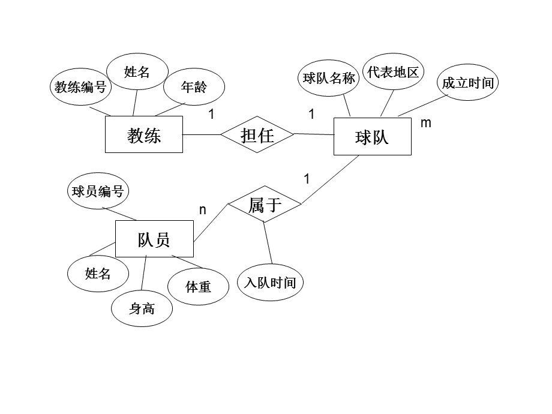

## 数据模型

数据模型与现实世界中的模型一样，是对现实世界数据特征的一种抽象。实际上，我们之前学习的类就是对现实世界数据的一种抽象，比如一个学生的特征包括姓名，年龄，年级，学号，专业等，这些特征也称为实体的一种属性，属性具有以下特点：

- 属性不可再分
- 一个实体的属性可以有很多个
- 用于唯一区分不同实体的的属性，称为Key，比如每个同学的学号都是不一样的
- 属性取值可以有一定的约束，比如性别只能是男或是女

实体或是属性之间可以具有一定的联系，比如一个老师可以教很多个学生，而学生相对于老师就是被教授的关系；又比如每个同学都有一个学号与其唯一对应，因此学号和学生之间也有一种联系。而像一个老师教多个学生的联系就是一种一对多的联系（1:n），而学号唯一对应，就是一种一对一的联系（1:1）；每一个老师不仅可以教多个学生，每一个学生也可以有多个教师，这就是一种多对多的联系（n:m）

MySQL就是一种关系型数据库，通过使用关系型数据库，我们就可以很好地存储这样带有一定联系的数据。



通过构建一个ER图，我们就能很好地理清不同数据模型之间的关系和特点。

## 数据库的规范化

要去设计存放一个实体的表，我们就需要了解数据库的关系规范化，尽可能减少“不好”的关系存在，如何设计一个优良的关系模型是最关键的内容！简而言之，我们要学习一下每一个表该如何去设计。

### 第一范式（1NF）

**属性不可再分**

第一范式是指数据库的每一列都是不可分割的基本数据项，而下面这样的就存在可分割的情况：

- 学生（姓名，电话号码）

电话号码实际上包括了`家用座机电话`和`移动电话`，因此它可以被拆分为：

- 学生（姓名，座机号码，手机号码）

满足第一范式是关系型数据库最基本的要求！

### 第二范式（2NF）

**存在主键**

第二范式要求表中必须存在主键，且其他的属性必须完全依赖于主键，比如：

- 学生（学号，姓名，性别）

学号是每个学生的唯一标识，每个学生都有着不同的学号，因此此表中存在一个主键，并且每个学生的所有属性都依赖于学号，学号发生改变就代表学生发生改变，姓名和性别都会因此发生改变，所有此表满足第二范式。

### 第三范式（3NF）

**不存在传递依赖**

在满足第二范式的情况下，所有的属性都不传递依赖于主键，满足第三范式。

- 学生借书情况（借阅编号，学生学号，书籍编号，书籍名称，书籍作者）

实际上书籍编号依赖于借阅编号，而书籍名称和书籍作者依赖于书籍编号，因此存在传递依赖的情况，我们可以将书籍信息进行单独拆分为另一张表：

- 学生借书情况（借阅编号，学生学号，书籍编号）
- 书籍（书籍编号，书籍名称，书籍作者）

这样就消除了传递依赖，从而满足第三范式。

### BCNF

**不存在关键字段决定关键字段**

BCNF作为第三范式的补充，假设仓库管理关系表为StorehouseManage(仓库ID, 存储物品ID, 管理员ID, 数量)，且有一个管理员只在一个仓库工作；一个仓库可以存储多种物品。这个数据库表中存在如下决定关系：

(仓库ID, 存储物品ID) →(管理员ID, 数量)

(管理员ID, 存储物品ID) → (仓库ID, 数量)

所以，(仓库ID, 存储物品ID)和(管理员ID, 存储物品ID)都是StorehouseManage的候选关键字，表中的唯一非关键字段为数量，它是符合第三范式的。但是，由于存在如下决定关系：

(仓库ID) → (管理员ID)

(管理员ID) → (仓库ID)

即存在关键字段决定关键字段的情况，如果修改管理员ID，那么就必须逐一进行修改，所以其不符合BCNF范式。

**问题：为什么修改管理员ID会导致问题？**

由于存在 **(仓库ID) → (管理员ID)** 和 **(管理员ID) → (仓库ID)**：

- 如果一个仓库的管理员更换了，我们需要修改所有包含该 **仓库ID** 的记录中的 **管理员ID**（因为一个仓库只能有一个管理员）。
- 反过来，如果一个管理员调到了另一个仓库，我们需要修改所有包含该 **管理员ID** 的记录中的 **仓库ID**（因为一个管理员只能属于一个仓库）。

这会导致 **数据冗余** 和 **更新异常**（修改一个地方，需要同步修改多个地方）。

**如何分解使其符合BCNF？**

我们可以将该表分解为两个表，消除 **仓库ID** 和 **管理员ID** 之间的依赖：

1. **WarehouseManager(仓库ID, 管理员ID)**
   - 存储仓库和管理员的一对一关系。
   - 候选键：**仓库ID** 或 **管理员ID**（因为它们互相决定）。
2. **StorehouseInventory(仓库ID, 存储物品ID, 数量)**
   - 存储物品在仓库中的数量。
   - 候选键：**(仓库ID, 存储物品ID)**。

这样：

- **WarehouseManager** 符合BCNF，因为 **仓库ID → 管理员ID**，而 **仓库ID** 是候选键。
- **StorehouseInventory** 符合BCNF，因为 **(仓库ID, 存储物品ID) → 数量**，而 **(仓库ID, 存储物品ID)** 是候选键。

## 认识SQL语句

结构化查询语言（Structured Query Language）简称SQL，这是一种特殊的语言，它专门用于数据库的操作。每一种数据库都支持SQL，但是他们之间会存在一些细微的差异，因此不同的数据库都存在自己的“方言”。

SQL语句不区分大小写（关键字推荐使用大写），它支持多行，并且需要使用`;`进行结尾！

SQL也支持注释，通过使用`--`或是`#`来编写注释内容，也可以使用`/*`来进行多行注释。

我们要学习的就是以下四种类型的SQL语言：

- 数据查询语言（Data Query Language, DQL）基本结构是由SELECT子句，FROM子句，WHERE子句组成的查询块。
- 数据操纵语言（Data Manipulation Language, DML）是SQL语言中，负责对数据库对象运行数据访问工作的指令集，以INSERT、UPDATE、DELETE三种指令为核心，分别代表插入、更新与删除，是开发以数据为中心的应用程序必定会使用到的指令。
- 数据库定义语言DDL(Data Definition Language)，是用于描述数据库中要存储的现实世界实体的语言。
- DCL（Data Control Language）是数据库控制语言。是用来设置或更改数据库用户或角色权限的语句，包括（grant,deny,revoke等）语句。在默认状态下，只有sysadmin,dbcreator,db_owner或db_securityadmin等人员才有权力执行DCL。

我们平时所说的CRUD其实就是增删改查（Create/Retrieve/Update/Delete）

## SQL数据类型

以下的数据类型用于字符串存储：

- char(n)可以存储任意字符串，但是是固定长度为n，如果插入的长度小于定义长度时，则用空格填充。
- varchar(n)也可以存储任意数量字符串，长度不固定，但不能超过n，不会用空格填充。

以下数据类型用于存储数字：

- smallint用于存储小的整数，范围在 (-32768，32767)
- int用于存储一般的整数，范围在 (-2147483648，2147483647)
- bigint用于存储大型整数，范围在 (-9,223,372,036,854,775,808，9,223,372,036,854,775,807)
- float用于存储单精度小数
- double用于存储双精度的小数

以下数据类型用于存储时间：

- date存储日期
- time存储时间
- year存储年份
- datetime用于混合存储日期+时间

## 数据库定义语言（DDL）

### 数据库操作

我们可以通过`create database`来创建一个数据库：                         

```sql
create database 数据库名
```

为了能够支持中文，我们在创建时可以设定编码格式：                          

```sql
CREATE DATABASE IF NOT EXISTS 数据库名 DEFAULT CHARSET utf8 COLLATE utf8_general_ci;
```

如果我们创建错误了，我们可以将此数据库删除，通过使用`drop database`来删除一个数据库：                         

```sql
drop database 数据库名
```

### 创建表

数据库创建完成后，我们一般通过`create table`语句来创建一张表：                         

```sql
create table 表名(列名 数据类型[列级约束条件],
             列名 数据类型[列级约束条件],
             ...
             [,表级约束条件])
```

### 列级约束条件

列级约束有六种：主键Primary key、外键foreign key 、唯一 unique、检查 check （MySQL不支持）、默认default 、非空/空值 not null/ null

### 表级约束条件

表级约束有四种：主键、外键、唯一、检查                       

```sql
[CONSTRAINT <外键名>] FOREIGN KEY 字段名 [，字段名2，…] REFERENCES <主表名> 主键列1 [，主键列2，…]
```

### 修改表

如果我们想修改表结构，我们可以通过`alter table`来进行修改：                          

```sql
ALTER TABLE 表名[ADD 新列名 数据类型[列级约束条件]]
							 [DROP COLUMN 列名[restrict|cascade]]
							 [ALTER COLUMN 列名 新数据类型]
```

我们可以通过ADD来添加一个新的列，通过DROP来删除一个列，不过我们可以添加restrict或cascade，默认是restrict，表示如果此列作为其他表的约束或视图引用到此列时，将无法删除，而cascade会强制连带引用此列的约束、视图一起删除。还可以通过ALTER来修改此列的属性。

### 删除表

我们可以通过`drop table`来删除一个表：                          

```sql
DROP TABLE 表名[restrict|cascade]
```

其中restrict和cascade上面的效果一致。