## Spring简介

### 1.1历史

2002年，首次推出了spring框架的雏形：interface21框架

2004年3月24日，悉尼大学音乐学博士**Rod Johnson**首次推出Spring框架1.0，解决企业应用开发的复杂性。

设计理念：使现有的技术更加容易使用，本身是一套大杂烩，整合了现有的技术框架。


- SSH：Struct2(视图框架) + Spring(融合剂) + Hibernate(全自动持久层框架)

- SSM : SpringMvc(视图框架) + Spring(融合剂) + Mybatis(半自动持久层框架，可定制性更高)

### 1.2优点

- Spring是一个开源的免费的框架（容器）

- Spring是一个轻量级的、非入侵式的框架
- 控制反转（IOC),面向方面编程（AOP)

- 支持事务的处理，对框架整合的支持

<mark>总结一句话：Spring就是一个轻量级的控制反转（IoC）和面向方面编程（AOP）的框架！</mark>

### 1.3组成

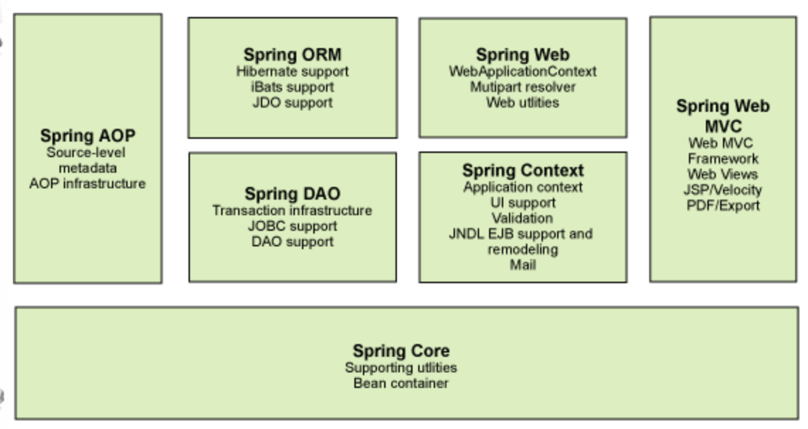

### 1.4拓展

- Spring Boot
  - 一个快速开发的脚手架
  - 基于Spring Boot可以快速的开发单个微服务
  - <mark>约定大于配置</mark>

- Spring Cloud
  - SpringCloud是基于SpringBoot实现的

现在大多数公司都在使用SpringBoot进行快速开发，所以先掌握Spring及SpringMVC很重要，承上启下！

## IoC

假如我们需要在程序内构建一辆”车“，那么我们传统的思想一般是下面这样的。

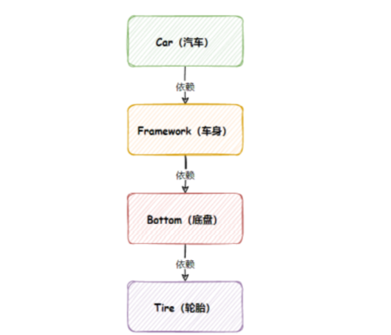

想要构建一辆汽车，首先要依赖于车身，而车身又依赖于地盘。而底盘需要轮胎。最终我们得到下面的代码。

```java
public class Main {
    public static void main(String[] args) {
        Car car = new Car();
        car.init();
   }
    /**
     * 汽⻋对象
     */
    static class Car {
        public void init() {
            // 依赖⻋身
            Framework framework = new Framework();
            framework.init();
       }
   }
    /**
     * ⻋身类
     */
    static class Framework {
        public void init() {
            // 依赖底盘
            Bottom bottom = new Bottom();
            bottom.init();
       }
   }
    /**
     * 底盘类
     */
    static class Bottom {
        public void init() {
            // 依赖轮胎
            Tire tire = new Tire();
            tire.init();
       }
   }
    /**
     * 轮胎类
     */
    static class Tire {
     // 尺⼨
        private int size = 30;
        public void init() {
            System.out.println("轮胎尺⼨：" + size);
       }
   }
}
```

 虽然这段代码的确能够满足需求，但是我们不难发现一个特点，就是它的耦合性非常高。假如我们需要更改轮胎的尺寸，我们需要将轮胎以及所有依赖轮胎的组件的构造方法全部更改一遍，加上size参数，例如下面那样。

```java
public class Main {
    public static void main(String[] args) {
        Car car = new Car(20);
        car.run();
   }
    /**
     * 汽⻋对象
     */
    static class Car {
        private Framework framework;
        public Car(int size) {
            framework = new Framework(size);
       }
        public void run() {
            // 依赖⻋身
            framework.init();
       }
   }
    /**
     * ⻋身类
     */
    static class Framework {
        private Bottom bottom;
        public Framework(int size) {
            bottom = new Bottom(size);
       }
        public void init() {
            // 依赖底盘
            bottom.init();
       }
   }
    /**
     * 底盘类
     */
    static class Bottom {
        private Tire tire;
public Bottom(int size) {
            tire = new Tire(size);
       }
        public void init() {
            // 依赖轮胎
            tire.init();
       }
   }
    /**
     * 轮胎类
     */
    static class Tire {
        // 尺⼨
        private int size;
        public Tire(int size) {
            this.size = size;
       }
        public void init() {
            System.out.println("轮胎尺⼨：" + size);
       }
   }
}
```

而在实际开发过程中，需求变更是很常见的。而我们不难看出，以上程序的问题是：**当最底层代码改动之后，整个调⽤链上的所有代码都需要修改。**这在实际开发过程中就会严重拖慢我们的进度，那么有什么办法能够解决这个问题呢。我们看看以下的代码。

```java
public class Main {
    public static void main(String[] args) {
        Tire tire = new Tire(20);
        Bottom bottom = new Bottom(tire);
        Framework framework = new Framework(bottom);
        Car car = new Car(framework);
        car.run();
   }
    static class Car {
        private Framework framework;
        public Car(Framework framework) {
            this.framework = framework;
       }
        public void run() {
            framework.init();
       }
   }
    static class Framework {
        private Bottom bottom;
        public Framework(Bottom bottom) {
            this.bottom = bottom;
       }
        public void init() {
            bottom.init();
       }
   }
    static class Bottom {
        private Tire tire;
        public Bottom(Tire tire) {
            this.tire = tire;
       }
        public void init() {
            tire.init();
       }
   }
static class Tire {
        private int size;
        public Tire(int size) {
            this.size = size;
       }
        public void init() {
            System.out.println("轮胎：" + size);
       }
   }
}
```

 可以看到我们先创建了所有的下级依赖类，然后再通过参数传递的方式注入。这样我们不需 要在当前类中创建下级类了，所以下级类即使发⽣变化（创建或减少参数），当前类本身也⽆需修改任 何代码，这样就完成了程序的解耦。

 以上就是所谓的控制反转式程序开发。此时⽆论底层类如何变化，整个调⽤链是不⽤做任何改变的，这样就完成了代码之间的解耦，从⽽实现了更加灵活、通⽤的程序设计了。
在传统的代码中对象创建顺序是：Car -> Framework -> Bottom -> Tire

改进之后解耦的代码的对象创建顺序是：Tire -> Bottom -> Framework -> Car
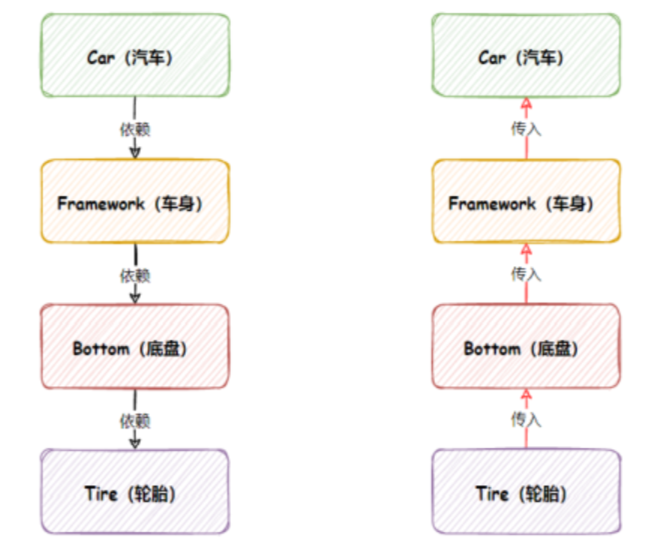

这里我们可以发现：通⽤程序的实现代码，类的创建顺序是反的，传统代码是 Car 控制并创建了 Framework，Framework 创建并创建了 Bottom，依次往下，⽽改进之后的控制权发⽣的反转，不再是上级对象创建并控制下级对象了，⽽是下级对象把注⼊将当前对象中，下级的控制权不再由上级类控制了，这样即使下级类发⽣任何改变，当前类都是不受影响的，这就是典型的控制反转，也就是 IoC 的实现思想。 

仔细去思考一下 , 以前所有东西都是由程序去进行控制创建 , 而现在是由我们自行控制创建对象 , 把主动权交给了调用者 . 程序不用去管怎么创建,怎么实现了 . 它只负责提供一个接口 .

这种思想 , 从本质上解决了问题 , 我们不再去管理对象的创建了 , 更多的去关注业务的实现 . 耦合性大大降低 . 这也就是IOC的原型 !

### IoC本质

控制反转IoC(Inversion of Control)，是一种设计思想，DI(依赖注入)是实现IoC的一种方法，也有人认为DI只是IoC的另一种说法。没有IoC的程序中 , 我们使用面向对象编程 , 对象的创建与对象间的依赖关系完全硬编码在程序中，对象的创建由程序自己控制，控制反转后将对象的创建转移给第三方，所谓控制反转就是：获得依赖对象的方式反转了。

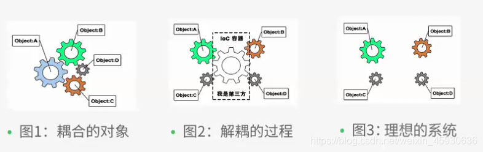

IoC是Spring框架的核心内容，使用多种方式完美的实现了IoC，可以使用XML配置，也可以使用注解，新版本的Spring也可以零配置实现IoC。

Spring容器在初始化时先读取配置文件，根据配置文件或元数据创建与组织对象存入容器中，程序使用时再从Ioc容器中取出需要的对象。

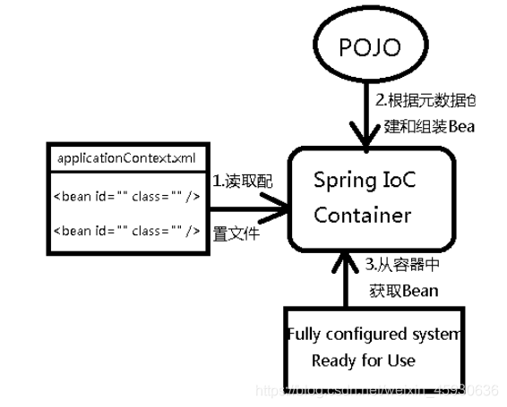

采用XML方式配置Bean的时候，Bean的定义信息是和实现分离的，而采用注解的方式可以把两者合为一体，Bean的定义信息直接以注解的形式定义在实现类中，从而达到了零配置的目的。

控制反转是一种通过描述（XML或注解）并通过第三方去生产或获取特定对象的方式。在Spring中实现控制反转的是IoC容器，其实现方法是依赖注入（Dependency Injection,DI）。

### IoC容器的使用

#### Bean注册与配置

1.Spring为我们提供了一个IoC容器用于存放我们需要使用的对象，我们可以将对象交给IoC容器来管理，当我们需要使用对象时，就可以向IoC容器索要，并由它来决定给我们哪一个对象。要使用IoC容器，就需要创建一个应用程序上下文，它代表的就是IoC容器，它会负责实例化、配置和组装Bean:

```java
ApplicationContext context = new ClassPathXmlApplicationContext("test.xml")
```

它有很多种实现方式，这里使用xml配置文件所以使用ClassPathXmlApplicationContext。

2.当你写好了一个bean，可以在xml文件里添加上。

```xml
<bean name="a" class="com.test.bean.Student"/>
<bean name="b" class="com.test.bean.Student"/>
```

class指定bean的类型,name（或id)表示该bean的唯一标识。

我们可以给Bean起名字，也可以起别名，就像我们除了有一个名字之外，可能在家里还有自己的小名：

```xml
<bean name="a" class="com.test.bean.Student"/>
<alias name="a" alias="test"/>
```

在xml文件上的bean可以通过context的getBean方法得到。getBean方法的参数可以是类型或name等。

3.那么现在又有新的问题了，IoC容器创建的Bean是只有一个还是每次索要的时候都会给我们一个新的对象？

实际上，我们配置的bean有两种模式(scope)。第一种是`singleton`，默认情况下就是这一种，当然还有`prototype`，表示为原型模式（为了方便叫多例模式也行）这种模式每次得到的对象都是一个新的。当Bean的作用域为单例模式时，那么它会在一开始（容器加载配置时）就被创建，我们之后拿到的都是这个对象。而处于原型模式下，只有在获取时才会被创建，也就是说，单例模式下，Bean会被IoC容器存储，只要容器没有被销毁，那么此对象将一直存在，而原型模式才是相当于在要用的时候直接new了一个对象，并不会被保存。

当然，如果我们希望单例模式下的Bean不用再一开始就加载，而是一样等到需要时再加载（加载后依然会被容器存储，之后一直使用这个对象了，不会再创建新的）我们也可以开启懒加载：

```xml
<bean class="com.test.bean.Student" lazy-init="true"/>
```

开启懒加载后，只有在真正第一次使用时才会创建对象。

因为单例模式下Bean是由IoC容器加载，但是加载顺序我们并不清楚，如果我们需要维护Bean的加载顺序（比如某个Bean必须要在另一个Bean之前创建）那么我们可以使用`depends-on`来设定前置加载Bean，这样被依赖的Bean一定会在之前加载，比如Teacher应该在Student之前加载：        

```xml
<bean name="teacher" class="com.test.bean.Teacher"/>
<bean name="student" class="com.test.bean.Student" depends-on="teacher"/>
```

这样就可以保证Bean的加载顺序了。

#### 依赖注入

4.IoC容器在创建对象时，需要将我们预先给定的属性注入到对象中，非常简单，我们可以使用`property`标签来实现，

首先依赖注入要求对应的属性必须有一个set方法：      

```java
public class Student {
    private Teacher teacher;
  	//要使用依赖注入，我们必须提供一个set方法（无论成员变量的访问权限是什么）命名规则依然是驼峰命名法
    public void setTeacher(Teacher teacher) {
        this.teacher = teacher;
    }
    ...
```

然后我们将bean标签展开插入property标签：             

```xml
<bean name="teacher" class="com.test.bean.ProgramTeacher"/>
<bean name="student" class="com.test.bean.Student">
    <property name="teacher" ref="teacher"/>
</bean>
```

- **`name="teacher"`**：指定了`Student`类中需要注入的属性名称，即`teacher`属性。
- **`ref="teacher"`**：表示这个`teacher`属性的值引用了前面定义的`teacher` Bean。也就是说，`Student`类的`teacher`属性会被注入为`ProgramTeacher`类的实例。

更改这两个属性，就达到了切换不同的实现。

当然，依赖注入并不一定要注入其他的Bean，也可以是一个简单的值：

```xml
<bean name="student" class="com.test.bean.Student">
    <property name="name" value="卢本伟"/>
</bean>
```

直接使用`value`可以直接传入一个具体值。

5.实际上，在很多情况下，类中的某些参数是在构造方法中就已经完成的初始化，而不是创建之后，比如：           

```java
public class Student {
    private final Teacher teacher;   //构造方法中完成，所以说是一个final变量

    public Student(Teacher teacher){   //Teacher属性是在构造方法中完成的初始化
        this.teacher = teacher;
    }
  	...
```

我们前面说了，Bean实际上是由IoC容器进行创建的，但是现在我们修改了默认的无参构造，可以看到配置文件里面报错了：

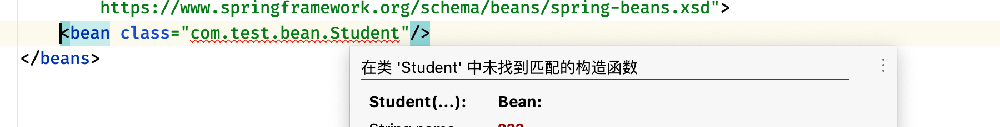

指定构造器

很明显，是因为我们修改了构造方法，IoC容器默认只会调用无参构造，所以，我们需要指明一个可以用的构造方法，我们展开bean标签，添加一个`constructor-arg`标签：   

```xml
<bean name="teacher" class="com.test.bean.ArtTeacher"/>
<bean name="student" class="com.test.bean.Student">
    <constructor-arg name="teacher" ref="teacher"/>
</bean>
```

这里的`constructor-arg`就是构造方法的一个参数，这个参数可以写很多个，会自动匹配符合里面参数数量的构造方法，这里匹配的就是我们刚刚编写的需要一个参数的构造方法。

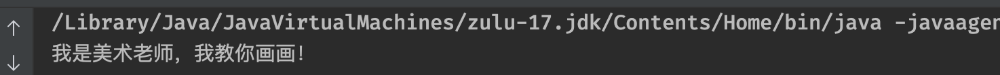

通过这种方式，我们也能实现依赖注入，只不过现在我们将依赖注入的时机提前到了对象构造时。

那要是出现这种情况呢？现在我们的Student类中是这样定义的：

```java
public class Student {
    private final String name;
    public Student(String name){
        System.out.println("我是一号构造方法");
        this.name = name;
    }

    public Student(int age){
        System.out.println("我是二号构造方法");
        this.name = String.valueOf(age);
    }
}
```

此时我们希望使用的是二号构造方法，那么怎么才能指定呢？有2种方式，我们可以给标签添加类型：

```xml
<constructor-arg value="1" type="int"/>
```

也可以指定为对应的参数名称：                   

```xml
<constructor-arg value="1" name="age"/>
```

反正只要能够保证我们指定的参数匹配到目标构造方法即可。

6.特殊的类型

现在我们的类中出现了一个比较特殊的类型，它是一个集合类型：    

```java
public class Student {
    private List<String> list;

    public void setList(List<String> list) {
        this.list = list;
    }
}
```

对于这种集合类型，有着特殊的支持：          

```xml
<bean name="student" class="com.test.bean.Student">
  	<!--  对于集合类型，我们可以直接使用标签编辑集合的默认值  -->
    <property name="list">
        <list>
            <value>AAA</value>
            <value>BBB</value>
            <value>CCC</value>
        </list>
    </property>
</bean>
```

不仅仅是List，Map、Set这类常用集合类包括数组在内，都是支持这样编写的，比如Map类型，我们也可以使用`entry`来注入：

```xml
<bean name="student" class="com.test.bean.Student">
    <property name="map">
        <map>
            <entry key="语文" value="100.0"/>
            <entry key="数学" value="80.0"/>
            <entry key="英语" value="92.5"/>
        </map>
    </property>
</bean>
```

至此，我们就已经完成了两种依赖注入的学习：

- Setter依赖注入：通过成员属性对应的set方法完成注入。
- 构造方法依赖注入：通过构造方法完成注入。

#### 自动装配

**autowire实现自动装配**

在之前，如果我们需要使用依赖注入的话，我们需要对`property`参数进行配置：       

```xml
<bean name="student" class="com.test.bean.Student">
    <property name="teacher" ref="teacher"/>
</bean>
```

但是有些时候为了方便，我们也可以开启自动装配。自动装配就是让IoC容器自己去寻找需要填入的值，我们只需要将set方法提供好就可以了，这里需要添加autowire属性：             

```xml
<bean name="student" class="com.test.bean.Student" autowire="byType"/>
```

`autowire`属性有两个值普通，一个是byName，还有一个是byType，顾名思义，一个是根据类型去寻找合适的Bean自动装配，还有一个是根据名字去找，这样我们就不需要显式指定`property`了。


此时set方法旁边会出现一个自动装配图标，效果和上面是一样的。

对于使用构造方法完成的依赖注入，也支持自动装配，我们只需要将autowire修改为：   

```xml
<bean name="student" class="com.test.bean.Student" autowire="constructor"/>
```

这样，我们只需要提供一个对应参数的构造方法就可以了（这种情况默认也是byType寻找的）：


这样同样可以完成自动注入：


**autowire-candidate和primary解决类型相同问题**

自动化的东西虽然省事，但是太过机械，有些时候，自动装配可能会遇到一些问题，比如出现了下面的情况：

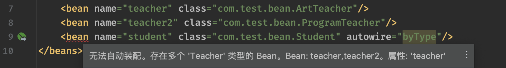

此时，由于`autowire`的规则为byType，存在两个候选Bean，但是我们其实希望ProgramTeacher这个Bean在任何情况下都不参与到自动装配中，此时我们就可以将它的自动装配候选关闭：     

```xml
<bean name="teacher" class="com.test.bean.ArtTeacher"/>
<bean name="teacher2" class="com.test.bean.ProgramTeacher" autowire-candidate="false"/>
<bean name="student" class="com.test.bean.Student" autowire="byType"/>
```

当`autowire-candidate`设定false时，这个Bean将不再作为自动装配的候选Bean，此时自动装配候选就只剩下一个唯一的Bean了，报错消失，程序可以正常运行。

除了这种方式，我们也可以设定primary属性，表示这个Bean作为主要的Bean，当出现歧义时，也会优先选择：             

```xml
<bean name="teacher" class="com.test.bean.ArtTeacher" primary="true"/>
<bean name="teacher2" class="com.test.bean.ProgramTeacher"/>
<bean name="student" class="com.test.bean.Student" autowire="byType"/>
```

这样写程序依然可以正常运行，并且选择的也是ArtTeacher。

#### 生命周期与继承

**`init-method`和`destroy-method`来指定初始和销毁方法**

除了修改构造方法，我们也可以为Bean指定初始化方法inti()和销毁方法destroy()，以便在对象创建和被销毁时执行一些其他的任务。

我们可以通过`init-method`和`destroy-method`来指定：

```xml
<bean name="student" class="com.test.bean.Student" init-method="init" destroy-method="destroy"/>
```

那么什么时候是初始化，什么时候又是销毁呢？

```java
//当容器创建时，默认情况下Bean都是单例的，那么都会在一开始就加载好，对象构造完成后，会执行init-method
ClassPathXmlApplicationContext context = new ClassPathXmlApplicationContext("test.xml");
//我们可以调用close方法关闭容器，此时容器内存放的Bean也会被一起销毁，会执行destroy-method
context.close();
```

所以说，最后的结果为：

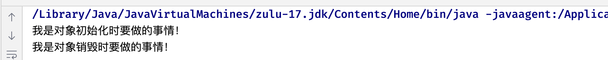

注意，如果Bean不是单例模式，而是采用的原型模式，那么就只会在获取时才创建，并调用init-method，而对应的销毁方法不会被调用（因此，对于原型模式下的Bean，Spring无法顾及其完整生命周期，而在单例模式下，Spring能够从Bean对象的创建一直管理到对象的销毁）。

**parent实现属性继承**

Bean之间也是具备继承关系的，只不过这里的继承并不是类的继承，而是属性的继承，比如：        

```java
public class SportStudent {
    private String name;

    public void setName(String name) {
        this.name = name;
    }
}                   
```

```java
public class ArtStudent {
    private String name;
   
    public void setName(String name) {
        this.name = name;
    }
}
```

此时，我们先将ArtStudent注册一个Bean：              

```xml
<bean name="artStudent" class="com.test.bean.ArtStudent">
    <property name="name" value="小明"/>
</bean>
```

这里我们会注入一个name的初始值，此时我们创建了一个SportStudent的Bean，我们希望这个Bean的属性跟刚刚创建的Bean属性是一样的，那么我们可以写一个一模一样的：                 

```xml
<bean class="com.test.bean.SportStudent">
    <property name="name" value="小明"/>
</bean>
```

但是如果属性太多的话，是不是写起来有点麻烦？这种情况，我们就可以配置Bean之间的继承关系了，我们可以让SportStudent这个Bean直接继承ArtStudent这个Bean配置的属性：            

```xml
<bean class="com.test.bean.SportStudent" parent="artStudent"/>
```

这样，在ArtStudent Bean中配置的属性，会直接继承给SportStudent Bean（注意，所有配置的属性，在子Bean中必须也要存在， 并且可以进行注入，否则会出现错误）当然，如果子类中某些属性比较特殊，也可以在继承的基础上单独配置：        

```xml
<bean name="artStudent" class="com.test.bean.ArtStudent" abstract="true">
    <property name="name" value="小明"/>
    <property name="id" value="1"/>
</bean>
<bean class="com.test.bean.SportStudent" parent="artStudent">
    <property name="id" value="2"/>
</bean>
```

**abstract将Bean仅作为一个配置模版**

如果我们只是希望某一个Bean仅作为一个配置模版供其他Bean继承使用，那么我们可以将其配置为abstract，这样，容器就不会创建这个Bean的对象了：        

```xml
<bean name="artStudent" class="com.test.bean.ArtStudent" abstract="true">
    <property name="name" value="小明"/>
</bean>
<bean class="com.test.bean.SportStudent" parent="artStudent"/>
```

注意，一旦声明为抽象Bean，那么就无法通过容器获取到其实例化对象了。

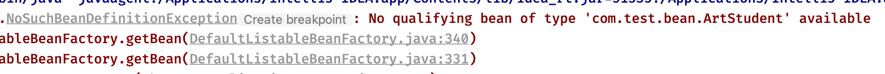

**大标签beans实现全局默认配置**

如果我们希望整个上下文中所有的Bean都采用某种配置，我们可以在最外层的beans标签中进行默认配置：

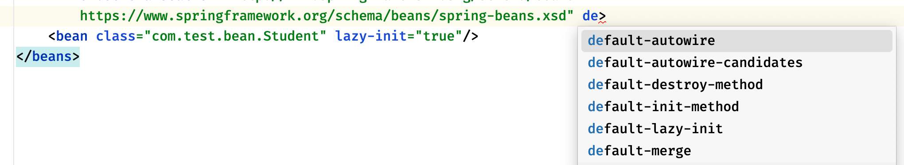

这样，即使Bean没有配置某项属性，但是只要在最外层编写了默认配置，那么同样会生效，除非Bean自己进行配置覆盖掉默认配置。

#### 工厂模式和工厂Bean

**factory-method实现static方法下的工厂模式创建工厂Bean**

前面我们介绍了IoC容器的Bean创建机制，默认情况下，容器会调用Bean对应类型的构造方法进行对象创建，但是在某些时候，我们可能不希望外界使用类的构造方法完成对象创建，比如在工厂方法设计模式中（详情请观看《Java设计模式》篇 视频教程）我们更希望 Spring不要直接利用反射机制通过构造方法创建Bean对象， 而是利用反射机制先找到对应的工厂类，然后利用工厂类去生成需要的Bean对象：  

```java
public class Student {
    Student() {
        System.out.println("我被构造了");
    }
}
```

```java
public class StudentFactory {
    public static Student getStudent(){
      	System.out.println("欢迎光临电子厂");
        return new Student();
    }
}
```

此时Student有一个工厂，我们正常情况下需要使用工厂才可以得到Student对象，现在我们希望Spring也这样做，不要直接去反射搞构造方法创建，我们可以通过factory-method进行指定：

```xml
<bean class="com.test.bean.StudentFactory" factory-method="getStudent"/>
```

注意，这里的Bean类型需要填写为Student类的工厂类，并且添加factory-method指定对应的工厂方法，但是最后注册的是工厂方法的返回类型，所以说依然是Student的Bean：


此时我们再去进行获取，拿到的也是通过工厂方法得到的对象：

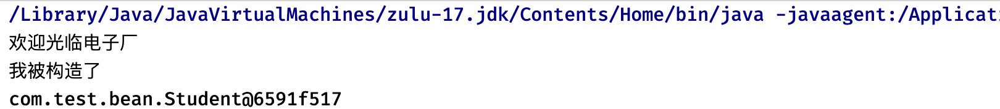

这里有一个误区，千万不要认为是我们注册了StudentFactory这个Bean，class填写为这个类这个只是为了告诉Spring我们的工厂方法在哪个位置，真正注册的是工厂方法提供的东西。

可以发现，**当我们采用工厂模式后，我们就无法再通过配置文件对Bean进行依赖注入等操作了，而是只能在工厂方法中完成**，这似乎与Spring的设计理念背道而驰？

**两种方式实现非static方法的工厂模式创建工厂Bean**

第一种

当然，可能某些工厂类需要构造出对象之后才能使用，我们也可以将某个工厂类直接注册为工厂Bean： 

```java
public class StudentFactory {
    public Student getStudent(){
        System.out.println("欢迎光临电子厂");
        return new Student();
    }
}
```

现在需要StudentFactory对象才可以获取到Student，此时我们就只能先将其注册为Bean了：                 

```xml
<bean name="studentFactory" class="com.test.bean.StudentFactory"/>
```

像这样将工厂类注册为Bean，我们称其为工厂Bean，然后再使用`factory-bean`来指定Bean的工厂Bean：               

```xml
<bean factory-bean="studentFactory" factory-method="getStudent"/>
```

注意，使用factory-bean之后，不再要求指定class，我们可以直接使用了：


此时可以看到，工厂方法上同样有了图标，这种方式，由于工厂类被注册为Bean，此时我们就可以在配置文件中为工厂Bean配置依赖注入等内容了。

第二种

通过在bean工厂类实现FactoryBean< T > 接口，T为该工厂生产Bean的类型。它有两个需要实现的方法，一个是获取工厂Bean的方法，一个是生产Bean的类型。

这里还有一个很细节的操作，如果我们想获取工厂Bean为我们提供的Bean，可以直接输入工厂Bean的名称，这样不会得到工厂Bean的实例，而是工厂Bean生产的Bean的实例：             

```java
Student bean = (Student) context.getBean("studentFactory");
```

当然，如果我们需要获取工厂类的实例，可以在名称前面添加`&`符号：           

```java
StudentFactory bean = (StudentFactory) context.getBean("&studentFactory");
```

又是一个小细节。

#### 使用注解开发

既然现在要使用注解来进行开发，那么我们就删掉之前的xml配置文件吧，我们来看看使用注解能有多方便。            

```java
ApplicationContext context = new AnnotationConfigApplicationContext();
```

现在我们使用AnnotationConfigApplicationContext作为上下文实现，它是注解配置的。

既然现在采用注解，我们就需要使用类来编写配置文件，在之前，我们如果要编写一个配置的话，需要：                  

```xml
<?xml version="1.0" encoding="UTF-8"?>
<beans xmlns="http://www.springframework.org/schema/beans"
       xmlns:xsi="http://www.w3.org/2001/XMLSchema-instance"
       xsi:schemaLocation="http://www.springframework.org/schema/beans
        https://www.springframework.org/schema/beans/spring-beans.xsd">
</beans>
```

现在我们只需要创建一个配置类(类上加上configuration注解)就可以了：                 

```java
@Configuration
public class MainConfiguration {
}
```

这两者是等价的，同样的，在一开始会提示我们没有配置上下文(新版idea可能自动配置好了)：

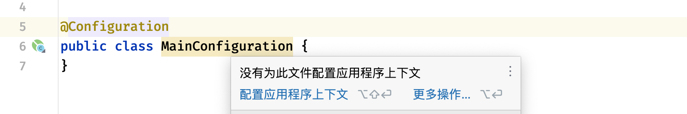

这里按照要求配置一下就可以，同上，这个只是会影响IDEA的代码提示，不会影响程序运行。

我们可以为AnnotationConfigApplicationContext指定一个默认的配置类：                  

```java
ApplicationContext context = new AnnotationConfigApplicationContext(MainConfiguration.class);
//这个构造方法可以接收多个配置类（更准确的说是多个组件）
```

那么现在我们该如何配置Bean呢？           

```java
@Configuration
public class MainConfiguration {

    @Bean("student")
    public Student student(){
        return new Student();
    }
}
```

这样写相对于配置文件中的：             

```xml
<?xml version="1.0" encoding="UTF-8"?>
<beans xmlns="http://www.springframework.org/schema/beans"
       xmlns:xsi="http://www.w3.org/2001/XMLSchema-instance"
       xsi:schemaLocation="http://www.springframework.org/schema/beans
        https://www.springframework.org/schema/beans/spring-beans.xsd">
    <bean name = "student" class="com.test.bean.Student"/>
</beans>
```

通过@Import还可以引入其他配置类：                      

```java
@Import(LBWConfiguration.class)  //在讲解到Spring原理时，我们还会遇到它，目前只做了解即可。
@Configuration
public class MainConfiguration {
```

只不过现在变成了由Java代码为我们提供Bean配置，这样会更加的灵活，也更加便于控制Bean对象的创建。              

```java
ApplicationContext context = new AnnotationConfigApplicationContext(MainConfiguration.class);
Student student = context.getBean(Student.class);
System.out.println(student);
```

使用方法是相同的，这跟使用XML配置是一样的。

那么肯定就有小伙伴好奇了，我们之前使用的那么多特性在哪里配置呢？首先，初始化方法和摧毁方法、自动装配可以直接在@Bean注解中进行配置：                  

```java
@Bean(name = "", initMethod = "", destroyMethod = "", autowireCandidate = false)
public Student student(){
    return new Student();
}
```

其次，我们可以使用一些其他的注解来配置其他属性，比如：         

```java
@Bean
@Lazy(true)     //对应lazy-init属性
@Scope("prototype")    //对应scope属性
@DependsOn("teacher")    //对应depends-on属性
public Student student(){
    return new Student();
}
```

对于那些我们需要通过构造方法或是Setter完成依赖注入的Bean，比如：         

```xml
<bean name="teacher" class="com.test.bean.ProgramTeacher"/>
<bean name="student" class="com.test.bean.Student">
    <property name="teacher" ref="teacher"/>
</bean>
```

像这种需要引入其他Bean进行的注入，我们可以直接将其作为形式参数放到方法中：

```java
@Configuration
public class MainConfiguration {
    @Bean
    public Teacher teacher(){
        return new Teacher();
    }

    @Bean
    public Student student(Teacher teacher){
        return new Student(teacher);
    }
}
```

此时我们可以看到，旁边已经出现图标了：


运行程序之后，我们发现，这样确实可以直接得到对应的Bean并使用。

只不过，除了这种基于构造器或是Setter的依赖注入之外，我们也可以直接到Bean对应的类中使用自动装配：               

```java
public class Student {
    @Autowired   //使用此注解来进行自动装配，由IoC容器自动为其赋值
    private Teacher teacher;
}
```

现在，我们甚至连构造方法和Setter都不需要去编写了，就能直接完成自动装配,太棒了。

当然，@Autowired并不是只能用于字段，对于构造方法或是Setter，它同样可以：          

```java
public class Student {
    private Teacher teacher;

    @Autowired
    public void setTeacher(Teacher teacher) {
        this.teacher = teacher;
    }
}
```

@Autowired默认采用byType的方式进行自动装配，也就是说会使用类型进行装配，那么要是出现了多个相同类型的Bean，如果我们想要指定使用其中的某一个该怎么办呢？                

```java
@Bean("a")
public Teacher teacherA(){
    return new Teacher();
}

@Bean("b")
public Teacher teacherB(){
    return new Teacher();
}
```

此时，我们可以配合@Qualifier进行名称匹配：         

```java
public class Student {
    @Autowired
    @Qualifier("a")   //匹配名称为a的Teacher类型的Bean
    private Teacher teacher;
}
```

随着Java版本的更新迭代，某些javax包下的包，会被逐渐弃用并移除。在JDK11版本以后，javax.annotation这个包被移除并且更名为jakarta.annotation其中有一个非常重要的注解，叫做@Resource，它的作用与@Autowired时相同的，也可以实现自动装配，但是在IDEA中并不推荐使用@Autowired注解对成员字段进行自动装配，而是推荐使用@Resource，如果需要使用这个注解，还需要额外导入包：               

```xml
<dependency>
    <groupId>jakarta.annotation</groupId>
    <artifactId>jakarta.annotation-api</artifactId>
    <version>2.1.1</version>
</dependency>
```

使用方法一样，直接替换掉就可以了：            

```java
public class Student {
    @Resource
    private Teacher teacher;
}
```

只不过，他们两有些机制上的不同：

- @Resource默认**ByName**如果找不到则**ByType**，可以添加到set方法、字段上。
- @Autowired默认是**byType**，只会根据类型寻找，可以添加在构造方法、set方法、字段、方法参数上。

因为@Resource的匹配机制更加合理高效，因此idea官方并不推荐使用@Autowired字段注入，当然，实际上Spring官方更推荐我们使用基于构造方法或是Setter的@Autowired注入，比如Setter 注入的一个好处是，Setter 方法使该类的对象能够在以后重新配置或重新注入。其实，最后使用哪个注解，还是看你自己，要是有强迫症不能忍受黄标但是又实在想用字段注入，那就用@Resource注解。

除了这个注解之外，还有@PostConstruct和@PreDestroy，它们效果和init-method和destroy-method是一样的：       

```java
@PostConstruct
public void init(){
    System.out.println("我是初始化方法");
}

@PreDestroy
public void destroy(){
    System.out.println("我是销毁方法");
}
```

我们只需要将其添加到对应的方法上即可：      

```java
AnnotationConfigApplicationContext context = new AnnotationConfigApplicationContext(MainConfiguration.class);
Student student = context.getBean(Student.class);
context.close();
```

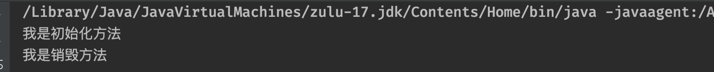

可以看到效果是完全一样的，这些注解都是jakarta.annotation提供的。

前面我们介绍了使用@Bean来注册Bean，但是实际上我们发现，如果只是简单将一个类作为Bean的话，这样写还是不太方便，因为都是固定模式，就是单纯的new一个对象出来，能不能像之前一样，让容器自己反射获取构造方法去生成这个对象呢？

肯定是可以的，我们可以在需要注册为Bean的类上添加`@Component`注解来将一个类进行注册**（现在最常用的方式）**，不过要实现这样的方式，我们需要添加一个自动扫描来告诉Spring，它需要在哪些包中查找我们提供的`@Component`声明的Bean。         

```java
@Component("dmw")   //同样可以自己起名字
public class Student {

}
```

要注册这个类的Bean，只需要添加@Component即可，然后配置一下包扫描：

```java
@Configuration
@ComponentScan("com.test.bean")   //包扫描，这样Spring就会去扫描对应包下所有的类
public class MainConfiguration {

}
```

Spring在扫描对应包下所有的类时，会自动将那些添加了@Component的类注册为Bean，是不是感觉很方便？只不过这种方式只适用于我们自己编写类的情况，如果是第三方包提供的类，只能使用前者完成注册，并且这种方式并不是那么的灵活。

不过，无论是通过@Bean还是@Component形式注册的Bean，Spring都会为其添加一个默认的name属性，比如：                        

```java
@Component
public class Student {
}
```

它的默认名称生产规则依然是类名并按照首字母小写的驼峰命名法来的，所以说对应的就是student：      

```java
Student student = (Student) context.getBean("student");   //这样同样可以获取到
System.out.println(student);
```

同样的，如果是通过@Bean注册的，默认名称是对应的方法名称：

```java
@Bean
public Student artStudent(){
    return new Student();
}            
```

```java
Student student = (Student) context.getBean("artStudent");
System.out.println(student);
```

相比传统的XML配置方式，注解形式的配置确实能够减少我们很多工作量。并且，对于这种使用`@Component`注册的Bean，如果其构造方法不是默认无参构造，那么默认会对其每一个参数都进行自动注入：            

```java
@Component
public class Student {
    Teacher teacher;
    public Student(Teacher teacher){   //如果有Teacher类型的Bean，那么这里的参数会被自动注入
        this.teacher = teacher;
    }
}
```

最后，对于我们之前使用的工厂模式，Spring也提供了接口，我们可以直接实现接口表示这个Bean是一个工厂Bean：                    

```java
@Component
public class StudentFactory implements FactoryBean<Student> {
    @Override
    public Student getObject() {   //生产的Bean对象
        return new Student();
    }

    @Override
    public Class<?> getObjectType() {   //生产的Bean类型
        return Student.class;
    }

    @Override
    public boolean isSingleton() {   //生产的Bean是否采用单例模式
        return false;
    }
}
```

实际上跟我们之前在配置文件中编写是一样的，这里就不多说了。

请注意，使用注解虽然可以省事很多，代码也能变得更简洁，但是这并不代表XML配置文件就是没有意义的，它们有着各自的优点，在不同的场景下合理使用，能够起到事半功倍的效果。


至此，关于Spring的IoC基础部分，我们就全部介绍完了。在最后，完成一个问题，现在有两个类：

```java
@Component
public class Student {
    @Resource
    private Teacher teacher;
} 
```

```java
@Component
public class Teacher {
    @Resource
    private Student student;
}
```

这两个类互相需要注入对方的实例对象，这个时候Spring会怎么进行处理呢？如果Bean变成原型模式，Spring又会怎么处理呢？

## Spring高级特性

### Bean Aware

在Spring中提供了一些以Aware结尾的接口，实现了Aware接口的bean在被初始化之后，可以获取相应资源。Aware的中文意思为**感知**。简单来说，他就是一个标识，实现此接口的类会获得某些感知能力，Spring容器会在Bean被加载时，根据类实现的感知接口，会调用类中实现的对应感知方法。

比如BeanNameAware之类的以Aware结尾的接口，这个接口获取的资源就是BeanName：

```java
@Component
public class Student implements BeanNameAware {   //我们只需要实现这个接口就可以了

    @Override
    public void setBeanName(String name) {   //Bean在加载的时候，容器就会自动调用此方法，将Bean的名称给到我们
        System.out.println("我在加载阶段获得了Bean名字："+name);
    }
}
```

实现BeanClassLoaderAware接口，那么它能够使得我们可以在Bean加载阶段就获取到当前Bean的类加载器：         

```java
@Component
public class Student implements BeanClassLoaderAware {

    @Override
    public void setBeanClassLoader(ClassLoader classLoader) {
        System.out.println(classLoader);
    }
}
```

实现ApplicationContextAware接口，它可以使我们在Bean加载阶段得到Bean的应用程序上下文。

```java
@Component
public class Student implements ApplicationContextAware {

    @Override
    public void setBeanApplicationContext(ApplicationContext applicationContext) {
        System.out.println(applicationContext);
    }
}
```

### 任务调度

为了执行某些任务，我们可能需要一些非常规的操作，比如我们希望使用多线程来处理我们的结果或是执行一些定时任务，到达指定时间再去执行。这时我们首先想到的就是创建一个新的线程来处理，或是使用TimerTask来完成定时任务，但是我们有了Spring框架之后，就不用这样了，因为Spring框架为我们提供了更加便捷的方式进行任务调度。

#### 异步任务

首先我们来看异步任务执行，需要使用Spring异步任务支持，我们需要**1.在配置类上添加`@EnableAsync`注解**。           

```java
@EnableAsync
@Configuration
@ComponentScan("com.test.bean")
public class MainConfiguration {
}
```

接着我们只需要**2.在需要异步执行的方法上，添加`@Async`注解即可将此方法标记为异步**，当此方法被调用时，会异步执行，也就是新开一个线程执行，而不是在当前线程执行。我们来测试一下：      

```java
@Component
public class Student {
    public void syncTest() throws InterruptedException {
        System.out.println(Thread.currentThread().getName()+"我是同步执行的方法，开始...");
        Thread.sleep(3000);
        System.out.println("我是同步执行的方法，结束！");
    }

    @Async
    public void asyncTest() throws InterruptedException {
        System.out.println(Thread.currentThread().getName()+"我是异步执行的方法，开始...");
        Thread.sleep(3000);
        System.out.println("我是异步执行的方法，结束！");
    }
}
```

现在我们在主方法中分别调用一下试试看：    

```java
public static void main(String[] args) throws InterruptedException {
    AnnotationConfigApplicationContext context = new AnnotationConfigApplicationContext(MainConfiguration.class);
    Student student = context.getBean(Student.class);
    student.asyncTest();   //异步执行
    student.syncTest();    //同步执行
}
```

可以看到，我们的任务执行结果为：

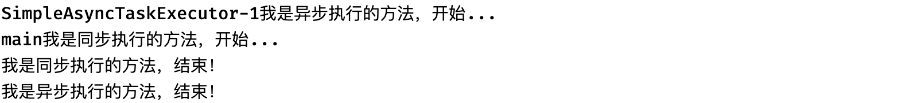

很明显，**异步执行的任务并不是在当前线程启动的，而是在其他线程启动的**，所以说并不会在当前线程阻塞，可以看到马上就开始执行下一行代码，调用同步执行的任务了。

因此，当我们要将Bean的某个方法设计为异步执行时，就可以直接添加这个注解。但是需要注意，**添加此注解要求方法的返回值只能是void或是Future类型才可以**。

还有，在使用时，可能还会出现这样的信息：


虽然出现了这样的信息，但是我们的程序依然可以正常运行，这是因为Spring默认会从容器中选择一个`Executor`类型的实例，并使用它来创建线程执行任务，这是Spring推荐的方式，当然，如果没有找到，那么会使用自带的 SimpleAsyncTaskExecutor 处理异步方法调用。

肯定会有小伙伴疑惑，什么情况？！这个方法很明显我们并没有去编写异步执行的逻辑，那么为什么会异步执行呢？这里很明显是同步调用的方法啊。的确，如果这个Bean只是一个简简单单的Student类型的对象，确实做不到。但是它真的只是一个简简单单的Student类型对象吗？

```java
Student student = context.getBean(Student.class);
System.out.println(student.getClass());   //这里我们通过getClass来获取一下类型，你会发现惊喜
```

我们来看看结果：


？？？这是什么东西？这实际上Spring帮助我们动态生成的一个代理类，我们原本的类代码已经被修改了，能做到这样的操作，这其实都是AOP的功劳。

#### 定时任务

看完了异步任务，我们接着来看定时任务，定时任务其实就是指定在哪个时候再去执行，在JavaSE阶段我们使用过TimerTask来执行定时任务。Spring中的定时任务是全局性质的，当我们的Spring程序启动后，那么定时任务也就跟着启动了，我们可以**1.在配置类上添加`@EnableScheduling`注解**：

```java
@EnableScheduling
@Configuration
@ComponentScan("com.test.bean")
public class MainConfiguration {
}
```

接着我们可以直接**2.在配置类里面编写定时任务，把我们要做的任务写成方法，并添加`@Scheduled`注解**：

```java
@Scheduled(fixedRate = 2000)   //单位依然是毫秒，这里是每两秒钟打印一次
public void task(){
    System.out.println("我是定时任务！"+new Date());
}
```


我们注意到`@Scheduled`中有很多参数，我们需要指定'cron', 'fixedDelay(String)', or 'fixedRate(String)'的其中一个，否则无法创建定时任务，他们的区别如下：

- fixedDelay：在上一次定时任务执行完之后，间隔多久继续执行。
- fixedRate：无论上一次定时任务有没有执行完成，两次任务之间的时间间隔。
- cron：如果嫌上面两个不够灵活，你还可以使用cron表达式来指定任务计划。

有关cron表达式：https://blog.csdn.net/sunnyzyq/article/details/98597252

### 监听器

监听实际上就是等待某个事件的触发，当事件触发时，对应事件的监听器就会被通知,简单介绍一下：

```java
@Component
public class TestListener implements ApplicationListener<ContextRefreshedEvent> {
    @Override
    public void onApplicationEvent(ContextRefreshedEvent event) {
        System.out.println(event.getApplicationContext());   //可以直接通过事件获取到事件相关的东西
    }
}
```

要编写监听器，我们只需要**1.让Bean继承ApplicationListener**就可以了，并且**2.将类型指定为对应的Event事件**，这样，当发生某个事件时就会通知我们，比如ContextRefreshedEvent，这个事件会在Spring容器初始化完成会触发一次：


是不是感觉挺智能的？Spring内部有各种各样的事件，当然我们也可以自己编写事件，然后在某个时刻发布这个事件到所有的监听器：

```java
public class TestEvent extends ApplicationEvent {   //自定义事件需要继承ApplicationEvent
    public TestEvent(Object source) {
        super(source);
    }
} 
```

```java
@Component
public class TestListener implements ApplicationListener<TestEvent> {
    @Override
    public void onApplicationEvent(TestEvent event) {
        System.out.println("发生了一次自定义事件，成功监听到！");
    }
}
```

比如现在我们希望在定时任务中每秒钟发生一次这个事件：

```java
@Component
public class TaskComponent  implements ApplicationEventPublisherAware {  
  	//要发布事件，需要拿到ApplicationEventPublisher，这里我们通过Aware在初始化的时候拿到
  	//实际上我们的ApplicationContext就是ApplicationEventPublisher的实现类，这里拿到的就是
  	//我们创建的ApplicationContext对象
    ApplicationEventPublisher publisher;

    @Scheduled(fixedRate = 1000)   //一秒一次
    public void task(){
      	//直接通过ApplicationEventPublisher的publishEvent方法发布事件
      	//这样，所有这个事件的监听器，都会监听到这个事件发生了
        publisher.publishEvent(new TestEvent(this));
    }

    @Override
    public void setApplicationEventPublisher(ApplicationEventPublisher publisher) {
        this.publisher = publisher;
    }
}
```

此时，发布事件旁边出现了图标，说明就可以了：


我们可以点击这个图标快速跳转到哪里监听了这个事件。我们来看看运行结果吧：


这样，我们就实现了自定义事件发布和监听。

## SpringEL表达式

SpEL 是一种强大，简洁的装配 Bean 的方式，用于动态地访问和操作对象的属性、调用方法、执行运算等，它可以通过运行期间执行的表达式将值装配到我们的属性或构造函数当中，更可以调用 JDK 中提供的静态常量，获取外部 Properties 文件中的的配置。

### 外部属性注入

有些时候，我们甚至可以将一些外部配置文件中的配置进行读取，并完成注入。

我们需要创建以`.properties`结尾的配置文件，这种配置文件格式很简单，类似于Map，需要一个Key和一个Value，中间使用等号进行连接，这里我们在resource目录下创建一个`test.properties`文件：

```properties
test.name=只因
```

这样，Key就是`test.name`，Value就是`只因`，我们可以通过一个注解直接读取到外部配置文件中对应的属性值，首先我们需要引入这个配置文件，我们可以在**1.配置类上添加`@PropertySource`注解**：

```java
@Configuration
@ComponentScan("com.test.bean")
@PropertySource("classpath:test.properties")   //注意，类路径下的文件名称需要在前面加上classpath:
public class MainConfiguration{
    
}
```

接着，我们就可以开始快乐的使用了，我们可以使用**2. @Value 注解**将外部配置文件中的值注入到任何我们想要的位置，就像我们之前使用@Resource自动注入一样：

```java
@Component
public class Student {
    @Value("${test.name}")   //这里需要在外层套上 ${ }
    private String name;   //String会被自动赋值为配置文件中对应属性的值

    public void hello(){
        System.out.println("我的名字是："+name);
    }
}
```

`@Value`中的`${...}`表示占位符，它会读取外部配置文件的属性值装配到属性中，如果配置正确没问题的话，这里甚至还会直接显示对应配置项的值：


我们来测试一下吧：


如果遇到乱码的情况，请将配置文件的编码格式切换成UTF-8（可以在IDEA设置中进行配置）然后在@PropertySource注解中添加属性 encoding = "UTF-8" 这样就正常了，当然，其实一般情况下也很少会在配置文件中用到中文。

除了在字段上进行注入之外，我们**3.也可以在需要注入的方法中使用**：     

```java
@Component
public class Student {
    private final String name;

  	//构造方法中的参数除了被自动注入外，我们也可以选择使用@Value进行注入
    public Student(@Value("${test.name}") String name){
        this.name = name;
    }

    public void hello(){
        System.out.println("我的名字是："+name);
    }
}
```

当然，如果我们只是想简单的注入一个常量值，**4.也可以直接填入固定值**：     

```java
private final String name;
public Student(@Value("10") String name){   //只不过，这里都是常量值了，我干嘛不直接写到代码里呢
    this.name = name;
}
```

当然，@Value 的功能还远不止这些，配合SpringEL表达式，能够实现更加强大的功能。

### SpEL简单使用

首先我们来看看如何创建一个SpEL表达式：                        

```java
ExpressionParser parser = new SpelExpressionParser();
Expression exp = parser.parseExpression("'Hello World'");  //使用parseExpression方法来创建一个表达式
System.out.println(exp.getValue());   //表达式最终的运算结果可以通过getValue()获取
```

这里得到的就是一个很简单的 Hello World 字符串，字符串使用单引号囊括，SpEL是具有运算能力的。

我们可以像写Java一样，对这个字符串进行各种操作，比如调用方法之类的：                          

```java
Expression exp = parser.parseExpression("'Hello World'.toUpperCase()");   //调用String的toUpperCase方法
System.out.println(exp.getValue());
```


不仅能调用方法、还可以访问属性、使用构造方法等。

对于Getter方法，我们可以像访问属性一样去使用：    

```java
//比如 String.getBytes() 方法，就是一个Getter，那么可以写成 bytes
Expression exp = parser.parseExpression("'Hello World'.bytes");
System.out.println(exp.getValue());
```

表达式可以不止一级，我们可以多级调用：                          

```java
Expression exp = parser.parseExpression("'Hello World'.bytes.length");   //继续访问数组的length属性
System.out.println(exp.getValue());
```

我们继续来试试看构造方法，其实就是写Java代码，只是可以写成这种表达式而已：                       

```java
Expression exp = parser.parseExpression("new String('hello world').toUpperCase()");
System.out.println(exp.getValue());
```


它甚至还支持根据特定表达式，从给定对象中获取属性出来：                

```java
@Component
public class Student {
    private final String name;
    public Student(@Value("${test.name}") String name){
        this.name = name;
    }

    public String getName() {    //比如下面要访问name属性，那么这个属性得可以访问才行，访问权限不够是不行的
        return name;
    }
}      
```

```java
Student student = context.getBean(Student.class);
ExpressionParser parser = new SpelExpressionParser();
Expression exp = parser.parseExpression("name");
System.out.println(exp.getValue(student));    //直接读取对象的name属性
```

拿到对象属性之后，甚至还可以继续去处理：                      

```java
Expression exp = parser.parseExpression("name.bytes.length");   //拿到name之后继续getBytes然后length
```

除了获取，我们也可以调用表达式的setValue方法来设定属性的值：                      

```java
Expression exp = parser.parseExpression("name");
exp.setValue(student, "刻师傅");   //同样的，这个属性得有访问权限且能set才可以，否则会报错
```

除了属性调用，我们也可以使用运算符进行各种高级运算：                    

```java
Expression exp = parser.parseExpression("66 > 77");   //比较运算
System.out.println(exp.getValue());                    
```

```java
Expression exp = parser.parseExpression("99 + 99 * 3");   //算数运算
System.out.println(exp.getValue());
```

对于那些需要导入才能使用的类，我们需要使用一个特殊的语法：                     

```java
Expression exp = parser.parseExpression("T(java.lang.Math).random()");   //由T()囊括，包含完整包名+类名
//Expression exp = parser.parseExpression("T(System).nanoTime()");   //默认导入的类可以不加包名
System.out.println(exp.getValue());
```

### 集合操作相关语法

现在我们的类中存在一些集合类：              

```java
@Component
public class Student {
    public Map<String, String> map = Map.of("test", "你干嘛");
    public List<String> list = List.of("AAA", "BBB", "CCC");
}
```

我们可以使用SpEL快速取出集合中的元素：              

```java
Expression exp = parser.parseExpression("map['test']");  //对于Map这里映射型，可以直接使用map[key]来取出value
System.out.println(exp.getValue(student));                
```

```java
Expression exp = parser.parseExpression("list[2]");   //对于List、数组这类，可以直接使用[index]
System.out.println(exp.getValue(student));
```

我们也可以快速创建集合：        

```java
Expression exp = parser.parseExpression("{5, 2, 1, 4, 6, 7, 0, 3, 9, 8}"); //使用{}来快速创建List集合
List value = (List) exp.getValue();
value.forEach(System.out::println);
```

```java
Expression exp = parser.parseExpression("{{1, 2}, {3, 4}}");   //它是支持嵌套使用的
```

```java
//创建Map也很简单，只需要key:value就可以了，怎么有股JSON味
Expression exp = parser.parseExpression("{name: '小明', info: {address: '北京市朝阳区', tel: 10086}}");
System.out.println(exp.getValue());
```

你以为就这么简单吗，我们还可以直接根据条件获取集合中的元素：               

```java
@Component
public class Student {
    public List<Clazz> list = List.of(new Clazz("高等数学", 4));

    public record Clazz(String name, int score){ }
}              
```

```java
Expression exp = parser.parseExpression("list.?[score > 3]");   //选择学分大于3分的科目
System.out.println(exp.getValue(student));
```

我们还可以针对某个属性创建对应的投影集合：        

```java
Expression exp = parser.parseExpression("list.![name]");   //使用.!创建投影集合，这里创建的时课程名称组成的新集合
System.out.println(exp.getValue(student));
```


我们接着来介绍安全导航运算符，安全导航运算符用于避免NullPointerException，它来自Groovy语言。通常，当您有对对象的引用时，您可能需要在访问对象的方法或属性之前验证它是否为空。为了避免这种情况，安全导航运算符返回null而不是抛出异常。以下示例显示了如何使用安全导航运算符：

```java
Expression exp = parser.parseExpression("name.toUpperCase()");   //如果Student对象中的name属性为null
System.out.println(exp.getValue(student));
```

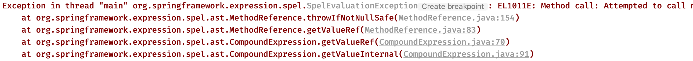

当遇到null时很不方便，我们还得写判断：   

```java
if(student.name != null)
    System.out.println(student.name.toUpperCase());
```

Java 8之后能这样写：

```java
Optional.ofNullable(student.name).ifPresent(System.out::println);
```

但是你如果写过Kotlin：         

```kotlin
println(student.name?.toUpperCase());
```

类似于这种判空问题，我们就可以直接使用安全导航运算符，SpEL也支持这种写法：         

```java
Expression exp = parser.parseExpression("name?.toUpperCase()");
System.out.println(exp.getValue(student));
```

当遇到空时，只会得到一个null，而不是直接抛出一个异常：

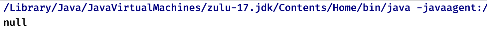

我们可以将SpEL配合 @Value 注解或是xml配置文件中的value属性使用，比如XML中可以这样写：

```xml
<bean id="numberGuess" class="org.spring.samples.NumberGuess">
    <property name="randomNumber" value="#{ T(java.lang.Math).random() * 100.0 }"/>
</bean>
```

或是使用注解开发：

```java
public class FieldValueTestBean {
    @Value("#{ systemProperties['user.region'] }")
    private String defaultLocale;
}
```

这样，我们有时候在使用配置文件中的值时，就能进行一些简单的处理了。

有关更多详细语法教程，请前往：https://docs.spring.io/spring-framework/docs/current/reference/html/core.html#expressions-language-ref

## AOP面向切片

AOP（Aspect Oriented Programming）思想实际上就是：在运行时，动态地将代码切入到类的指定方法、指定位置上。也就是说，我们可以使用AOP来帮助我们在方法执行前或执行之后，做一些额外的操作，实**际上，它就是代理！**

通过AOP我们可以在保证原有业务不变的情况下，添加额外的动作，比如我们的某些方法执行完成之后，需要打印日志，那么这个时候，我们就可以使用AOP来帮助我们完成，它可以批量地为这些方法添加动作。可以说，它相当于将我们原有的方法，在不改变源代码的基础上进行了增强处理。

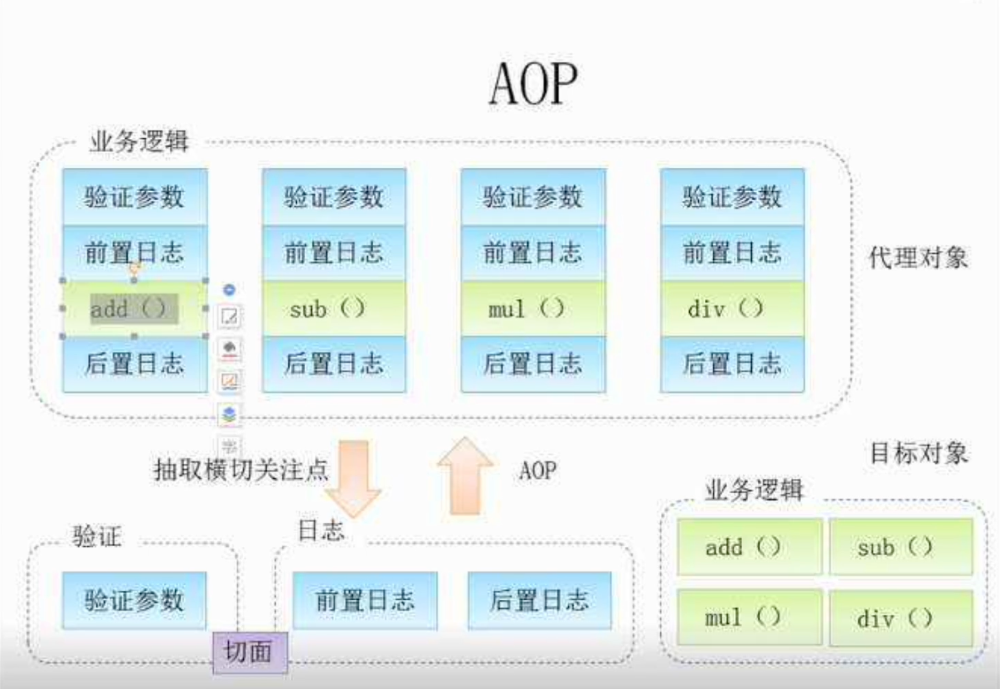

相当于我们的整个业务流程，被直接斩断，并在断掉的位置添加了一个额外的操作，再连接起来，也就是在一个切点位置插入内容。它的原理实际上就是通过动态代理机制实现的，我们在JavaWeb阶段已经给大家讲解过动态代理了。不过Spring底层并不是使用的JDK提供的动态代理，而是使用的第三方库实现，它能够以父类的形式代理，而不仅仅是接口。

### 使用配置实现AOP

在开始之前，我们先换回之前的XML配置模式，注意这里我们还加入了一些新的AOP相关的约束进来，建议直接CV下面的：                    

```xml
<?xml version="1.0" encoding="UTF-8"?>
<beans xmlns="http://www.springframework.org/schema/beans"
       xmlns:xsi="http://www.w3.org/2001/XMLSchema-instance"
       xmlns:aop="http://www.springframework.org/schema/aop"
       xsi:schemaLocation="http://www.springframework.org/schema/beans http://www.springframework.org/schema/beans/spring-beans.xsd
       http://www.springframework.org/schema/aop http://www.springframework.org/schema/aop/spring-aop.xsd">
</beans>
```

Spring是支持AOP编程的框架之一（实际上它整合了AspectJ框架的一部分），要使用AOP我们需要先导入一个依赖：                       

```xml
<dependency>
    <groupId>org.springframework</groupId>
    <artifactId>spring-aspects</artifactId>
    <version>6.0.10</version>
</dependency>
```

那么，如何使用AOP呢？首先我们要明确，要实现AOP操作，我们需要知道这些内容：

1. 需要切入的类，类的哪个方法需要被切入(切到哪，找到需要切入的bean)
2. 切入之后需要执行什么动作（切了干啥，新建切入类）
3. 是在方法执行前切入还是在方法执行后切入（切入时机）
4. 如何告诉Spring需要进行切入（怎么切）

比如现在我们希望对这个学生对象的`study`方法进行增强，在不修改源代码的情况下，增加一些额外的操作：

​                           

```java
public class Student {
    public void study(){
        System.out.println("室友还在打游戏，我狠狠的学Java，太爽了"); 
      	//现在我们希望在这个方法执行完之后，打印一些其他的内容，在不修改原有代码的情况下，该怎么做呢？
    }
}
```

​                                   

```java
<bean class="org.example.entity.Student"/>
```

那么我们按照上面的流程，依次来看，首先需要解决的问题是，找到需要切入的类，很明显，就是这个Student类，我们要切入的是这个`study`方法。

第二步，我们切入之后要做什么呢？这里我们直接创建一个新的类，并将要执行的操作写成一个方法：

​                

```java
public class StudentAOP {
  	//这个方法就是我们打算对其进行的增强操作
    public void afterStudy() {
        System.out.println("为什么毕业了他们都继承家产，我还倒给他们打工，我努力的意义在哪里...");
    }
}
```

注意这个类也得注册为Bean才可以：                          

```xml
<bean id="studentAOP" class="org.example.entity.StudentAOP"/>
```

第三步，我们要明确这是在方法执行之前切入还是执行之后切入，很明显，按照上面的要求，我们需要执行之后进行切入。

第四步，最关键的来了，我们怎么才能告诉Spring我们要进行切入操作呢？这里我们需要在配置文件中进行AOP配置：                        

```xml
<aop:config>

</aop:config>
```

接着我们需要添加一个新的切点，首先填写ID，这个随便起都可以：

​                         

```xml
<aop:pointcut id="test" expression=""/>
```

然后就是通过后面的`expression`表达式来选择到我们需要切入的方法，这个表达式支持很多种方式进行选择，Spring AOP支持以下AspectJ切点指示器（PCD）用于表达式：

- `execution`：用于匹配方法执行连接点。这是使用Spring AOP时使用的主要点切割指示器。
- `within`：限制匹配到某些类型的连接点（使用Spring AOP时在匹配类型中声明的方法的执行）。
- `this`：限制与连接点匹配（使用Spring AOP时方法的执行），其中bean引用（Spring AOP代理）是给定类型的实例。
- `target`：限制匹配连接点（使用Spring AOP时方法的执行），其中目标对象（正在代理的应用程序对象）是给定类型的实例。
- `args`：限制与连接点匹配（使用Spring AOP时方法的执行），其中参数是给定类型的实例。
- `@target`：限制匹配连接点（使用Spring AOP时方法的执行），其中执行对象的类具有给定类型的注释。
- `@args`：限制匹配到连接点（使用Spring AOP时方法的执行），其中传递的实际参数的运行时类型具有给定类型的注释。
- `@within`：限制与具有给定注释的类型中的连接点匹配（使用Spring AOP时在带有给定注释的类型中声明的方法的执行）。
- `@annotation`：与连接点主体（在Spring AOP中运行的方法）具有给定注释的连接点匹配的限制。

其中，我们主要学习的`execution`填写格式如下：                          

```xml
修饰符 包名.类名.方法名称(方法参数)
```

- 修饰符：public、protected、private、包括返回值类型、static等等（使用*代表任意修饰符）
- 包名：如com.test（* 代表全部，比如com.*代表com包下的全部包）
- 类名：使用*也可以代表包下的所有类
- 方法名称：可以使用*代表全部方法
- 方法参数：填写对应的参数即可，比如(String, String)，也可以使用*来代表任意一个参数，使用..代表所有参数。

也可以使用其他属性来进行匹配，比如`@annotation`可以用于表示标记了哪些注解的方法被切入，这里我们就只是简单的执行，所以说只需要这样写就可以了：

​                             

```xml
<aop:pointcut id="test" expression="execution(* org.example.entity.Student.study())"/>
```

这样，我们就指明了需要切入的方法，然后就是将我们的增强方法，我们在里面继续添加`aop:aspect`标签，并使用`ref`属性将其指向我们刚刚注册的AOP类Bean：

​                          

```xml
<aop:config>
    <aop:pointcut id="test" expression="execution(* org.example.entity.Student.study())"/>
    <aop:aspect ref="studentAOP">
				
    </aop:aspect>
</aop:config>
```

接着就是添加后续动作了，当然，官方支持的有多种多样的，比如执行前、执行后、抛出异常后、方法返回后等等：

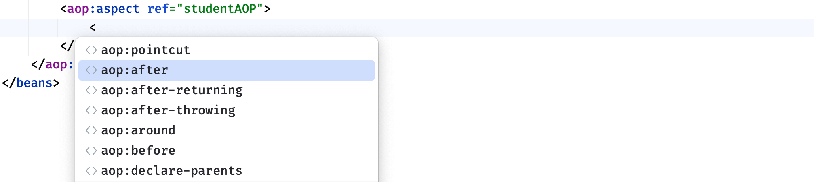

其中around方法为环绕方法，自定义度会更高，我们会在稍后介绍。这里我们按照上面的要求，直接添加后续动作，注意需要指明生效的切点：                          

```xml
<aop:aspect ref="studentAOP">
  	<!--     method就是我们的增强方法，pointcut-ref指向我们刚刚创建的切点     -->
    <aop:after method="afterStudy" pointcut-ref="test"/>
</aop:aspect>
```

这样，我们就成功配置好了，配置正确会在旁边出现图标：

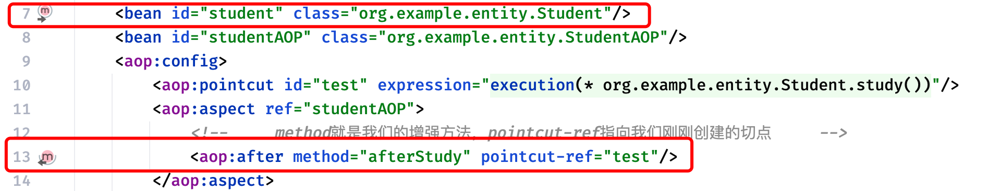

我们来试试看吧：                          

```java
public static void main(String[] args) {
    ApplicationContext context = new ClassPathXmlApplicationContext("application.xml");
    Student bean = context.getBean(Student.class);
    bean.study();
}
```

结果如下：


可以看到在我们原本的方法执行完成之后，它还继续执行了我们的增强方法，这实际上就是动态代理做到的，实现在不修改原有代码的基础上，对方法的调用进行各种增强，在之后的SpringMVC学习中，我们甚至可以使用它来快速配置访问日志打印。

前面我们说了，AOP是基于动态代理实现的，所以说我们如果直接获取Bean的类型，会发现不是原本的类型了：                          

```java
Student bean = context.getBean(Student.class);
System.out.println(bean.getClass());
```


这里其实是Spring通过CGLib为我们生成的动态代理类，也就不难理解为什么调用方法会直接得到增强之后的结果了。包括我们前面讲解Spring的异步任务调度时，为什么能够直接实现异步，其实就是利用了AOP机制实现的方法增强。

虽然这些功能已经非常强大了，但是仅仅只能简单的切入还是不能满足一些需求，在某些情况下，我们可以需求方法执行的一些参数，比如方法执行之后返回了什么，或是方法开始之前传入了什么参数等等，现在我们修改一下Student中`study`方法的参数：   

```java
public class Student {
    public void study(String str){  //现在方法有一个String类型的参数
        System.out.println("都别学Java了，根本找不到工作，快去卷"+str);
    }
}
```

我们希望在增强的方法中也能拿到这个参数，然后进行处理：                          

```java
public class StudentAOP {
    public void afterStudy() {
      	//这个str参数我们该从哪里拿呢？
        System.out.println("学什么"+str+"，Rust天下第一！");
    }
}
```

这个时候，我们可以为我们切入的方法添加一个JoinPoint参数，通过此参数就可以快速获取切点位置的一些信息：

```java
public void afterStudy(JoinPoint point) {   //JoinPoint实例会被自动传入
    //这里我们直接通过getArgs()返回的参数数组获取第1个参数
    System.out.println("学什么"+point.getArgs()[0]+"，Rust天下第一！");
}
```

接着我们修改一下刚刚的AOP配置（因为方法参数有变动）看看结果吧：                          

```xml
<aop:pointcut id="test" expression="execution(* org.example.entity.Student.study(String))"/>
```

现在我们来测试一下：

```java
public static void main(String[] args) {
    ApplicationContext context = new ClassPathXmlApplicationContext("application.xml");
    Student bean = context.getBean(Student.class);
    bean.study("PHP");
}
```


是不是感觉大部分功能都可以通过AOP来完成了？

我们接着来看自定义度更高的环绕方法，现在我们希望在方法执行前和执行后都加入各种各样的动作，如果还是一个一个切点写，有点太慢了，能不能直接写一起呢，此时我们就可以使用环绕方法。

环绕方法相当于完全代理了此方法，它完全将此方法包含在中间，需要我们手动调用才可以执行此方法，并且我们可以直接获取更多的参数：

​                          

```java
public Object around(ProceedingJoinPoint joinPoint) throws Throwable {
    System.out.println("方法开始之前");
    Object value = joinPoint.proceed();   //调用process方法来执行被代理的原方法，如果有返回值，可以使用value接收
    System.out.println("方法执行完成，结果为："+value);
  	return value;
}
```

注意，如果代理方法存在返回值，那么环绕方法也需要有一个返回值，通过`proceed`方法来执行代理的方法，也可以修改参数之后调用`proceed(Object[])`，使用我们给定的参数再去执行：

```java
public Object around(ProceedingJoinPoint joinPoint) throws Throwable {
    System.out.println("方法开始之前");
    String arg = joinPoint.getArgs()[0] + "伞兵一号";
    Object value = joinPoint.proceed(new Object[]{arg});
    System.out.println("方法执行完成，结果为："+value);
    return value;
}
```

这里我们还是以`study`方法为例，现在我们希望在调用前修改这个方法传入的参数值，改成我们自己的，然后在调用之后对返回值结果也进行处理：                          

```java
public String study(String str){
    if(str.equals("Java"))
        System.out.println("我的梦想是学Java");
    else {
        System.out.println("我就要学Java，不要修改我的梦想！");
        str = "Java";
    }
    return str;
}
```

现在我们编写一个环绕方法，对其进行全方面处理：                         

```java
Object around(ProceedingJoinPoint joinPoint) throws Throwable {
    System.out.println("我是她的家长，他不能学Java，必须学Rust，这是为他好");
    Object value = joinPoint.proceed(new Object[]{"Rust"});
    if(value.equals("Java")) {
        System.out.println("听话，学Rust以后进大厂！");
        value = "Rust";
    }
    return value;
}
```

同样的，因为方法变动了，现在我们去修改一下我们的AOP配置：                          

```xml
<aop:pointcut id="test" expression="execution(* org.example.entity.Student.study(String))"/>
<aop:aspect ref="studentAOP">
    <aop:around method="around" pointcut-ref="test"/>
</aop:aspect>
```


细心的小伙伴可能会发现，环绕方法的图标是全包的，跟我们之前的图标不太一样。

现在我们来试试看吧:                          

```java
public static void main(String[] args) {
    ApplicationContext context = new ClassPathXmlApplicationContext("application.xml");
    Student bean = context.getBean(Student.class);
    System.out.println("已报名："+bean.study("Java"));
}
```


这样，我们就实现了环绕方法，通过合理利用AOP带来的便捷，可以使得我们的代码更加清爽和优美。这里介绍一下 AOP 领域中的特性术语，防止自己下来看不懂文章：

- 通知（Advice）: AOP 框架中的增强处理，通知描述了切面何时执行以及如何执行增强处理，也就是我们上面编写的方法实现。
- 连接点（join point）: 连接点表示应用执行过程中能够插入切面的一个点，这个点可以是方法的调用、异常的抛出，实际上就是我们在方法执行前或是执行后需要做的内容。
- 切点（PointCut）: 可以插入增强处理的连接点，可以是方法执行之前也可以方法执行之后，还可以是抛出异常之类的。
- 切面（Aspect）: 切面是通知和切点的结合，我们之前在xml中定义的就是切面，包括很多信息。
- 引入（Introduction）：引入允许我们向现有的类添加新的方法或者属性。
- 织入（Weaving）: 将增强处理添加到目标对象中，并创建一个被增强的对象，我们之前都是在将我们的增强处理添加到目标对象，也就是织入（这名字挺有文艺范的）

### 使用接口实现AOP

前面我们介绍了如何使用xml配置一个AOP操作，这节课我们来看看如何使用Advice实现AOP。

它与我们之前学习的动态代理更接近一些，比如在方法开始执行之前或是执行之后会去调用我们实现的接口，首先我们需要将一个类实现Advice接口，只有实现此接口，才可以被通知，比如我们这里使用`MethodBeforeAdvice`表示是一个在方法执行之前的动作：                         

```java
public class StudentAOP implements MethodBeforeAdvice {
    @Override
    public void before(Method method, Object[] args, Object target) throws Throwable {
        System.out.println("通过Advice实现AOP");
    }
}
```

我们发现，方法中包括了很多的参数，其中args代表的是方法执行前得到的实参列表，还有target表示执行此方法的实例对象。运行之后，效果和之前是一样的，但是在这里我们就可以快速获取到更多信息。还是以简单的study方法为例：                          

```java
public class Student {
    public void study(){
        System.out.println("我是学习方法！");
    }
}                          
```

```xml
<bean id="student" class="org.example.entity.Student"/>
<bean id="studentAOP" class="org.example.entity.StudentAOP"/>
<aop:config>
    <aop:pointcut id="test" expression="execution(* org.example.entity.Student.study())"/>
  	<!--  这里只需要添加我们刚刚写好的advisor就可以了，注意是Bean的名字  -->
    <aop:advisor advice-ref="studentAOP" pointcut-ref="test"/>
</aop:config>
```

我们来测试一下吧：


除了此接口以外，还有其他的接口，比如`AfterReturningAdvice`就需要实现一个方法执行之后的操作：                          

```java
public class StudentAOP implements MethodBeforeAdvice, AfterReturningAdvice {
    @Override
    public void before(Method method, Object[] args, Object target) throws Throwable {
        System.out.println("通过Advice实现AOP");
    }

    @Override
    public void afterReturning(Object returnValue, Method method, Object[] args, Object target) throws Throwable {
        System.out.println("我是方法执行之后的结果，方法返回值为："+returnValue);
    }
}
```

因为使用的是接口，就非常方便，直接写一起，配置文件都不需要改了：


我们也可以使用MethodInterceptor（同样也是Advice的子接口）进行更加环绕那样的自定义的增强，它用起来就真的像代理一样，例子如下：                       

```java
public class Student {
    public String study(){
        System.out.println("我是学习方法！");
        return "lbwnb";
    }
}
```

​             

```java
public class StudentAOP implements MethodInterceptor {   //实现MethodInterceptor接口
    @Override
    public Object invoke(MethodInvocation invocation) throws Throwable {  //invoke方法就是代理方法
        Object value = invocation.proceed();   //跟之前一样，需要手动proceed()才能调用原方法
        return value+"增强";
    }
}
```

我们来看看结果吧：


使用起来还是挺简单的。

### 使用注解实现AOP

接着我们来看看如何使用注解实现AOP操作，现在变回我们之前的注解开发，首先我们需要在主类添加`@EnableAspectJAutoProxy`注解，开启AOP注解支持：                          

```java
@EnableAspectJAutoProxy
@ComponentScan("org.example.entity")
@Configuration
public class MainConfiguration {
}
```

还是熟悉的玩法，类上直接添加`@Component`快速注册Bean：                        

```java
@Component
public class Student {
    public void study(){
        System.out.println("我是学习方法！");
    }
}
```

接着我们需要在定义AOP增强操作的类上添加`@Aspect`注解和`@Component`将其注册为Bean即可，就像我们之前在配置文件中也要将其注册为Bean那样：

```java
@Aspect
@Component
public class StudentAOP {

}
```

接着，我们可以在里面编写增强方法，并将此方法添加到一个切点中，比如我们希望在Student的study方法执行之前执行我们的`before`方法：                      

```java
public void before(){
    System.out.println("我是之前执行的内容！");
}
```

那么只需要添加@Before注解即可：                   

```java
@Before("execution(* org.example.entity.Student.study())")  //execution写法跟之前一样
public void before(){
    System.out.println("我是之前执行的内容！");
}
```

这样，这个方法就会在指定方法执行之前执行了，是不是感觉比XML配置方便多了。我们来测试一下：

```java
public static void main(String[] args) {
    ApplicationContext context = new AnnotationConfigApplicationContext(MainConfiguration.class);
    Student bean = context.getBean(Student.class);
    bean.study();
}
```


同样的，我们可以为其添加`JoinPoint`参数来获取切入点信息，使用方法跟之前一样：                   

```java
@Before("execution(* org.example.entity.Student.study())")
public void before(JoinPoint point){
    System.out.println("参数列表："+ Arrays.toString(point.getArgs()));
    System.out.println("我是之前执行的内容！");
}
```

为了更方便，我们还可以直接将参数放入，比如：

```java
public void study(String str){
    System.out.println("我是学习方法！");
}
```
