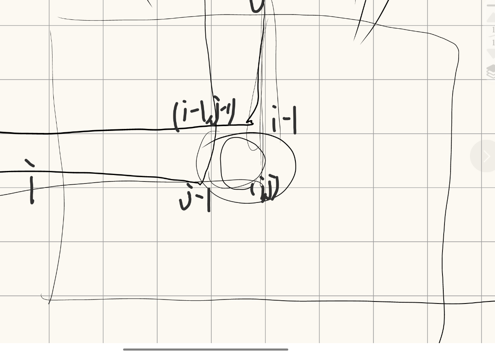
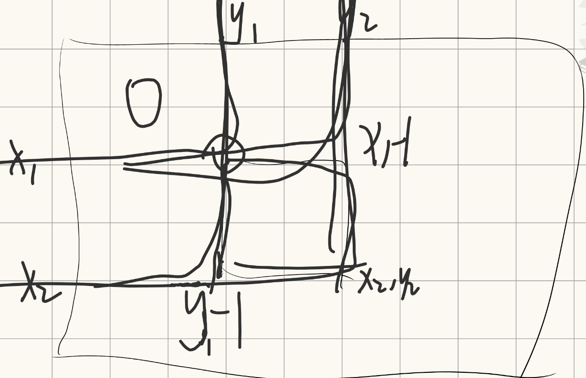

## 1.前缀和

前缀和提供一个时间复杂的为O(1)的区间查询。通过前缀和右端点与左端点-1之差可以得到其区间和。

本题链接：

[【模板】前缀和 | 星码StarryCoding | 算法竞赛新手村 | ACM、OI、蓝桥杯、天梯赛、CCF、ACM-ICPC、大学生信息学竞赛](https://www.starrycoding.com/problem/7)

今日题解如下：

```c++
#include<bits/stdc++.h>
using namespace std;
using ll = long long;

const int N = 1e5 +9;
ll a[N], pre[N];

int main() {
   ios::sync_with_stdio(0), cin.tie(0), cout.tie(0);
   int t;
   cin>>t;
   
   while(t--) {
   	int n,q;
   	cin >> n >> q;
   	
   	for(int i = 1; i <= n; ++i)cin>>a[i];
   	for(int i = 1; i <= n; ++i)pre[i] = pre[i-1] + a[i];

   	while(q--) {
   		int l, r;
   		cin>>l>>r;
   		cout << pre[r] -pre[l - 1] << '\n';
   	}
   }

   return 0;
}
```

粗心的把ll = long long 写成ll = int；导致结果错误。

## 2.差分

差分便于区间修改，可以通过前缀和得到前缀和数组，然后利用前缀和得到修改后的区间和。

原题链接：

[【模板】差分 | 星码StarryCoding | 算法竞赛新手村 | ACM、OI、蓝桥杯、天梯赛、CCF、ACM-ICPC、大学生信息学竞赛](https://www.starrycoding.com/problem/8)

今日题解:

```c++
#include<bits/stdc++.h>
using namespace std;
using ll = long long;
const int N = 1e5 + 9;
ll a[N],diff[N],pre[N];

void solve() {
	ios::sync_with_stdio(0), cin.tie(0), cout.tie(0);
	int n,p,q;
	cin>>n>>p>>q;
	for(int i=1;i<=n;++i) {
		cin>>a[i];
	}
	for(int i=1;i<=n;++i) {
		diff[i] = a[i] - a[i-1];//差分数组每一项为原数组两项之差
	} 
	while(p--) {
		int l,r,x;
		cin>>l>>r>>x;
		diff[l]+=x;
		diff[r+1]-=x;//只在[l,r]上修改，之后的要恢复原样
	}
	for(int i=1;i<=n;++i) {
		a[i]=a[i-1]+diff[i];//恢复成原数组
	}
	for(int i=1;i<=n;++i) {
		pre[i]=pre[i-1]+a[i];//修改后的前缀和
	}
	while(q--) {
		int l,r;
		cin>>l>>r;
		cout<<pre[r] - pre[l-1]<<'\n';
	}
}

int main() {
	ios::sync_with_stdio(0), cin.tie(0), cout.tie(0);
	int t=1;
//	cin>>t;
	while(t--) {
		solve();
	}
	return 0;
}
```

## 3.**二维前缀和**

原题链接：

[【模板】二维前缀和 | 星码StarryCoding | 算法竞赛新手村 | ACM、OI、蓝桥杯、天梯赛、CCF、ACM-ICPC、大学生信息学竞赛](https://www.starrycoding.com/problem/15)

今日题解：

```c++
#include<bits/stdc++.h>
using namespace std;
using ll = long long;

const int N = 1e3 + 9;
ll a[N][N], pre[N][N];

void solve() {
	ios::sync_with_stdio(0), cin.tie(0), cout.tie(0);
	int n,m,q;
	cin>>n>>m>>q;
	for(int i=1;i<=n;++i) {
		for(int j=1;j<=m;++j) {
			cin>>a[i][j];
		}
	}
	for(int i=1;i<=n;++i) {
		for(int j=1;j<=m;++j) {
			pre[i][j]=pre[i-1][j]+pre[i][j-1]-pre[i-1][j-1]+a[i][j];//见图1
		}
	}
	while(q--) {
		int x1,y1,x2,y2;
		cin>>x1>>y1>>x2>>y2;
		cout<<pre[x2][y2]-pre[x2][y1-1]-pre[x1-1][y2]+pre[x1-1][y1-1]<<'\n';//见图2
	}
}

int main() {
	ios::sync_with_stdio(0), cin.tie(0), cout.tie(0);
	int t=1;
//	cin>>t;
	while(t--) {
		solve();
	}
	return 0;
}
```

图1：



图2：

