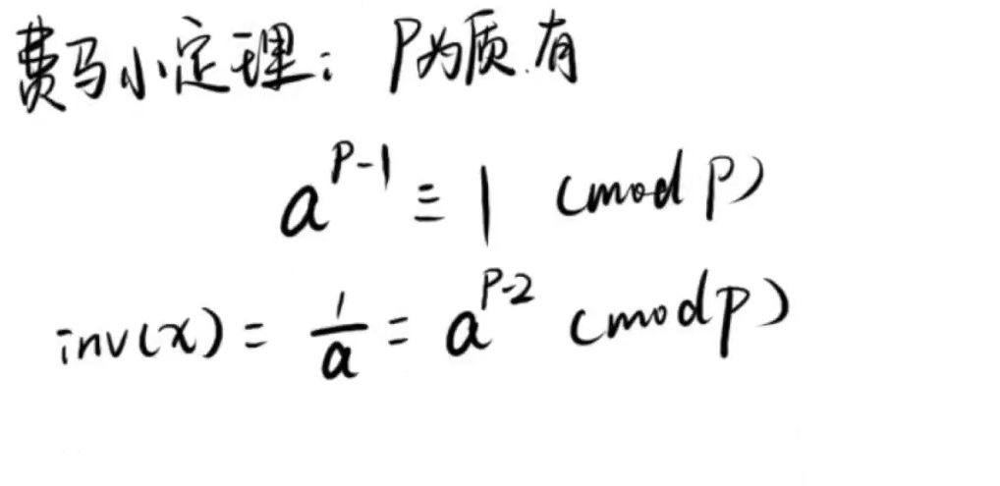
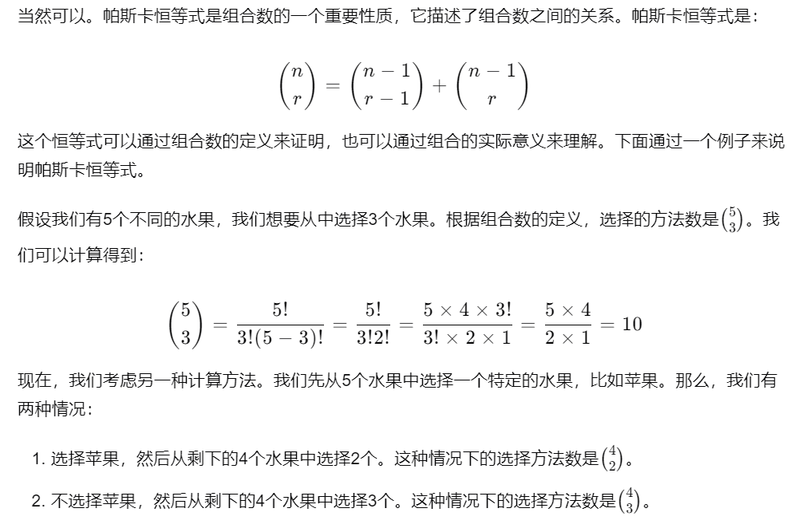

## 1.埃氏筛法

### 解决:

找出所有小于等于n的质数问题。

### 思想：

任意一个数（大于1），它的倍数均不是质数。

### 核心代码：

vis[0]=vis[1]=true;//1表示不是质数，被筛掉

  for(int i=2;i<=n;++i){

​    if(!vis[i])for(ll j=1ll  * i  * i; j<=n;j+=i)vis[j]=true;

  }

### 复杂度：

O(n*log(logn))， 小于1e7可用，再大用欧拉筛法


### 欧拉筛法

欧拉筛法的核心思想是：**每个合数只被它的最小质因数筛掉一次**。通过这种方式，避免了埃氏筛法中合数被重复标记的问题，从而提高了效率。

```cpp
    // 初始化
    for (int i = 2; i <= n; ++i) is_prime[i] = true;

    // 筛选
    for (int i = 2; i <= n; ++i) {
        if (is_prime[i]) prime.push_back(i); // 如果i是素数，加入素数列表
        for (int j = 0; j < prime.size() && (long long)i * prime[j] <= n; ++j) {
            is_prime[i * prime[j]] = false; // 标记合数
            if (i % prime[j] == 0) break;   // 关键优化：停止条件
        }
    }
```

## 2.gcd和lcm

### 辗转相除法

求两个数的最大公因数gcd

c语言代码：

```c++
int gcd（int a,int b）{
	if(a<b){//其实可以不加此步骤，若a<b,在第一次while循环赋值时会交换ab的值
		int temp=b;
		b=a;
		a=temp;
	}
	while(b!=0) {//(a,b)->(b,a%b)->(a%b,a%b%b)->...//当较小数不为0时循环继续
		int temp=b;
		b=a%b;
		a=temp;
	}
	return a;//较大数即为所求最大公因数/公约数
}
```

tips：最小公倍数lcm即二者之积除以他们的最大公因数。

## 3.快速幂

把指数拆到底数中来

```c++
ll qmi(ll a, ll b, ll c){
	ll res = 1;
	while(b) {
		if(b%2)res = a * res % c;
		a = a * a % c;
		b/=2;
	}
	return res;
};
```

## 4.乘法逆元

在取模时可能会用到乘法逆元，用来求在mod意义下的同类数。在取模意义下除以一个数等于乘以这个数的乘法逆元。取模的这个数是质数时有费马小定理。费马小定理就是用来求这个数的乘法逆元的。

根据费马小定理有：



代码：

```c++
ll inv(ll x){//利用费马小定理得出乘法逆元式子，快速幂快速求出其值
	return qmi(x, p - 2);
}

ll f(ll a, ll b, ll c, ll x) {
	return (a * x % p + b) % p * inv(c * x % p) % p;
}
```

## 5.组合数

注意一个重要的性质：帕斯卡恒等式。



