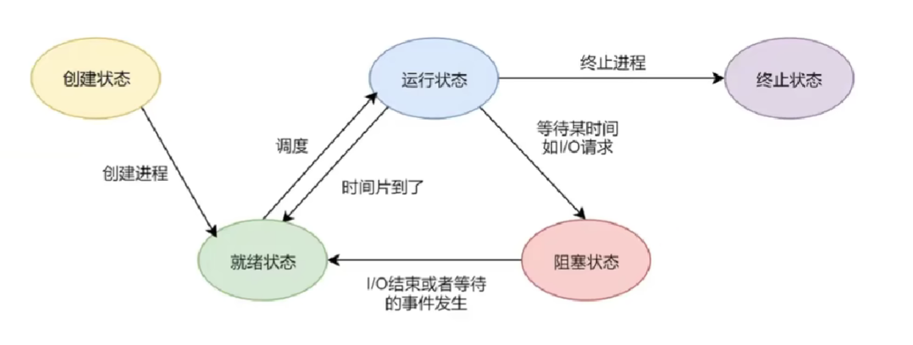

## 操作系统概述

### 定义

操作系统(Operating System;OS)是**计算机硬件与用户之间的接口**(系统软件程序)，它管理和调度硬件资源（如CPU、内存、输入/输出设备等），并提供用户与计算机交互的界面。

### 特征

最基本特征为**并发**和**共享**(二者互为存在条件)

**并发**：是指两个或多个活动在同一给定的时间段中进行

**共享**：是指计算机系统中的资源被多个进程所共用

**异步**：进程以不可预知的速度向前推进

**虚拟**：把一个物理上的实体变为若干个逻辑上的对应物

关于并发和并行的区别：可以想象并发是有两排队伍排一个窗口，而并行是两个队伍分别排两个窗口。

### 功能

**1.计算机资源管理：**

**处理器管理**:主要包括进程控制、进程同步、进程通信、死锁处理、处理器调度等

**存储器管理**:主要包括内存分配与回收、地址映射、内存保护与共享、内存扩充等

**文件管理**:主要包括文件存储空间的管理、目录管理、文件读写管理和保护等

**设备管理**:主要包括缓冲管理、设备分配、设备处理、虚拟设备等

2.**作为用户与计算机硬件系统之间的接口**：**命令接口和程序接口**

3.**用作扩充机器**。

### 一些基本概念

- 特权指令：不允许用户程序使用(只允许操作系统使用)如IO指令、中断指令。
- 非特权指令：普通的运算指令
- 内核程序：系统的管理者，可以执行一切指令，运行在核心态
- 应用程序：普通用户程序只能执行非特权程序，运行在用户态

**处理器状态：**

- 用户态(目态)：CPU只能执行非特权指令
- 核心态(管态、内核态)：可以执行所有指令
- 用户态到内核态：通过中断或异常**(是硬件完成的)**
- 核心态到用户态：特权指令psw的标志位，0用户态，1核心态。

**原语：**

- 处在操作系统的最底层，是最接近硬件的部分
- 这些程序的运行具有原子性，其操作只能一气呵成
- 这些程序的运行时间都较短，而且调用频繁

## 进程管理

### **进程（Process）**

进程是**操作系统进行资源分配和调度的基本单位**，是**程序在处理器上的一次运行活动**。进程包括程序控制块、PCB、程序段、数据段。

PCB：包含操作系统对其进行管理所需的各种信息，如进程描述信息、控制信息、管理信息、资源分配清单和处理器相关信息

**特点：**

- **动态性(基本特征)**：进程是动态的实体，有创建、运行、阻塞、终止等状态。
- **并发性**：多个进程可以同时运行，共享系统资源。
- **独立性**：**进程是资源分配的基本单位**，具有独立的资源和运行环境。
- 异步性：各个进程按各自独立的、不可预知的速度向前推进，操作系统要提供进程同步机制来解决异步问题。
- 结构性：每个进程都配置一个PCB。结构上看，进程由程序段、数据段和PCB组成。

**进程状态：**

- **就绪态（Ready）**：进程已准备好运行，等待CPU分配。
- **运行态（Running）**：进程正在CPU上运行。
- **阻塞态（Blocked）**：进程因等待某种事件（如I/O操作完成）而暂停运行。

进程的状态转换：



**线程（Thread）**

**线程是进程中的一个执行单元，是CPU调度的基本单位**。一个进程可以包含多个线程，它们共享进程的资源。
**特点：**

- **轻量级**：线程的创建和切换开销小。
- **并发性**：多个线程可以并发执行，提高程序的效率。
- **共享资源**：线程共享所属进程的资源，如内存空间。

**线程与进程的区别：**

- 线程是进程的子集，线程的切换更快，但线程之间共享资源可能导致数据竞争和同步问题。
- 进程是资源分配的基本单位，线程是CPU调度的基本单位。

CPU调度常用算法

- **先来先服务（FCFS，First-Come-First-Served）**：按进程到达的顺序调度，简单但可能导致饥饿现象。

- **最短作业优先（SJF，Shortest Job First）**：优先调度运行时间最短的进程，但需要预估进程运行时间。

- **优先级调度（Priority Scheduling）**：根据进程的优先级进行调度，优先级高的进程优先运行。

- **最高响应比优先（HRRN,Highest Response Ratio Next）**：是一种非抢占式的动态调度算法，主要用于平衡短作业和长作业的执行需求。它通过计算每个进程的**响应比**来选择下一个执行的进程，响应比公式为：

  **响应比 = 1 + 等待时间 / 执行时间**

  - **特点**：随着进程等待时间增加，响应比升高，避免长作业饥饿，同时兼顾短作业的快速响应。
  - **优点**：兼顾公平性和效率，避免饥饿问题，适合批处理系统。
  - **缺点**：计算复杂度较高，调度开销大。
  - **适用场景**：适用于需要平衡长短作业的系统，提高吞吐量和响应速度。

- **时间片轮转（RR，Round-Robin）**：将CPU时间划分为时间片，按顺序分配给就绪队列中的进程，适合分时系统。

### 进程的通信

1）进程通信是指进程之间的信息交换。

**低级通信**：PV操作

**高级通信**：是指以较高的效率传输大量数据的通信方式。

高级通信方法主要有三类：

1.共享存储：基于共享数据结构的通信方式(如生产者和消费者)基于共享存储区的通信方式。

2.消息传递：是以格式化的消息为单位，利用原语传递消息，分为直接通信和间接通信。

3.管道通信：是消息传递的一种特殊方式，是指用于连接一个读进程和一个写进程以实现他们之间通信的一个共享文件，又称pipe文件。

**临界区**：每个进程中访问临界资源(一次只允许一个进程使用的资源)的那段**代码**称为临界区。

进程同步机制应遵循的**原则**：空闲让进、忙则等待、有限等待、让权等待。

实现进程同步的**机制**有：

- **互斥锁（Mutex）**：确保同一时间只有一个线程可以访问共享资源。
- **信号量（Semaphore）**：用于控制对共享资源的访问数量。
- **条件变量（Condition Variable）**：用于线程间的同步，等待某个条件满足后再执行。

#### PV操作解决生产者-消费者问题

**信号量定义**

- `mutex`：用于保护缓冲区的互斥访问，初始值为1。
- `empty`：表示缓冲区中空闲位置的数量，初始值为`N`（缓冲区大小）。
- `full`：表示缓冲区中已占用位置的数量，初始值为0。

**生产者伪代码**

```c
semaphore mutex = 1;  // 互斥信号量
semaphore empty = N;  // 空位信号量，初始值为缓冲区大小
semaphore full = 0;   // 满位信号量，初始值为0

void producer() {
    while (true) {
        produce_item();  // 生产一个产品
		//消耗一个产品进入空闲缓冲区
        P(empty);        // 等待空位，减少空位计数
        P(mutex);        // 进入临界区

        // 将产品放入缓冲区
        put_item_into_buffer();

        V(mutex);        // 离开临界区
        V(full);         // 增加满位计数，通知消费者
    }
}
```

**消费者伪代码**

```c
void consumer() {
    while (true) {
        P(full);         // 等待有产品，减少满位计数
        P(mutex);        // 进入临界区

        // 从缓冲区取出产品
        take_item_from_buffer();

        V(mutex);        // 离开临界区
        V(empty);        // 增加空位计数，通知生产者
        consume_item();  // 消费产品
    }
}
```

**运行示例**

假设缓冲区大小为`N`：

- 初始时，`empty = N`，`full = 0`。
- 生产者执行`P(empty)`，`empty`减1，表示占用一个空位。
- 生产者执行`V(full)`，`full`加1，表示增加一个满位。
- 消费者执行`P(full)`，`full`减1，表示取出一个产品。
- 消费者执行`V(empty)`，`empty`加1，表示释放一个空位。