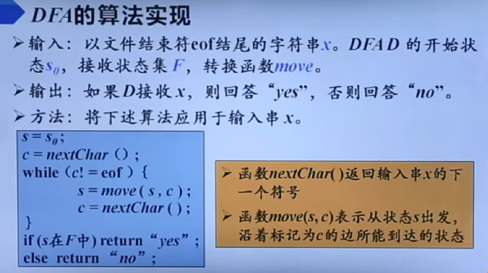
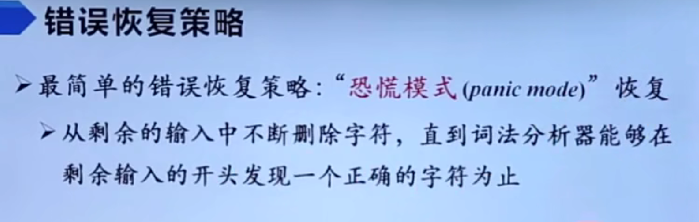

## 引论

### **编译程序的工作过程：**

**1.词法分析**：扫描源程序，**分解和识别出每个单词**，并把单词翻译成相应的机内表示。tips：单词是语言中最小的语义单位，如语言中的关键字(保留字或基本字)、标识符、常数、运算符和界限符。

**2.语法分析**：把单词符号串**分解成各类语法单位**，如表达式，语句等。判断是否正确，不正确则抛出错误位置和性质。生成语法分析树。

**3.语义分析**：保证标识符和常数的正确使用。

**4.中间代码生成**(非必要)：将源程序翻译成某种中间代码形式如三元式、四元式和逆波兰式等。

**5.中间代码优化**(非必要)：调整或改变中间代码某些操作次序以产生更高效的目标代码。

**6.目标代码生成**：将优化后的代码转换成等价的机器代码或汇编指令。

### **编译程序结构**

### 编译器的结构

### 高级程序设计语言翻译的两种方式

1.编译方式是指在程序运行之前，将高级语言程序完整地**翻译**成机器语言程序或中间代码。编译器（Compiler）是实现这一过程的软件工具。

2.解释方式是指在程序运行时，逐条读取高级语言程序并**翻译执行**。解释器（Interpreter）是实现这一过程的软件工具。

### 编译程序的自展

1. **定义**：自展是指使用已有的编译器来编译自身的源代码，从而生成新的编译器。例如，C语言的编译器可以用C语言本身编写，然后用现有的C编译器来编译它，生成新的编译器。
2. **过程**：自展通常是一个迭代过程。例如，先用语言X1编写语言X2的编译器，然后用X2编写X3的编译器，依此类推。这种方法可以逐步扩展编译器的功能和语言的特性。
3. **优点**：自展可以保证编译器的正确性和可靠性，并且能够逐步优化编译器的性能。

### 编译程序的移植

1. **定义**：移植是指将已有的编译器从一个平台迁移到另一个平台上运行。这可能涉及到对编译器代码的修改和适配。
2. **方法**：移植通常需要对目标平台的特性（如指令集、操作系统等）进行适配。例如，将一个在x86架构上运行的编译器移植到ARM架构上。
3. **挑战**：移植过程中可能需要解决不同平台之间的差异，如字节序、数据对齐等问题。

### 编译程序的自动化

**定义**：编译程序的自动化是指使用专门的工具或脚本，根据给定的规则和描述文件自动生成编译程序。例如，Make工具可以根据Makefile中的规则自动化构建项目。

### 并行编译的概念

1. **定义**：并行编译是指将编译过程中的多个独立任务分配给多个处理器或计算节点同时执行，从而缩短整体编译时间。
2. **原理**：编译过程可以分为多个独立的任务（如编译不同的源文件），这些任务之间没有依赖关系，可以并行执行。

## 形式语言理论

形式语言理论研究语言的结构、语法、语义以及语言的生成和识别机制。

### 词法语法分析基本概念：

### **形式文法（Formal Grammar）**

形式文法是用于生成形式语言的规则系统。它定义了如何从基本符号组合成复杂的字符串。形式文法通常由以下四部分组成：

S:开始符号。表示该文法最大的语法成分。例如：S=<句子>。

简单示例：

符号约定

### 语言的定义：

**文法解决了无穷语言的有穷表示问题**

### 文法的分类

**乔姆斯基文法层次的四个类型及其特点：**

------

1. **0型文法（无限制文法或短语结构文法，Type-0 Grammar）PSG**

- **定义**：产生式规则的形式为`α → β`，其中`α`和`β`是字母表上的符号序列，且**`α`中至少包含一个非终结符**。
- **特点**：
  - 产生式规则没有任何限制。
  - 可以生成非常复杂的语言，包括递归可枚举语言（Recursively Enumerable Languages）。
- **对应的自动机**：图灵机（Turing Machine）。
- **应用场景**：图灵机是计算模型的理论基础，用于研究可计算性问题。

------

2. **1型文法（上下文有关文法，Type-1 Grammar）CSG**

- **定义**：产生式规则的形式为`αAβ → αγβ`，其中`A`是非终结符，`α`、`β`和`γ`是符号序列，**且`γ`不能为空**即不包含空产生式。
- **特点**：
  - 非终结符的替换依赖于上下文（即`α`和`β`）。
  - 生成的语言称为上下文有关语言（Context-Sensitive Languages）。
  - 语言的复杂性介于上下文无关语言和递归可枚举语言之间。
- **对应的自动机**：线性有界自动机（Linear Bounded Automata, LBA）。
- **应用场景**：主要用于理论研究，实际应用较少。

------

3. **2型文法（上下文无关文法，Type-2 Grammar）CFG**

- **定义**：产生式规则的形式为`A → α`，其中`A`是非终结符，`α`是符号序列（可以包含终结符和非终结符）。
- **特点**：
  - 非终结符的替换不依赖于上下文。
  - 生成的语言称为上下文无关语言（Context-Free Languages）。
  - 语言的复杂性较低，适合描述程序设计语言的语法结构。
- **对应的自动机**：下推自动机（Pushdown Automata, PDA）。
- **应用场景**：广泛用于编译器设计中的语法分析，例如LL(1)解析器、LR解析器等。

------

4. **3型文法（正则文法，Type-3 Grammar）RG**

- **定义**：产生式规则的形式为`A → aB`或`A → a`，其中`A`和`B`是非终结符，`a`是终结符。
  - 也可以写成`A → a`或`A → aB`的形式（右线性文法）。
- **特点**：
  - 生成的语言称为正则语言（Regular Languages）。
  - 语言的复杂性最低，适合描述简单的模式匹配。
- **对应的自动机**：有限状态自动机（Finite Automata, FA），包括确定性有限自动机（DFA）和非确定性有限自动机（NFA）。
- **应用场景**：广泛用于词法分析器的设计，例如正则表达式匹配。

#### 乔姆斯基文法层次的总结

| 类型    | 特点       | 产生式规则                           | 语言类别       | 对应的自动机   |
| :------ | :--------- | :----------------------------------- | :------------- | :------------- |
| 0型文法 | 无限制     | `α → β`（`α`中至少包含一个非终结符） | 递归可枚举语言 | 图灵机         |
| 1型文法 | 上下文有关 | `αAβ → αγβ`（`γ`不能为空）           | 上下文有关语言 | 线性有界自动机 |
| 2型文法 | 上下文无关 | `A → α`                              | 上下文无关语言 | 下推自动机     |
| 3型文法 | 正则       | `A → aB` 或 `A → a`                  | 正则语言       | 有限状态自动机 |

### CFG的分析树

## 词法分析

### 正则表达式

### 正则定义

### 有穷自动机

有穷自动机（Finite Automaton）FA是一种数学模型，用于描述具有有限状态的系统，它可以用来识别输入符号串是否符合某种模式或语言。

**分类**

有穷自动机主要分为以下两种类型：

- **确定型有穷自动机（DFA, Deterministic Finite Automaton）**：对于每个状态和输入符号，转移函数 *δ* 定义了唯一一个确定的下一个状态。
- **非确定型有穷自动机（NFA, Nondeterministic Finite Automaton）**：对于每个状态和输入符号，转移函数 *δ* 可以定义多个可能的下一个状态，甚至允许在没有输入的情况下进行状态转移（即空转移）。

### 从正则表达式到有穷自动机

 

### 识别单词的DFA

