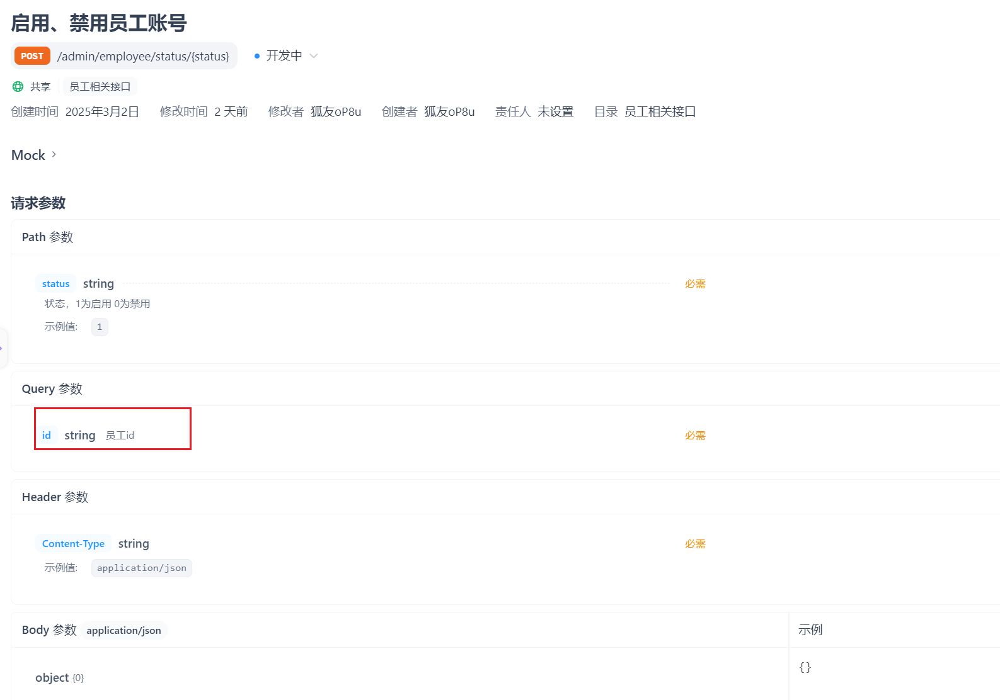
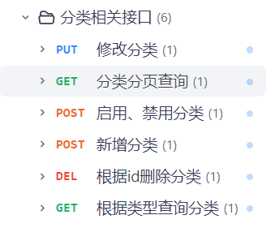

本文章记录学习苍穹外卖的过程和遇到的问题。

​	首次接手苍穹外卖这个项目，可以发现并不是让我们从零开始建立的，我们是在一定基础上进行后续的功能开发的。并且提供了前端所有的源码以便于我们进行前后端联调测试，先把学习重心放到后端实现上来。

​	我首先关注到的是这个项目的结构，跟目录下分了3个包，分别是common(普通类)、pojo(实体类等)和server(业务逻辑类等)，把前端用nginx启动后，直接在server包下的SkyApplication类启动这个项目。发现这个项目运行在本地的8080上，登录和登出功能已经是做好了的。

​	然后老师带我们进行了需求分析，导入需要实现的功能接口，老师演示的是Yapi导入的接口，由于它已经停止服务我便使用apifox进行了接口导入。

## 第一个功能->新增员工

​	查看接口


​	在控制层EmployeeController类新增一个方法作为对外的接口

```java
/**
* 新增员工
* @param employeeDTO
* @return
* */
@PostMapping
@ApiOperation("新增员工")
public Result save(@RequestBody EmployeeDTO employeeDTO) {
    log.info("新增员工: {}", employeeDTO);
    employeeService.save(employeeDTO);
    return Result.success();
}
```

具体的实现交给业务逻辑层的employeeService接口和它的实现类，

```java
    /**
     * 新增员工
     * @param employeeDTO
     */
    @Override
    public void save(EmployeeDTO employeeDTO) {
        Employee employee = new Employee();
        //对象属性拷贝
        BeanUtils.copyProperties(employeeDTO, employee);
        //设置账号状态，在常量类中0表示禁用disable，1相反，这里新增的员工默认可用
        employee.setStatus(StatusConstant.ENABLE);
        //设置密码，默认123456
        employee.setPassword(DigestUtils.md5DigestAsHex(PasswordConstant.DEFAULT_PASSWORD.getBytes()));
        //设置时间
        employee.setCreateTime(LocalDateTime.now());
        employee.setUpdateTime(LocalDateTime.now());
        //设置当前记录创建人id和修改人id
        //  后期需要改为当前登录用户的id 已利用上下文的thread完成
        employee.setCreateUser(BaseContext.getCurrentId());
        employee.setUpdateUser(BaseContext.getCurrentId());

        //
        employeeMapper.insert(employee);
    }
```

至于数据库的相关操作交给Mapper层处理

```java
/**
 * 插入员工数据
 * @param employee
 */
@Insert("insert into employee(name,username,password,phone,sex,id_number,create_time,update_time,create_user,update_user,status)" +
        "values " +
        "(#{name},#{username},#{password},#{phone},#{sex},#{idNumber},#{createTime},#{updateTime},#{createUser},#{updateUser},#{status})")
void insert(Employee employee);
```

做了两个优化

问题有：

1.录入的用户名重复抛出的异常没有处理

2.新增员工的创建人id和修改人id设置为了固定值

第一个 查看控制台的报错，"Duplicate entry...",在全局的异常处理器handler的GlobalExceptionHandler.java统一捕获处理异常

```java
    /**
     * 处理SQL异常
     * @param ex
     * @return
     */
    @ExceptionHandler
    public Result exceptionHandler(SQLIntegrityConstraintViolationException ex){
        String message = ex.getMessage();
        if (message.contains("Duplicate entry")){
            String[] split = message.split(" ");//先以空格分割获取用户名
            String username = split[2];//用户名在报错信息的第3个字符串
            String msg = username + MessageConstant.AlREDY_EXISTS;
            return Result.error(msg);
        }else {//其他情况返回常量类定义的字符串
            return Result.error(MessageConstant.UNKNOWN_ERROR);
        }
    }

```

第二个

生成jwt令牌的时候用到了用户的id，把它反解析出来

```java
Long empId = Long.valueOf(claims.get(JwtClaimsConstant.EMP_ID).toString());
```

利用每一次请求都是同一线程的特点，使用ThreadLocal保存并在需要的时候调用即可。以下是这个类的信息：

```java
package com.sky.context;

public class BaseContext {

    public static ThreadLocal<Long> threadLocal = new ThreadLocal<>();

    public static void setCurrentId(Long id) {
        threadLocal.set(id);
    }

    public static Long getCurrentId() {
        return threadLocal.get();
    }

    public static void removeCurrentId() {
        threadLocal.remove();
    }

}
```

于是可以在生成jwt令牌时保存

```java
Long empId = Long.valueOf(claims.get(JwtClaimsConstant.EMP_ID).toString());
log.info("当前员工id：", empId);

BaseContext.setCurrentId(empId);
```

在实现类里面调用

```java
//设置当前记录创建人id和修改人id
//  后期需要改为当前登录用户的id 已利用上下文的thread完成
employee.setCreateUser(BaseContext.getCurrentId());
employee.setUpdateUser(BaseContext.getCurrentId());
```

## 第二个功能员工分页查询

​	控制层EmployeeController类

```java
/**
 * 员工分页查询
 * @param employeePageQueryDTO
 * @return
 */
@GetMapping("/page")
@ApiOperation("员工分页查询")
public Result<PageResult> page(EmployeePageQueryDTO employeePageQueryDTO) {
    log.info("员工分页查询，参数为：{}",employeePageQueryDTO);
    PageResult pageResult = employeeService.pageQuery(employeePageQueryDTO);
    return Result.success(pageResult);
}
```

​	业务逻辑层的实现类EmployeeServiceImpl

```java
/**
 * 分页查询
 * @param employeePageQueryDTO
 * @return
 */
@Override
public PageResult pageQuery(EmployeePageQueryDTO employeePageQueryDTO) {
    //select * from employee limit 0,10
    //利用mybatis的pagehelper
    PageHelper.startPage(employeePageQueryDTO.getPage(),employeePageQueryDTO.getPageSize());

    Page<Employee> page = employeeMapper.pageQuery(employeePageQueryDTO);

    long total = page.getTotal();
    List<Employee> records = page.getResult();

    return new PageResult(total,records);
}
```

​	数据库交互层EmployeeMapper类

```java
/**
 * 分页查询
 * @param employeePageQueryDTO
 * @return
 */
Page<Employee> pageQuery(EmployeePageQueryDTO employeePageQueryDTO);
```

EmployeeMapper.xml

```xml
<select id="pageQuery" resultType="com.sky.entity.Employee">
    select * from employee
    <where>
        <if test="name != null and name != ''">
            and name like concat('%',#{name},'%')
        </if>
    </where>
    order by create_time desc
</select>
```

做了一个优化

问题是：前端显示的时间格式不美观

通过在WebMvcConfiguration中扩展Spring MVC的消息转换器，统一对日期进行格式化处理

```java
/**
 * 扩展spring MVC消息转换器
 * @param converters
 */
protected void extendMessageConverters(List<HttpMessageConverter<?>> converters) {
    log.info("扩展消息转换器...");
    //创建一个消息转换器对象
    MappingJackson2HttpMessageConverter converter = new MappingJackson2HttpMessageConverter();
    //需要为消息转换器设置一个对象转换器，对象转换器可以将java对象序列化为json数据
    converter.setObjectMapper(new JacksonObjectMapper());
    //将自己的消息转换器加入容器中
    converters.add(0,converter);//索引为0，优先使用我们自己的消息转换器
}
```

具体格式在JacksonObjectMapper类中自定义。

**第二天:**


关于苍穹外卖的学习，今天继续添加功能

## 第一个功能启用/禁用员工账号

首先查看接口文档



在控制层写，路径参数注解后面的status可省略(在两者名字相同时)，这个项目我们约定修改的返回值Result无需使用泛型，而查询的需要使用泛型。

```java
/**
 *启用禁用员工
 * @return
 */
@PostMapping("/status/{status}")
@ApiOperation("启用禁用员工账号")
public Result startOrStop(@PathVariable("status") Integer status, Long id) {
    log.info("启用禁用员工账号：{},{}",status,id);
    employeeService.startOrStop(status,id);
    return Result.success();
}
```

service层加接口，写实现类

```java
    /**
     * 启用禁用员工账号
     * @param status
     * @param id
     */
    public void startOrStop(Integer status, Long id) {
        //update employee set status = ? where id = ?

        //构造实体类对象 常规方法
//        Employee employee = new Employee();
//        employee.setId(id);
//        employee.setStatus(status);

        //利用构造器注解@Bulid
        Employee employee = Employee.builder()
                .status(status)
                .id(id)
                .build();
        
        employeeMapper.update(employee);
    }
```

这里想着可能传递的参数不只是状态和id，也有可能是其他的，于是在持久层mapper里面写的update方法的形参是一个对象，包含了所有可能传递的参数。所以持久层mapper写：

```java
/**
 * 根据主键动态修改属性
 * @param employee
 */
void update(Employee employee);
```

它的具体实现由于是动态sql所以不用注解实现而是写在配置文件 EmployeeMapper.xml 里：

```xml
<update id="update" parameterType="Employee">
    update employee
    <set>
        <if test="name != null">name = #{name},</if>
        <if test="username != null">username = #{username},</if>
        <if test="password != null">password = #{password},</if>
        <if test="phone != null">phone = #{phone},</if>
        <if test="sex != null">sex = #{sex},</if>
        <if test="idNumber != null">id_Number = #{idNumber},</if>
        <if test="updateTime != null">update_Time = #{updateTime},</if>
        <if test="updateUser != null">update_User = #{updateUser},</if>
        <if test="status != null">status = #{status},</if>
    </set>
    where id = #{id}
</update>
```

### 特别注意：

**这里的字段名字，数据库采用的是蛇形命名(如id_number),这里也需要加下划线变成id_Number。**

最后提交推送分支。

## 第二个功能编辑员工信息

涉及两个接口，一个是根据员工id查询员工信息，

一个是修改员工信息


第一个接口，控制层：

```java
/**
 * 根据id查询员工信息
 * @param id
 * @return
 */
@GetMapping("/{id}")
@ApiOperation("根据id查询员工信息")
public Result<Employee> getById(@PathVariable Long id) {
    Employee employee = employeeService.getById(id);
    return Result.success(employee);
}
```

业务逻辑层：这里把密码字段为了安全性重新设置为星号，不给前端传密码

```java
/**
 * 根据id查询员工
 * @param id
 * @return
 */
public Employee getById(Long id) {
    Employee employee = employeeMapper.getById(id);
    employee.setPassword("****");
    return employee;
}
```

持久层mapper：

```java
/**
 * 根据id查询员工信息
 * @param id
 * @return
 */
@Select("select * from employee where id = #{id}")
Employee getById(Long id);
```

测试

正常返回，开发第二个接口：


根据接口定义写控制层：

```java
/**
 * 编辑员工信息
 * @param employeeDTO
 * @return
 */
@PutMapping
@ApiOperation("编辑员工信息")
public Result update(@RequestBody EmployeeDTO employeeDTO) {
    log.info("编辑员工信息：{}", employeeDTO);
    employeeService.update(employeeDTO);
    return Result.success();
}
```

业务逻辑层：

```java
/**
 * 编辑员工信息
 * @param employeeDTO
 */
public void update(EmployeeDTO employeeDTO) {
    Employee employee = new Employee();
    //属性拷贝
    BeanUtils.copyProperties(employeeDTO, employee);
    //设置DTO对象里面没有的属性，这里是更新时间和更新者
    employee.setUpdateTime(LocalDateTime.now());
    employee.setUpdateUser(BaseContext.getCurrentId());
    //直接调用之前写好的持久层更新的方法
    employeeMapper.update(employee);
}
```


截止目前我们已经实现了员工管理模块的许多功能，后续再想想密码修改的实现。接下来我们尝试实现分类模块的功能，由于该模块的所有功能与员工管理模块大差不差，故全记录在此篇文章。

以下是我们需要实现的所有功能



先从分类的分页查询开始，查看接口说明


得知它的参数为一个数据传输对象DTO。

由于是新的模块，我们新建控制层CategoryController类，业务层CategoryService接口和它的实现类CategoryServiceImpl类，持久层CategoryMapper类和它的配置文件CategoryMapper.xml。 

CategoryController：

```java
/**
 * 分类管理
 */
@RestController
@RequestMapping("/admin/category")
@Slf4j
@Api(tags = "分类相关接口")
public class CategoryController {

    @Autowired
    private CategoryService categoryService;

    /**
     * 分类分页查询
     * @param categoryPageQueryDTO
     * @return
     */
    @GetMapping("/page")
    @ApiOperation("分类分页查询")
    public Result<PageResult> page(CategoryPageQueryDTO categoryPageQueryDTO) {
        log.info("分类分页查询，参数为：{}",categoryPageQueryDTO);
        PageResult pageResult = categoryService.pageQuery(categoryPageQueryDTO);
        return Result.success(pageResult);
    }

}
```

CategoryService：

```java
@Service
public class CategoryServiceImpl implements CategoryService {

    @Autowired
    private CategoryMapper categoryMapper;

    /**
     * 分类分页查询
     * @param categoryPageQueryDTO
     * @return
     */
    @Override
    public PageResult pageQuery(CategoryPageQueryDTO categoryPageQueryDTO) {
        //select *from category limit 0,10
        //利用mybatis的pagehelper
        PageHelper.startPage(categoryPageQueryDTO.getPage(),categoryPageQueryDTO.getPageSize());
        Page<Category> page = categoryMapper.pageQuery(categoryPageQueryDTO);

        long total = page.getTotal();
        List<Category> list = page.getResult();
        return new PageResult(total,list);
    }
}
```

CategoryMapper：

```java
@Mapper
public interface CategoryMapper {
    /**
     * 分页查询
     *
     * @param categoryPageQueryDTO
     * @return
     */
    Page<Category> pageQuery(CategoryPageQueryDTO categoryPageQueryDTO);
}
```

CategoryMapper.xml：

```xml
<?xml version="1.0" encoding="UTF-8" ?>
<!DOCTYPE mapper PUBLIC "-//mybatis.org//DTD Mapper 3.0//EN"
        "http://mybatis.org/dtd/mybatis-3-mapper.dtd" >
<mapper namespace="com.sky.mapper.CategoryMapper">
    <select id="pageQuery" resultType="com.sky.entity.Category">
        select * from category
        <where>
            <if test="name != null and name != ''">
                and name like concat('%',#{name},'%')
            </if>
            <if test="type != null">and type = #{type}</if>
        </where>
        order by create_time desc
    </select>
</mapper>
```

### 特别注意：

SQL 中的 `WHERE` 子句不支持用逗号分隔多个条件。条件之间应该用逻辑运算符（如 `AND` 或 `OR`）连接。

**第三天：**


## 公共字段填充

注意到在修改表数据时总是会使用到createUser、updateUser和createTime、updateTime等字段，故考虑把它们抽出来单独处理。这样的思想可以归纳为aop即面向切面编程，它是一种编程范式，**用于将横切关注点从业务逻辑中分离出来**，从而提高代码的模块化、可维护性和可扩展性。

实现流程：

1.确定需要分离的点，这里的公共字段


2.自定义注解@AutoFill：用于标识需要进行统一处理的方法。

3.新建切面包，自定义切面类AutoFillAspect：统一拦截加入了AutoFill的方法，通过反射来为统一赋值

4.在Mapper层具体的方法加上AutoFill注解。

代码实现：

**1.自定义AutoFill注解【只用来标识，标识那些类需要自动填充】**

1.创建annotaion包用来存放自定义注解，然后创建AutoFill注解

2.添加注解@Target(ElementType.METHOD)用来说明注解是加到方法上的

3.添加@Retention(RetentionPolicy.RUNTIME)注解，保留策略为运行时

4.在注解里面指定当前数据库操作类型【可以使用枚举】【定义了之后参数列表的value就可以使用枚举类的值】

5.OperationType value();//自定义的枚举类型【里面是update和insert】

```java
/**
 * 用于标识方法需要进行功能字段自动填充处理
 */
@Target(ElementType.METHOD)
@Retention(RetentionPolicy.RUNTIME)
public @interface AutoFill {
    //数据库操作类型 insert或者update
    OperationType value();
}
```

**2.自定义切面类AutoFillAspect**

1.找切入点，即加上注解的方法

2.在执行这些方法执行前先执行我的这个操作（公共字段填充）

```java
/**
 * 自定义切面，实现公共字段自动填充处理
 */
@Aspect
@Component
@Slf4j
public class AutoFillAspact {
    /**
     * 切入点
     */
    @Pointcut("execution(* com.sky.mapper.*.*(..)) && @annotation(com.sky.annotation.AutoFill)")
    public void autoFillPointCut() {}

    @Before("autoFillPointCut()")
    public void autoFill(JoinPoint joinPoint) throws Throwable {
        log.info("开始进行公共字段填充");

        //获取当前被拦截的方法上的数据库操作类型(insert update等)
        MethodSignature methodSignature = (MethodSignature) joinPoint.getSignature();//方法签名对象
        AutoFill autoFill = methodSignature.getMethod().getAnnotation(AutoFill.class);//获取方法上的注解对象
        OperationType operationType = autoFill.value();//获得操作类型

        //获取当前被拦截方法的参数(比如这里的实体对象)
        Object[] args = joinPoint.getArgs();
        if (args == null || args.length == 0) {
            return;
        }

        Object entity =  args[0];

        //准备赋值的数据
        LocalDateTime now = LocalDateTime.now();
        Long currentId = BaseContext.getCurrentId();
        //根据当前不同的操作类型，为对应的属性通过反射来赋值
        if(operationType == OperationType.INSERT) {
            Method setCreateTime= entity.getClass().getDeclaredMethod(AutoFillConstant.SET_CREATE_TIME,LocalDateTime.class);
            Method setCreateUser= entity.getClass().getDeclaredMethod(AutoFillConstant.SET_CREATE_USER,Long.class);
            Method setUpdateTime= entity.getClass().getDeclaredMethod(AutoFillConstant.SET_UPDATE_TIME,LocalDateTime.class);
            Method setUpdateUser= entity.getClass().getDeclaredMethod(AutoFillConstant.SET_UPDATE_USER,Long.class);

            //通过反射来为对象赋值
            setCreateTime.invoke(entity,now);
            setCreateUser.invoke(entity,currentId);
            setUpdateTime.invoke(entity,now);
            setUpdateUser.invoke(entity,currentId);
        } else if (operationType == OperationType.UPDATE) {
            Method setUpdateTime= entity.getClass().getDeclaredMethod(AutoFillConstant.SET_UPDATE_TIME,LocalDateTime.class);
            Method setUpdateUser= entity.getClass().getDeclaredMethod(AutoFillConstant.SET_UPDATE_USER,Long.class);
            setUpdateTime.invoke(entity,now);
            setUpdateUser.invoke(entity,currentId);
        }

    }
}
```

## 新增菜品

实现两件事，其一完成文件上传，其二完成菜品新增

**文件上传：**

新增通用接口控制层：

```java
/**
 * 通用接口
 */
@RestController
@RequestMapping("/admin/common")
@Api("通用接口")
@Slf4j
public class CommonController {

    private static String FILE_UPLOAD_PATH = "C:\\Users\\zhangbin\\Desktop\\sky-take-out\\sky-server\\src\\main\\resources\\uploads/";

    @PostMapping("/upload")
    @ResponseBody
    public Result uploadFile(@RequestParam("file") MultipartFile file) throws IOException {
        if (file.isEmpty()) {
            return Result.error("文件不能为空");
        }

        File dir = new File(FILE_UPLOAD_PATH);
        if (!dir.exists() || !dir.isDirectory()) {
            boolean created = dir.mkdirs();
            if(created) {
                log.info("创建文件夹成功: {}", FILE_UPLOAD_PATH);
            } else {
                log.warn("创建文件夹失败或已经存在: {}", FILE_UPLOAD_PATH);
            }
        }

        String originalFilename = file.getOriginalFilename();
        if (originalFilename == null || originalFilename.isEmpty()) {
            return Result.error("文件名无效");
        }

        // 确保文件路径安全，避免路径遍历攻击
        Path targetLocation = Paths.get(FILE_UPLOAD_PATH).resolve(originalFilename).normalize();
        try {
            Files.copy(file.getInputStream(), targetLocation, StandardCopyOption.REPLACE_EXISTING);
            log.info("文件上传成功: {}", originalFilename);
        } catch (IOException e) {
            log.error("文件上传失败: {}", originalFilename, e);
            return Result.error("文件上传失败");
        }

        // 你可以根据实际情况调整返回的文件访问链接
        String fileUrl = "http://localhost:8080/uploads/" + originalFilename;
        return Result.success(fileUrl);
    }
}
```

配置类的WebMvcConfiguration类里新增静态资源映射：

```java
private static String FILELOCATION = "C:\\Users\\zhangbin\\Desktop\\sky-take-out\\sky-server\\src\\main\\resources\\uploads/";
/**
 * 设置静态资源映射
 * @param registry
 */
protected void addResourceHandlers(ResourceHandlerRegistry registry) {
    registry.addResourceHandler("/doc.html").addResourceLocations("classpath:/META-INF/resources/");
    registry.addResourceHandler("/webjars/**").addResourceLocations("classpath:/META-INF/resources/webjars/");

    // 将本地文件系统的 uploads 目录映射为 /uploads/** 的 URL
    registry.addResourceHandler("/uploads/**")
            .addResourceLocations("file:" + FILELOCATION);
}
```

**新增菜品：**

需要实现菜品和口味的新增：

控制层DishController：

```java
/**
 * 菜品管理
 */
@RestController
@RequestMapping("/admin/dish")
@Api(tags = "菜品相关接口")
@Slf4j
public class DishController {

    @Autowired
    private DishService dishService;

    /**
     * 新增菜品和口味
     * @param dishDTO
     * @return
     */
    @PostMapping
    public Result save(@RequestBody DishDTO dishDTO) {
      log.info("新增菜品{}", dishDTO);
      dishService.saveWithFlavor(dishDTO);

      return Result.success();
    }
}
```

业务逻辑层DishServiceImpl：

```java
@Service
@Slf4j
public class DishServiceImpl implements DishService {

    @Autowired
    private DishMapper dishMapper;
    @Autowired
    private DishFlavorMapper dishFlavorMapper;
    /**
     * 新增菜品和对应的口味
     * @param dishDTO
     */
    @Transactional//保证事务原子性要么成功要么失败
    public void saveWithFlavor(DishDTO dishDTO) {

        Dish dish = new Dish();
        BeanUtils.copyProperties(dishDTO, dish);

        //向菜品表插入1条数据
        dishMapper.insert(dish);

        Long dishId = dish.getId();//获取insert语句生成的主键值

        //向口味表插入n条数据
        List<DishFlavor> flavors =  dishDTO.getFlavors();
        if (flavors != null && flavors.size() > 0) {
            flavors.forEach(dishFlavor -> {
                dishFlavor.setDishId(dishId);
            });

            dishFlavorMapper.insertBatch(flavors);
        }

    }
}
```

菜品的新增直接在Mapper层的配置文件写插入语句即可。

口味的新增Mapper层的配置文件写动态sql

```xml
<insert id="insertBatch">
    insert into dish_flavor (dish_id, name, value) VALUES
    <foreach collection="flavors" item="df" separator=",">
        (#{df.dishId},#{df.name},#{df.value})
    </foreach>
</insert>
```

遇到的问题：

1.老师提供的oss已无法使用，本地存储解决

但是在使用value注解的时候没办法替换yml文件里的属性，直接写的变量解决，但是导致直接写的路径很长而且修改麻烦。

2.复制DishMapper的时候复制了autofill注解到DishFlavorMapper导致报错，去掉即可。

3.数据库的字段名和实体的字段名别搞混淆。

## 批量删除菜品

考虑菜品是否可以删除：

1.是否存在起售中的菜品

2.是否存在关联到套餐的菜品

## 修改菜品基本信息和口味数据

1.查询菜品分类（已实现）

2.图片上传和回显菜品图片（已实现）

3.根据id查询菜品---简单

4.修改菜品

注意口味数据可以先删除再新增以达到修改的效果。