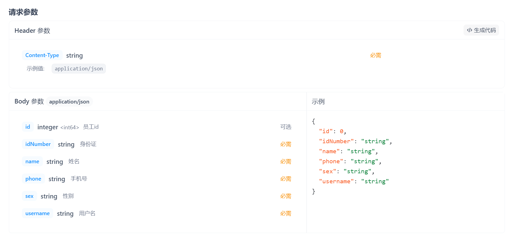

本文章记录学习苍穹外卖的过程和遇到的问题。

​	首次接手苍穹外卖这个项目，可以发现并不是让我们从零开始建立的，我们是在一定基础上进行后续的功能开发的。并且提供了前端所有的源码以便于我们进行前后端联调测试，而且把先把学习重心放到后端实现上来。

​	我首先关注到的是这个项目的结构，跟目录下分了3个包，分别是common(普通类)、pojo(实体类等)和server(业务逻辑类等)，把前端用nginx启动后，直接在server包下的SkyApplication类启动这个项目。发现这个项目运行在本地的8080上，登录和登出功能已经是做好了的。

​	然后老师带我们进行了需求分析，导入需要实现的功能接口，老师演示的是Yapi导入的接口，由于它已经停止服务我便使用apifox进行了接口导入。

## 第一个功能->新增员工

​	查看接口



​	在控制层EmployeeController类新增一个方法作为对外的接口

```java
/**
* 新增员工
* @param employeeDTO
* @return
* */
@PostMapping
@ApiOperation("新增员工")
public Result save(@RequestBody EmployeeDTO employeeDTO) {
    log.info("新增员工: {}", employeeDTO);
    employeeService.save(employeeDTO);
    return Result.success();
}
```

具体的实现交给业务逻辑层的employeeService接口和它的实现类，

```java
    /**
     * 新增员工
     * @param employeeDTO
     */
    @Override
    public void save(EmployeeDTO employeeDTO) {
        Employee employee = new Employee();
        //对象属性拷贝
        BeanUtils.copyProperties(employeeDTO, employee);
        //设置账号状态，在常量类中0表示禁用disable，1相反，这里新增的员工默认可用
        employee.setStatus(StatusConstant.ENABLE);
        //设置密码，默认123456
        employee.setPassword(DigestUtils.md5DigestAsHex(PasswordConstant.DEFAULT_PASSWORD.getBytes()));
        //设置时间
        employee.setCreateTime(LocalDateTime.now());
        employee.setUpdateTime(LocalDateTime.now());
        //设置当前记录创建人id和修改人id
        //  后期需要改为当前登录用户的id 已利用上下文的thread完成
        employee.setCreateUser(BaseContext.getCurrentId());
        employee.setUpdateUser(BaseContext.getCurrentId());

        //
        employeeMapper.insert(employee);
    }
```

至于数据库的相关操作交给Mapper层处理

```java
/**
 * 插入员工数据
 * @param employee
 */
@Insert("insert into employee(name,username,password,phone,sex,id_number,create_time,update_time,create_user,update_user,status)" +
        "values " +
        "(#{name},#{username},#{password},#{phone},#{sex},#{idNumber},#{createTime},#{updateTime},#{createUser},#{updateUser},#{status})")
void insert(Employee employee);
```

做了两个优化

问题有：

1.录入的用户名重复抛出的异常没有处理

2.新增员工的创建人id和修改人id设置为了固定值

第一个 查看控制台的报错，"Duplicate entry...",在全局的异常处理器handler的GlobalExceptionHandler.java统一捕获处理异常

```java
    /**
     * 处理SQL异常
     * @param ex
     * @return
     */
    @ExceptionHandler
    public Result exceptionHandler(SQLIntegrityConstraintViolationException ex){
        String message = ex.getMessage();
        if (message.contains("Duplicate entry")){
            String[] split = message.split(" ");//先以空格分割获取用户名
            String username = split[2];//用户名在报错信息的第3个字符串
            String msg = username + MessageConstant.AlREDY_EXISTS;
            return Result.error(msg);
        }else {//其他情况返回常量类定义的字符串
            return Result.error(MessageConstant.UNKNOWN_ERROR);
        }
    }
}
```

第二个

生成jwt令牌的时候用到了用户的id，把它反解析出来

```java
Long empId = Long.valueOf(claims.get(JwtClaimsConstant.EMP_ID).toString());
```

利用每一次请求都是同一线程的特点，使用ThreadLocal保存并在需要的时候调用即可。以下是这个类的信息：

```java
package com.sky.context;

public class BaseContext {

    public static ThreadLocal<Long> threadLocal = new ThreadLocal<>();

    public static void setCurrentId(Long id) {
        threadLocal.set(id);
    }

    public static Long getCurrentId() {
        return threadLocal.get();
    }

    public static void removeCurrentId() {
        threadLocal.remove();
    }

}
```

于是可以在生成jwt令牌时保存

```java
Long empId = Long.valueOf(claims.get(JwtClaimsConstant.EMP_ID).toString());
log.info("当前员工id：", empId);

BaseContext.setCurrentId(empId);
```

在实现类里面调用

```java
//设置当前记录创建人id和修改人id
//  后期需要改为当前登录用户的id 已利用上下文的thread完成
employee.setCreateUser(BaseContext.getCurrentId());
employee.setUpdateUser(BaseContext.getCurrentId());
```

## 第二个功能员工分页查询

​	控制层EmployeeController类

```java
/**
 * 员工分页查询
 * @param employeePageQueryDTO
 * @return
 */
@GetMapping("/page")
@ApiOperation("员工分页查询")
public Result<PageResult> page(EmployeePageQueryDTO employeePageQueryDTO) {
    log.info("员工分页查询，参数为：{}",employeePageQueryDTO);
    PageResult pageResult = employeeService.pageQuery(employeePageQueryDTO);
    return Result.success(pageResult);
}
```

​	业务逻辑层的实现类EmployeeServiceImpl

```java
/**
 * 分页查询
 * @param employeePageQueryDTO
 * @return
 */
@Override
public PageResult pageQuery(EmployeePageQueryDTO employeePageQueryDTO) {
    //select * from employee limit 0,10
    //利用mybatis的pagehelper
    PageHelper.startPage(employeePageQueryDTO.getPage(),employeePageQueryDTO.getPageSize());

    Page<Employee> page = employeeMapper.pageQuery(employeePageQueryDTO);

    long total = page.getTotal();
    List<Employee> records = page.getResult();

    return new PageResult(total,records);
}
```

​	数据库交互层EmployeeMapper类

```java
/**
 * 分页查询
 * @param employeePageQueryDTO
 * @return
 */
Page<Employee> pageQuery(EmployeePageQueryDTO employeePageQueryDTO);
```

EmployeeMapper.xml

```xml
<select id="pageQuery" resultType="com.sky.entity.Employee">
    select * from employee
    <where>
        <if test="name != null and name != ''">
            and name like concat('%',#{name},'%')
        </if>
    </where>
    order by create_time desc
</select>
```

做了一个优化

问题是：前端显示的时间格式不美观

通过在WebMvcConfiguration中扩展Spring MVC的消息转换器，统一对日期进行格式化处理

```java
/**
 * 扩展spring MVC消息转换器
 * @param converters
 */
protected void extendMessageConverters(List<HttpMessageConverter<?>> converters) {
    log.info("扩展消息转换器...");
    //创建一个消息转换器对象
    MappingJackson2HttpMessageConverter converter = new MappingJackson2HttpMessageConverter();
    //需要为消息转换器设置一个对象转换器，对象转换器可以将java对象序列化为json数据
    converter.setObjectMapper(new JacksonObjectMapper());
    //将自己的消息转换器加入容器中
    converters.add(0,converter);//索引为0，优先使用我们自己的消息转换器
}
```

具体格式在JacksonObjectMapper类中自定义。