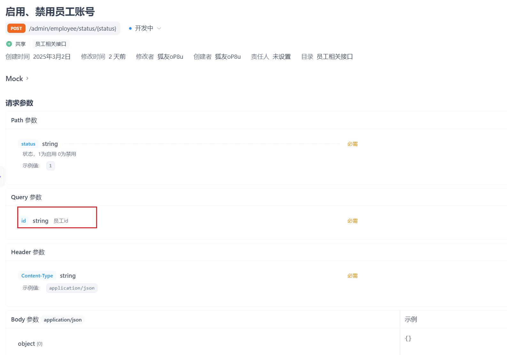
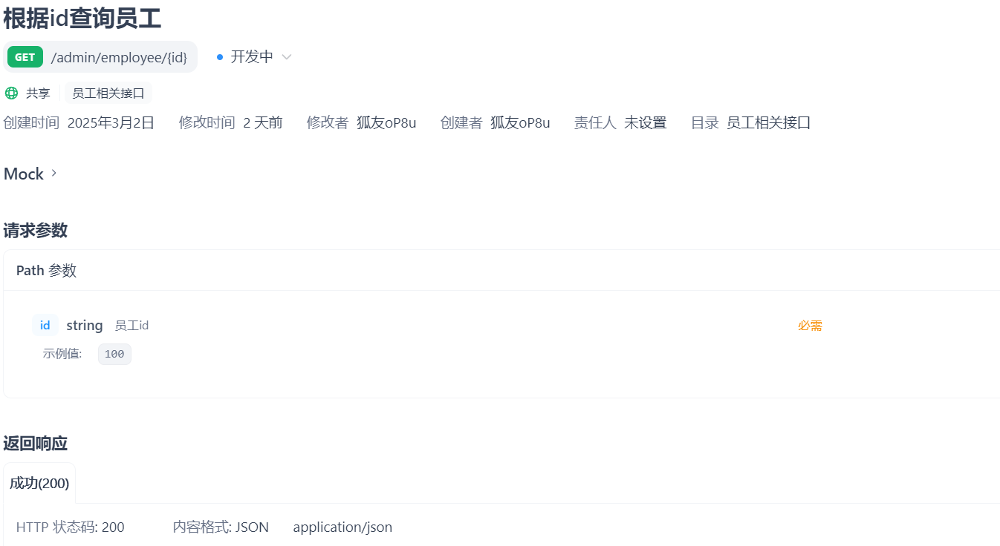
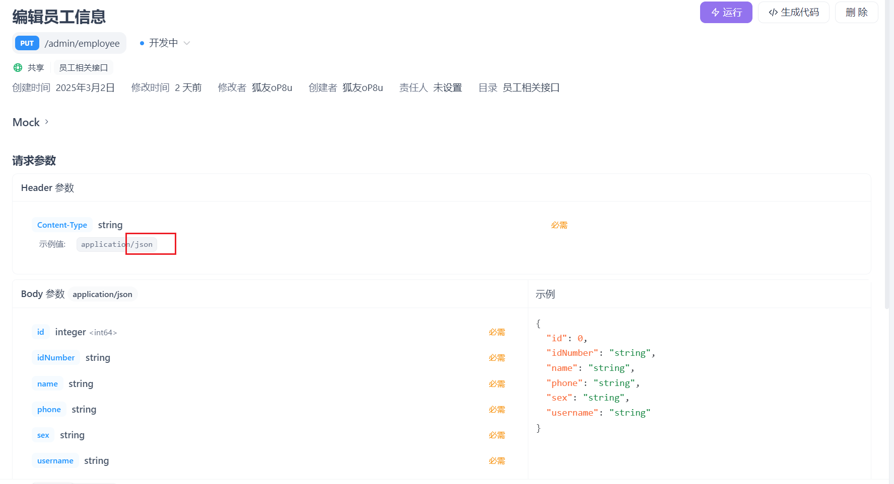

关于苍穹外卖的学习，今天继续添加功能

## 第一个功能启用/禁用员工账号

首先查看接口文档



在控制层写，路径参数注解后面的status可省略(在两者名字相同时)，这个项目我们约定修改的返回值Result无需使用泛型，而查询的需要使用泛型。

```java
/**
 *启用禁用员工
 * @return
 */
@PostMapping("/status/{status}")
@ApiOperation("启用禁用员工账号")
public Result startOrStop(@PathVariable("status") Integer status, Long id) {
    log.info("启用禁用员工账号：{},{}",status,id);
    employeeService.startOrStop(status,id);
    return Result.success();
}
```

service层加接口，写实现类

```java
    /**
     * 启用禁用员工账号
     * @param status
     * @param id
     */
    public void startOrStop(Integer status, Long id) {
        //update employee set status = ? where id = ?

        //构造实体类对象 常规方法
//        Employee employee = new Employee();
//        employee.setId(id);
//        employee.setStatus(status);

        //利用构造器注解@Bulid
        Employee employee = Employee.builder()
                .status(status)
                .id(id)
                .build();
        
        employeeMapper.update(employee);
    }
```

这里想着可能传递的参数不只是状态和id，也有可能是其他的，于是在持久层mapper里面写的update方法的形参是一个对象，包含了所有可能传递的参数。所以持久层mapper写：

```java
/**
 * 根据主键动态修改属性
 * @param employee
 */
void update(Employee employee);
```

它的具体实现由于是动态sql所以不用注解实现而是写在配置文件 EmployeeMapper.xml 里：

```xml
<update id="update" parameterType="Employee">
    update employee
    <set>
        <if test="name != null">name = #{name},</if>
        <if test="username != null">username = #{username},</if>
        <if test="password != null">password = #{password},</if>
        <if test="phone != null">phone = #{phone},</if>
        <if test="sex != null">sex = #{sex},</if>
        <if test="idNumber != null">id_Number = #{idNumber},</if>
        <if test="updateTime != null">update_Time = #{updateTime},</if>
        <if test="updateUser != null">update_User = #{updateUser},</if>
        <if test="status != null">status = #{status},</if>
    </set>
    where id = #{id}
</update>
```

### 特别注意：

**这里的字段名字，数据库采用的是蛇形命名(如id_number),这里也需要加下划线变成id_Number。**

最后提交推送分支。

## 第二个功能编辑员工信息

涉及两个接口，一个是根据员工id查询员工信息，

一个是修改员工信息



第一个接口，控制层：

```java
/**
 * 根据id查询员工信息
 * @param id
 * @return
 */
@GetMapping("/{id}")
@ApiOperation("根据id查询员工信息")
public Result<Employee> getById(@PathVariable Long id) {
    Employee employee = employeeService.getById(id);
    return Result.success(employee);
}
```

业务逻辑层：这里把密码字段为了安全性重新设置为星号，不给前端传密码

```java
/**
 * 根据id查询员工
 * @param id
 * @return
 */
public Employee getById(Long id) {
    Employee employee = employeeMapper.getById(id);
    employee.setPassword("****");
    return employee;
}
```

持久层mapper：

```java
/**
 * 根据id查询员工信息
 * @param id
 * @return
 */
@Select("select * from employee where id = #{id}")
Employee getById(Long id);
```

测试

正常返回，开发第二个接口：


根据接口定义写控制层：

```java
/**
 * 编辑员工信息
 * @param employeeDTO
 * @return
 */
@PutMapping
@ApiOperation("编辑员工信息")
public Result update(@RequestBody EmployeeDTO employeeDTO) {
    log.info("编辑员工信息：{}", employeeDTO);
    employeeService.update(employeeDTO);
    return Result.success();
}
```

业务逻辑层：

```java
/**
 * 编辑员工信息
 * @param employeeDTO
 */
public void update(EmployeeDTO employeeDTO) {
    Employee employee = new Employee();
    //属性拷贝
    BeanUtils.copyProperties(employeeDTO, employee);
    //设置DTO对象里面没有的属性，这里是更新时间和更新者
    employee.setUpdateTime(LocalDateTime.now());
    employee.setUpdateUser(BaseContext.getCurrentId());
    //直接调用之前写好的持久层更新的方法
    employeeMapper.update(employee);
}
```