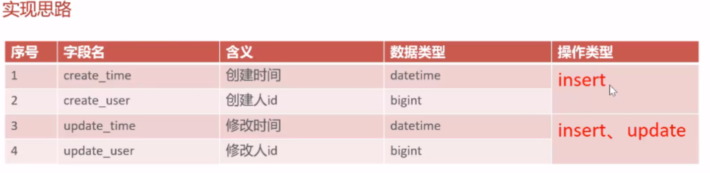

## 公共字段填充

注意到在修改表数据时总是会使用到createUser、updateUser和createTime、updateTime等字段，故考虑把它们抽出来单独处理。这样的思想可以归纳为aop即面向切面编程，它是一种编程范式，**用于将横切关注点从业务逻辑中分离出来**，从而提高代码的模块化、可维护性和可扩展性。

实现流程：

1.确定需要分离的点，这里的公共字段



2.自定义注解@AutoFill：用于标识需要进行统一处理的方法。

3.新建切面包，自定义切面类AutoFillAspect：统一拦截加入了AutoFill的方法，通过反射来为统一赋值

4.在Mapper层具体的方法加上AutoFill注解。

代码实现：

**1.自定义AutoFill注解【只用来标识，标识那些类需要自动填充】**

1.创建annotaion包用来存放自定义注解，然后创建AutoFill注解

2.添加注解@Target(ElementType.METHOD)用来说明注解是加到方法上的

3.添加@Retention(RetentionPolicy.RUNTIME)注解，保留策略为运行时

4.在注解里面指定当前数据库操作类型【可以使用枚举】【定义了之后参数列表的value就可以使用枚举类的值】

5.OperationType value();//自定义的枚举类型【里面是update和insert】

```java
/**
 * 用于标识方法需要进行功能字段自动填充处理
 */
@Target(ElementType.METHOD)
@Retention(RetentionPolicy.RUNTIME)
public @interface AutoFill {
    //数据库操作类型 insert或者update
    OperationType value();
}
```

**2.自定义切面类AutoFillAspect**

1.找切入点，即加上注解的方法

2.在执行这些方法执行前先执行我的这个操作（公共字段填充）

```java
/**
 * 自定义切面，实现公共字段自动填充处理
 */
@Aspect
@Component
@Slf4j
public class AutoFillAspact {
    /**
     * 切入点
     */
    @Pointcut("execution(* com.sky.mapper.*.*(..)) && @annotation(com.sky.annotation.AutoFill)")
    public void autoFillPointCut() {}

    @Before("autoFillPointCut()")
    public void autoFill(JoinPoint joinPoint) throws Throwable {
        log.info("开始进行公共字段填充");

        //获取当前被拦截的方法上的数据库操作类型(insert update等)
        MethodSignature methodSignature = (MethodSignature) joinPoint.getSignature();//方法签名对象
        AutoFill autoFill = methodSignature.getMethod().getAnnotation(AutoFill.class);//获取方法上的注解对象
        OperationType operationType = autoFill.value();//获得操作类型

        //获取当前被拦截方法的参数(比如这里的实体对象)
        Object[] args = joinPoint.getArgs();
        if (args == null || args.length == 0) {
            return;
        }

        Object entity =  args[0];

        //准备赋值的数据
        LocalDateTime now = LocalDateTime.now();
        Long currentId = BaseContext.getCurrentId();
        //根据当前不同的操作类型，为对应的属性通过反射来赋值
        if(operationType == OperationType.INSERT) {
            Method setCreateTime= entity.getClass().getDeclaredMethod(AutoFillConstant.SET_CREATE_TIME,LocalDateTime.class);
            Method setCreateUser= entity.getClass().getDeclaredMethod(AutoFillConstant.SET_CREATE_USER,Long.class);
            Method setUpdateTime= entity.getClass().getDeclaredMethod(AutoFillConstant.SET_UPDATE_TIME,LocalDateTime.class);
            Method setUpdateUser= entity.getClass().getDeclaredMethod(AutoFillConstant.SET_UPDATE_USER,Long.class);

            //通过反射来为对象赋值
            setCreateTime.invoke(entity,now);
            setCreateUser.invoke(entity,currentId);
            setUpdateTime.invoke(entity,now);
            setUpdateUser.invoke(entity,currentId);
        } else if (operationType == OperationType.UPDATE) {
            Method setUpdateTime= entity.getClass().getDeclaredMethod(AutoFillConstant.SET_UPDATE_TIME,LocalDateTime.class);
            Method setUpdateUser= entity.getClass().getDeclaredMethod(AutoFillConstant.SET_UPDATE_USER,Long.class);
            setUpdateTime.invoke(entity,now);
            setUpdateUser.invoke(entity,currentId);
        }

    }
}
```

## 新增菜品

实现两件事，其一完成文件上传，其二完成菜品新增

**文件上传：**

新增通用接口控制层：

```java
/**
 * 通用接口
 */
@RestController
@RequestMapping("/admin/common")
@Api("通用接口")
@Slf4j
public class CommonController {

    private static String FILE_UPLOAD_PATH = "C:\\Users\\zhangbin\\Desktop\\sky-take-out\\sky-server\\src\\main\\resources\\uploads/";

    @PostMapping("/upload")
    @ResponseBody
    public Result uploadFile(@RequestParam("file") MultipartFile file) throws IOException {
        if (file.isEmpty()) {
            return Result.error("文件不能为空");
        }

        File dir = new File(FILE_UPLOAD_PATH);
        if (!dir.exists() || !dir.isDirectory()) {
            boolean created = dir.mkdirs();
            if(created) {
                log.info("创建文件夹成功: {}", FILE_UPLOAD_PATH);
            } else {
                log.warn("创建文件夹失败或已经存在: {}", FILE_UPLOAD_PATH);
            }
        }

        String originalFilename = file.getOriginalFilename();
        if (originalFilename == null || originalFilename.isEmpty()) {
            return Result.error("文件名无效");
        }

        // 确保文件路径安全，避免路径遍历攻击
        Path targetLocation = Paths.get(FILE_UPLOAD_PATH).resolve(originalFilename).normalize();
        try {
            Files.copy(file.getInputStream(), targetLocation, StandardCopyOption.REPLACE_EXISTING);
            log.info("文件上传成功: {}", originalFilename);
        } catch (IOException e) {
            log.error("文件上传失败: {}", originalFilename, e);
            return Result.error("文件上传失败");
        }

        // 你可以根据实际情况调整返回的文件访问链接
        String fileUrl = "http://localhost:8080/uploads/" + originalFilename;
        return Result.success(fileUrl);
    }
}
```

配置类的WebMvcConfiguration类里新增静态资源映射：

```java
private static String FILELOCATION = "C:\\Users\\zhangbin\\Desktop\\sky-take-out\\sky-server\\src\\main\\resources\\uploads/";
/**
 * 设置静态资源映射
 * @param registry
 */
protected void addResourceHandlers(ResourceHandlerRegistry registry) {
    registry.addResourceHandler("/doc.html").addResourceLocations("classpath:/META-INF/resources/");
    registry.addResourceHandler("/webjars/**").addResourceLocations("classpath:/META-INF/resources/webjars/");

    // 将本地文件系统的 uploads 目录映射为 /uploads/** 的 URL
    registry.addResourceHandler("/uploads/**")
            .addResourceLocations("file:" + FILELOCATION);
}
```

**新增菜品：**

需要实现菜品和口味的新增：

控制层DishController：

```java
/**
 * 菜品管理
 */
@RestController
@RequestMapping("/admin/dish")
@Api(tags = "菜品相关接口")
@Slf4j
public class DishController {

    @Autowired
    private DishService dishService;

    /**
     * 新增菜品和口味
     * @param dishDTO
     * @return
     */
    @PostMapping
    public Result save(@RequestBody DishDTO dishDTO) {
      log.info("新增菜品{}", dishDTO);
      dishService.saveWithFlavor(dishDTO);

      return Result.success();
    }
}
```

业务逻辑层DishServiceImpl：

```java
@Service
@Slf4j
public class DishServiceImpl implements DishService {

    @Autowired
    private DishMapper dishMapper;
    @Autowired
    private DishFlavorMapper dishFlavorMapper;
    /**
     * 新增菜品和对应的口味
     * @param dishDTO
     */
    @Transactional//保证事务原子性要么成功要么失败
    public void saveWithFlavor(DishDTO dishDTO) {

        Dish dish = new Dish();
        BeanUtils.copyProperties(dishDTO, dish);

        //向菜品表插入1条数据
        dishMapper.insert(dish);

        Long dishId = dish.getId();//获取insert语句生成的主键值

        //向口味表插入n条数据
        List<DishFlavor> flavors =  dishDTO.getFlavors();
        if (flavors != null && flavors.size() > 0) {
            flavors.forEach(dishFlavor -> {
                dishFlavor.setDishId(dishId);
            });

            dishFlavorMapper.insertBatch(flavors);
        }

    }
}
```

菜品的新增直接在Mapper层的配置文件写插入语句即可。

口味的新增Mapper层的配置文件写动态sql

```xml
<insert id="insertBatch">
    insert into dish_flavor (dish_id, name, value) VALUES
    <foreach collection="flavors" item="df" separator=",">
        (#{df.dishId},#{df.name},#{df.value})
    </foreach>
</insert>
```

遇到的问题：

1.老师提供的oss已无法使用，本地存储解决

但是在使用value注解的时候没办法替换yml文件里的属性，直接写的变量解决，但是导致直接写的路径很长而且修改麻烦。

2.复制DishMapper的时候复制了autofill注解到DishFlavorMapper导致报错，去掉即可。

3.数据库的字段名和实体的字段名别搞混淆。

## 批量删除菜品

考虑菜品是否可以删除：

1.是否存在起售中的菜品

2.是否存在关联到套餐的菜品

## 修改菜品基本信息和口味数据

1.查询菜品分类（已实现）

2.图片上传和回显菜品图片（已实现）

3.根据id查询菜品---简单

4.修改菜品

注意口味数据可以先删除再新增以达到修改的效果。