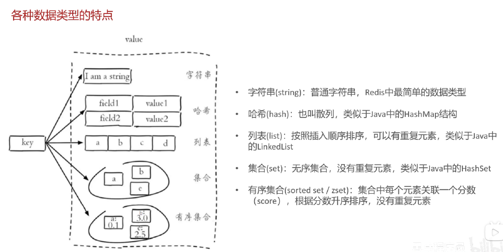
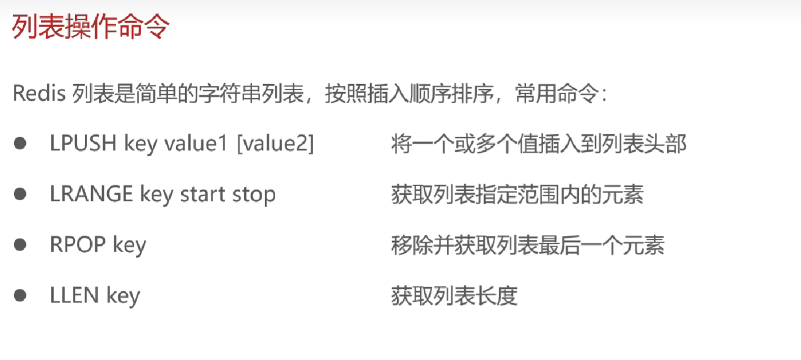

## Redis

是什么：基于**内存**的**key-value**结构的**数据库**

特点：

- 基于内存存储，读写性能高
- 适合存储热点数据（热点商品、资讯、新闻）

官网：https://redis.io/

中文网：https://www.redis.net.cn/

### 数据类型

#### 常用命令：

字符串：

- set key value---设置指定key的值
- get key---获取指定key的值
- setex key seconds value---设置指定key的值，并在seconds后过期(常用于验证码)
- setnx key value---只有在key不存在时设置key的值

哈希：

- hset key field value---设置指定key的字段和值
- hget key field---获取指定key的字段的值
- hdel key field---删除指定key的字段
- hkeys key---显示所有字段
- hvals key---显示所有值

列表：

集合：
