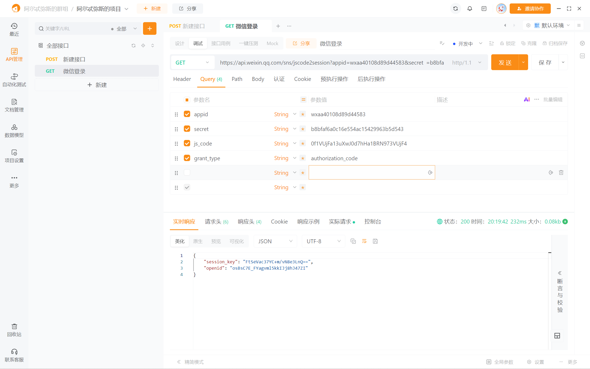
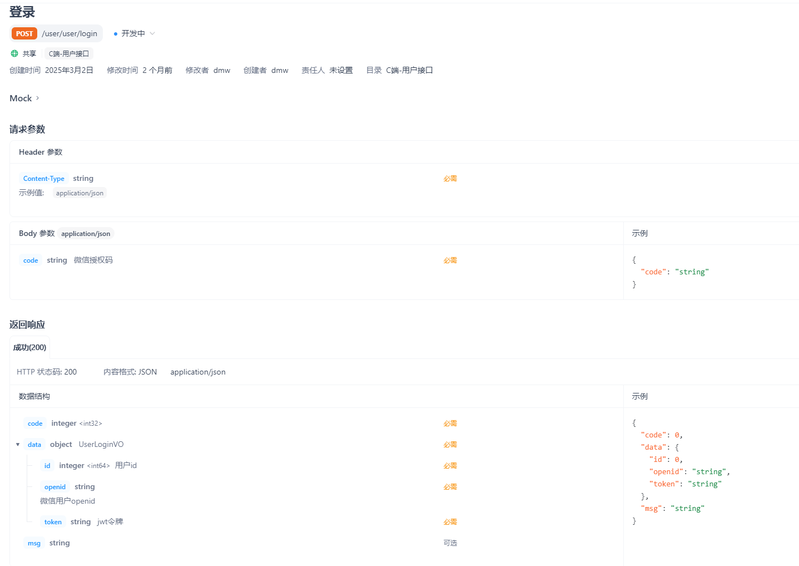
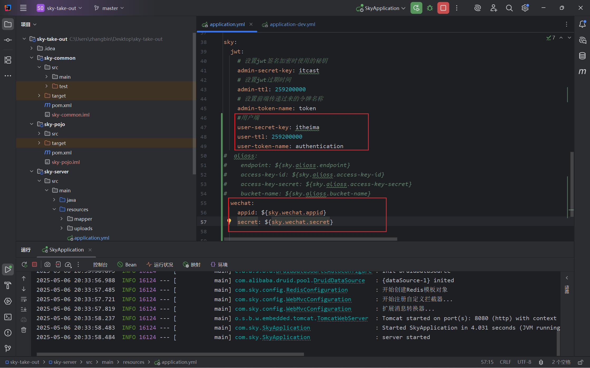

## 微信登录功能实现

### 采用HTTPS 调用

```text
GET https://api.weixin.qq.com/sns/jscode2session 
```

请求参数

| 属性       | 类型   | 必填 | 说明                                                         |
| :--------- | :----- | :--- | :----------------------------------------------------------- |
| appid      | string | 是   | 小程序 appId                                                 |
| secret     | string | 是   | 小程序 appSecret                                             |
| js_code    | string | 是   | 登录时获取的 code，可通过[wx.login](https://developers.weixin.qq.com/miniprogram/dev/api/open-api/login/wx.login.html)获取 |
| grant_type | string | 是   | 授权类型，此处只需填写 authorization_code                    |

返回参数

| 属性        | 类型   | 说明                                                         |
| :---------- | :----- | :----------------------------------------------------------- |
| session_key | string | 会话密钥                                                     |
| unionid     | string | 用户在开放平台的唯一标识符，若当前小程序已绑定到微信开放平台帐号下会返回，详见 [UnionID 机制说明](https://developers.weixin.qq.com/miniprogram/dev/framework/open-ability/union-id.html)。 |
| errmsg      | string | 错误信息，请求失败时返回                                     |
| openid      | string | 用户唯一标识                                                 |
| errcode     | int32  | 错误码，请求失败时返回                                       |

#### 测试一下

第一二项参数为小程序自带，第三项参数为每次调用时的唯一code，第四项参数为固定值。



可以获得唯一的用户标识openid，查看我们的开发文档：

尝试为用户写登录功能。

### 代码实现

首先在配置文件写用户的令牌生成配置信息。



写用户的DTO和VO

```java
package com.sky.dto;

import lombok.Data;

import java.io.Serializable;

/**
 * C端用户登录
 */
@Data
public class UserLoginDTO implements Serializable {

    private String code;

}
```

```java
package com.sky.vo;

import lombok.AllArgsConstructor;
import lombok.Builder;
import lombok.Data;
import lombok.NoArgsConstructor;

import java.io.Serializable;

@Data
@Builder
@NoArgsConstructor
@AllArgsConstructor
public class UserLoginVO implements Serializable {

    private Long id;
    private String openid;
    private String token;

}
```

继续三件套，controller->service->mapper,先写controller层

```java
import ...//省略

@RestController
@RequestMapping("/user/user")
@Api(tags = "c端用户相关接口")
@Slf4j
public class UserController {

    @Autowired
    private UserService userService;
    @Autowired
    private JwtProperties jwtProperties;

    /**
     * 微信登录
     * @param userLoginDTO
     * @return
     */
    @PostMapping("/login")
    @ApiOperation("微信登录")
    public Result<UserLoginVO> login(@RequestBody UserLoginDTO userLoginDTO) {
        log.info("微信用户登录：{}", userLoginDTO.getCode());
        User user = userService.wxLogin(userLoginDTO);

        //为微信用户生成jwt令牌
        Map<String, Object> claims = new HashMap<>();
        claims.put(JwtClaimsConstant.USER_ID, user.getId());//键值对
        String token = JwtUtil.createJWT(jwtProperties.getUserSecretKey(),jwtProperties.getUserTtl(),claims);

        UserLoginVO userLoginVO = UserLoginVO.builder()
                .id(user.getId())
                .openid(user.getOpenid())
                .token(token)
                .build();
        return Result.success(userLoginVO);
    }
}
```

写service实现层

```java
package com.sky.service;

import com.sky.dto.UserLoginDTO;
import com.sky.entity.User;

public interface UserService {


    User wxLogin(UserLoginDTO userLoginDTO);

}
```

它的实现类

```java
@Service
@Slf4j
public class UserServiceImpl implements UserService {

    public static final String WX_LOGIN = "https://api.weixin.qq.com/sns/jscode2session";

    @Autowired
    private WeChatProperties properties;
    @Autowired
    private UserMapper userMapper;
    /**
     * 微信登录
     * @param userLoginDTO
     * @return
     */
    public User wxLogin(UserLoginDTO userLoginDTO) {
        String openid = getOpenid(userLoginDTO.getCode());

        //判断openid是否为空，如果为空表示登录失败，抛出业务异常
        if (openid == null) {
            throw new LoginFailedException(MessageConstant.LOGIN_FAILED);
        }
        //判断openid是否已存在，存在则为老用户，否则为新用户
        User user = userMapper.getByOpenid(openid);
        //如果是新用户自动完成注册
        if (user == null) {
            user = User.builder()
                    .openid(openid)
                    .createTime(LocalDateTime.now())
                    .build();
            userMapper.insert(user);
        }
        //返回用户对象
        return user;
    }

    /**
     * 调用微信接口服务获得微信用户的openid
     * @param code
     * @return
     */
    private String getOpenid(String code) {
        //调用微信接口服务获得当前微信用户的openid
        Map<String, String> map = new HashMap<>();
        map.put("appid", properties.getAppid());
        map.put("secret", properties.getSecret());
        map.put("js_code", code);
        map.put("grant_type", "authorization_code");
        String json = HttpClientUtil.doGet(WX_LOGIN,map);

        JSONObject jsonObject = JSON.parseObject(json);
        String openid = jsonObject.getString("openid");
        return openid;
    }
}
```

mapper层

```java
package com.sky.mapper;

import com.sky.entity.User;
import org.apache.ibatis.annotations.Mapper;
import org.apache.ibatis.annotations.Select;

@Mapper
public interface UserMapper {

    /**
     * 根据openid查询用户
     * @param openid
     * @return
     */
    @Select("select * from user where openid = #{openid}")
    User getByOpenid(String openid);

    /**
     * 插入数据
     * @param user
     */
    void insert(User user);
}
```

```xml
<?xml version="1.0" encoding="UTF-8" ?>
<!DOCTYPE mapper PUBLIC "-//mybatis.org//DTD Mapper 3.0//EN"
        "http://mybatis.org/dtd/mybatis-3-mapper.dtd" >
<mapper namespace="com.sky.mapper.UserMapper">

    <insert id="insert" useGeneratedKeys="true" keyProperty="id">
        insert into user (openid, name, phone, sex, id_number, avatar, create_time)
        values (#{openid},#{name},#{phone},#{sex},#{idNumber},#{avatar},#{createTime})
    </insert>

</mapper>
```

继续完善令牌校验，登录之后保存的token值，此代码没有手搓，是复制原有的管理员令牌改写的。

```java
package com.sky.interceptor;

import com.sky.constant.JwtClaimsConstant;
import com.sky.context.BaseContext;
import com.sky.properties.JwtProperties;
import com.sky.utils.JwtUtil;
import io.jsonwebtoken.Claims;
import lombok.extern.slf4j.Slf4j;
import org.springframework.beans.factory.annotation.Autowired;
import org.springframework.stereotype.Component;
import org.springframework.web.method.HandlerMethod;
import org.springframework.web.servlet.HandlerInterceptor;

import javax.servlet.http.HttpServletRequest;
import javax.servlet.http.HttpServletResponse;

/**
 * jwt令牌校验的拦截器
 */
@Component
@Slf4j
public class JwtTokenUserInterceptor implements HandlerInterceptor {

    @Autowired
    private JwtProperties jwtProperties;

    /**
     * 校验jwt
     *
     * @param request
     * @param response
     * @param handler
     * @return
     * @throws Exception
     */
    public boolean preHandle(HttpServletRequest request, HttpServletResponse response, Object handler) throws Exception {
        //判断当前拦截到的是Controller的方法还是其他资源
        if (!(handler instanceof HandlerMethod)) {
            //当前拦截到的不是动态方法，直接放行
            return true;
        }

        //1、从请求头中获取令牌
        String token = request.getHeader(jwtProperties.getUserTokenName());

        //2、校验令牌
        try {
            log.info("jwt校验:{}", token);
            Claims claims = JwtUtil.parseJWT(jwtProperties.getUserSecretKey(), token);
            Long userId = Long.valueOf(claims.get(JwtClaimsConstant.USER_ID).toString());
            log.info("当前用户id：", userId);

            BaseContext.setCurrentId(userId);
            //3、通过，放行
            return true;
        } catch (Exception ex) {
            //4、不通过，响应401状态码
            response.setStatus(401);
            return false;
        }
    }
}

```

同时需要去配置类里也注入此bean。

```java
@Configuration
@Slf4j
public class WebMvcConfiguration extends WebMvcConfigurationSupport{

    @Autowired
    private JwtTokenAdminInterceptor jwtTokenAdminInterceptor;
    @Autowired
    private JwtTokenUserInterceptor jwtTokenUserInterceptor;

    /**
     * 注册自定义拦截器
     *
     * @param registry
     */
    protected void addInterceptors(InterceptorRegistry registry) {
        log.info("开始注册自定义拦截器...");
        registry.addInterceptor(jwtTokenAdminInterceptor)
                .addPathPatterns("/admin/**")
                .excludePathPatterns("/admin/employee/login");

        registry.addInterceptor(jwtTokenUserInterceptor)
                .addPathPatterns("/user/**")
                .excludePathPatterns("/user/user/login")
                .excludePathPatterns("/user/shop/status");
    }

    /**
     * 通过knife4j生成接口文档
     * @return
     */
    @Bean
    public Docket docket1() {
        ApiInfo apiInfo = new ApiInfoBuilder()
                .title("苍穹外卖项目接口文档")
                .version("2.0")
                .description("苍穹外卖项目接口文档")
                .build();
        Docket docket = new Docket(DocumentationType.SWAGGER_2)
                .groupName("管理端接口")
                .apiInfo(apiInfo)
                .select()
                .apis(RequestHandlerSelectors.basePackage("com.sky.controller.admin"))
                .paths(PathSelectors.any())
                .build();
        return docket;
    }

    @Bean
    public Docket docket2() {
        ApiInfo apiInfo = new ApiInfoBuilder()
                .title("苍穹外卖项目接口文档")
                .version("2.0")
                .description("苍穹外卖项目接口文档")
                .build();
        Docket docket = new Docket(DocumentationType.SWAGGER_2)
                .groupName("用户端接口")
                .apiInfo(apiInfo)
                .select()
                .apis(RequestHandlerSelectors.basePackage("com.sky.controller.user"))
                .paths(PathSelectors.any())
                .build();
        return docket;
    }

    private static String FILELOCATION = "C:\\Users\\zhangbin\\Desktop\\sky-take-out\\sky-server\\src\\main\\resources\\uploads/";
    /**
     * 设置静态资源映射
     * @param registry
     */
    protected void addResourceHandlers(ResourceHandlerRegistry registry) {
        registry.addResourceHandler("/doc.html").addResourceLocations("classpath:/META-INF/resources/");
        registry.addResourceHandler("/webjars/**").addResourceLocations("classpath:/META-INF/resources/webjars/");

        // 将本地文件系统的 uploads 目录映射为 /uploads/** 的 URL
        registry.addResourceHandler("/uploads/**")
                .addResourceLocations("file:" + FILELOCATION);
    }

    /**
     * 扩展spring MVC消息转换器
     * @param converters
     */
    protected void extendMessageConverters(List<HttpMessageConverter<?>> converters) {
        log.info("扩展消息转换器...");
        //创建一个消息转换器对象
        MappingJackson2HttpMessageConverter converter = new MappingJackson2HttpMessageConverter();
        //需要为消息转换器设置一个对象转换器，对象转换器可以将java对象序列化为json数据
        converter.setObjectMapper(new JacksonObjectMapper());
        //将自己的消息转换器加入容器中
        converters.add(0,converter);//索引为0，优先使用我们自己的消息转换器
    }
}
```